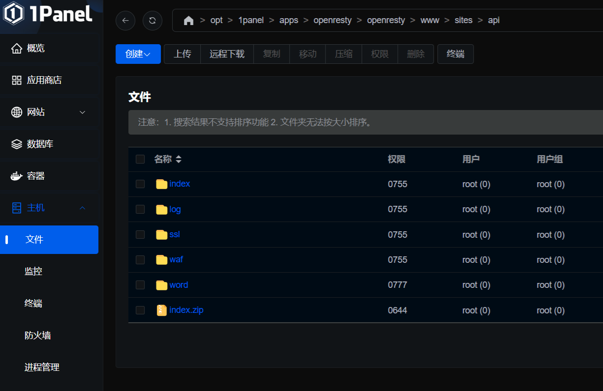
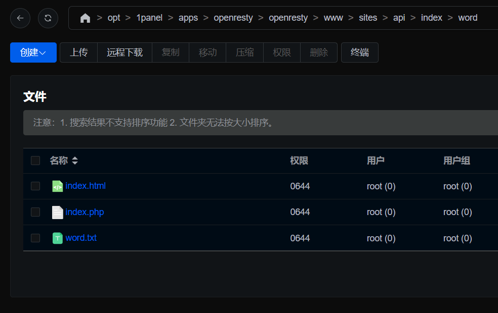
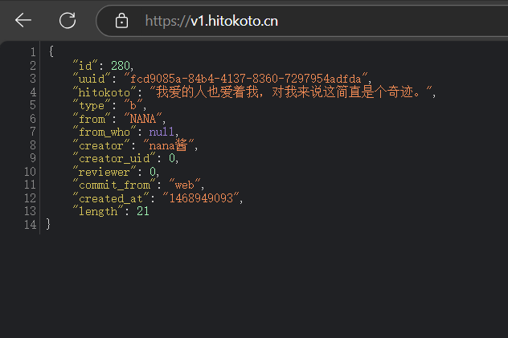

### 使用php，1panel部署
进入1panel，新建网站，我用的是域名加端口，端口需要去安全组开放，域名的话需要备案，我直接用的服务器ip，


注意目录的放置，去网站目录的inndex文件夹下新建word文件夹，把index.php word.txt index.html都放置进去





```php
<?php
  // 获取句子文件的绝对路径
  // 如果你介意别人可能会拖走这个文本，可以把文件名自定义一下，或者通过Nginx禁止拉取也行。
  $path = dirname(__FILE__);
$file = file($path."/word.txt");

# 随机读取一行
$arr  = mt_rand( 0, count( $file ) - 1 );
$content  = trim($file[$arr]);

# 编码判断，用于输出相应的响应头部编码
if (isset($_GET['charset']) && !empty($_GET['charset'])) {
  $charset = $_GET['charset'];
  if (strcasecmp($charset,"gbk") == 0 ) {
    $content = mb_convert_encoding($content,'gbk', 'utf-8');
  }
} else {
  $charset = 'utf-8';
}
header("Content-Type: text/html; charset=$charset");

# 格式化判断，输出js或纯文本
if ($_GET['format'] === 'js') {
  echo "function poem(){document.write('" . $content ."');}";
} else {
  echo $content;
}
```

在同路径下创建word.txt

<details class="lake-collapse"><summary id="u6eb98684"><span class="ne-text">word.txt</span></summary><p id="u2036c2eb" class="ne-p"><span class="ne-text">忍者要沉着冷静、仔细判断。打破忍者世界规则跟铁律的人，我们都叫他废物。 ...可是，不懂得重视同伴的人，是最最差劲的废物!<br /></span><span class="ne-text">对不起，风太大，我没有听清楚⋯⋯<br /></span><span class="ne-text">世界这么大，人生这么长，总会有那么一个人，让你想要温柔的对待。<br /></span><span class="ne-text">弱小和无知，不是生存的障碍，傲慢才是。<br /></span><span class="ne-text">不管是多久以前的事，失去最重要的人总是无法忘怀，总会感到孤独的啊！因为你……寂寞的话，我也……会寂寞。<br /></span><span class="ne-text">无论如何，我想和你一起看到人生尽头的风景呢。<br /></span><span class="ne-text">生命和死亡都是可以搬运的。<br /></span><span class="ne-text">云想衣裳花想容，春风拂槛露华浓。<br /></span><span class="ne-text">看来你是不见棺材不落泪不到黄河心不死欲穷千里目更上一层楼呢<br /></span><span class="ne-text">如果每个人都能理解你，那么你得普通成什么样子。<br /></span><span class="ne-text">古之立大事者，不惟有超世之才，亦必有坚忍不拔之志。<br /></span><span class="ne-text">被质疑的时候，才是证明自己的好机会啊。<br /></span><span class="ne-text">Via Soul!<br /></span><span class="ne-text">就像那句狠话：有一天，我一定会后悔的。<br /></span><span class="ne-text">现世为梦，夜梦为真。<br /></span><span class="ne-text">在茫茫人海中相遇相知相守无论谁都不会一帆风顺，只有一颗舍得付出懂得感恩的心才能拥有一生的爱和幸福。<br /></span><span class="ne-text">笑是对身边的事物感到一瞬间的幸福而表现出来的东西。<br /></span><span class="ne-text">我为什么一定要向三次元的女生表白。<br /></span><span class="ne-text">廉价的自尊、粗劣的傲气，无论哪个后生小辈都很重视这些东西。<br /></span><span class="ne-text">看惯黑夜的人，不应该习惯黑夜，而是应该期待黑夜中的光明。<br /></span><span class="ne-text">选择最难的路走暗夜里看成群的星星涌来。<br /></span><span class="ne-text">请教别人不折本，舌头打个滚<br /></span><span class="ne-text">或许就像现在这样，孤独、寂寞。但我们依旧有着美好的明天。<br /></span><span class="ne-text">只要你微笑,你心里的我就会陪你一起微笑.<br /></span><span class="ne-text">若似月轮终皎洁，不辞冰雪为卿热。<br /></span><span class="ne-text">无他，凭心而行，后果自负而已<br /></span><span class="ne-text">如果我身边最重要的人始终要离开我，我宁愿一辈子从来都没有拥有过。<br /></span><span class="ne-text">完美啊完美，正中下怀呢！<br /></span><span class="ne-text">出生到世上，单单因为这个，就该心存感激。<br /></span><span class="ne-text">一个人，一个人，一个人，不是不想交朋友，而是懒。<br /></span><span class="ne-text">爱情不是一个拼图，是一个圆碰到另一个圆。<br /></span><span class="ne-text">绝不能和梦中的人说话,那是与黑暗的国度对话。<br /></span><span class="ne-text">真正喜欢你的人你再蠢的套路她都愿意吃你的。<br /></span><span class="ne-text">等待和犹豫才是这个世界上最无情的杀手。<br /></span><span class="ne-text">能轻易离开的人确实谈不上遗憾<br /></span><span class="ne-text">爱,其实很简单，困难的是去接受它。<br /></span><span class="ne-text">现在的我能明白，只要有想见的人，就不再是孤单一人。<br /></span><span class="ne-text">旅行的意义在于找到自己，而非浏览他人。<br /></span><span class="ne-text">如今的夜空没有昔日流星的闪烁，没有灯火璀璨的繁华，只剩下我独自一人，心在天边惆怅。<br /></span><span class="ne-text">你说的这些事，我已经想了很多遍了，但是，有些心情是无法用道理讲清的。<br /></span><span class="ne-text">南天寂静亮星少，北落师门赛明灯。<br /></span><span class="ne-text">那天，我听到了种子破土的声音，又细微又坚定。<br /></span><span class="ne-text">毁灭一个人只要一句话，培植一个人却要千句话，请你口下留情<br /></span><span class="ne-text">即使你已经习惯了受伤害，也有人看了会心疼的。<br /></span><span class="ne-text">我们，在路上，勿忘初心。找寻最初的梦想和微弱的希望。<br /></span><span class="ne-text">为什么要担心？如果努力了，担心不会让结果变得更好。<br /></span><span class="ne-text">年轻人总是急于求成，就连等待一匙砂糖彻底溶解的耐心也没有，后悔所带来的苦涩，恰好印证了你曾经有所作为，这一点一滴都将成为点缀人生的各种味道。<br /></span><span class="ne-text">我是天空里的一片云，偶尔投影在你的波心。<br /></span><span class="ne-text">我们都还没有说再见，所以我不会把它当做离别。<br /></span><span class="ne-text">你有学校也有朋友，但对我来说，我的生活中就只有你。<br /></span><span class="ne-text">如果忘记了，就请沉默直到记起来为止。<br /></span><span class="ne-text">为什么妈妈就不明白无所事事的忙碌呢。<br /></span><span class="ne-text">时光总有一天会将你我拆散，可是即便如此，在那个时刻之前，也让我们在一起吧<br /></span><span class="ne-text">我们都是武器，挥断了就挥断了。<br /></span><span class="ne-text">东风夜放花千树。更吹落、星如雨。<br /></span><span class="ne-text">我的愿望是—幸福地活着，幸福地死去。<br /></span><span class="ne-text">把手拿开，想传染笨蛋菌给我吗，笨蛋……<br /></span><span class="ne-text">失败的人只有一种。就是在抵达成功之前放弃的人<br /></span><span class="ne-text">喜欢上你，爱上你，真是太好了，谢谢。<br /></span><span class="ne-text">一个细胞里，却分裂出了两种截然不同的命运。<br /></span><span class="ne-text">人生的选择是对是错，没有人知道.<br /></span><span class="ne-text">努力过后，才知道许多事情，坚持坚持，就过来了。<br /></span><span class="ne-text">人生无论何时都无法重新来过。<br /></span><span class="ne-text">历经漫漫岁月，两人一起思考吧，时间即负重，我做如是想。御狐神给予我的时间。今后我也会多次回想起，这漫漫时光里的故事。两人共同编织出的漫漫时光。<br /></span><span class="ne-text">跟喜欢的人是做不了朋友的，距离远近都是折磨。<br /></span><span class="ne-text">如果没什么好事发生的话，就把没有发生坏事的每一天当作好事吧。<br /></span><span class="ne-text">万法缘生，皆系缘分！<br /></span><span class="ne-text">这世上本无绝对的对与错，所谓的错，或许只是对的另一种执着。<br /></span><span class="ne-text">快乐的时候不要想以后，痛苦的时候多想想将来。<br /></span><span class="ne-text">甲之蜜糖，乙之砒霜。<br /></span><span class="ne-text">想要让每一天重新来过，又不想让仔细回味每一天。<br /></span><span class="ne-text">那手中的冥火，是坦克中的噩梦；无极里的鬼影，在我的身边穿梭。<br /></span><span class="ne-text">幻影，就如梦境一般，确实存在于那里。但梦醒之后，就会渐渐从记忆中消逝……<br /></span><span class="ne-text">尽管我会凋零，但至少我盛开过。<br /></span><span class="ne-text">如果约会的人迟到了，会跑着去迎接吧。<br /></span><span class="ne-text">不要祈求生活公平，只需要适应它。<br /></span><span class="ne-text">要是追不上光，那就变成光吧。<br /></span><span class="ne-text">时间总是会过去的，让时间流走你的烦恼吧！<br /></span><span class="ne-text">如果有什么毒药能轻易杀人，我也想要呢，因为不知道什么时候会用到，也没准是自己要用。<br /></span><span class="ne-text">到了熟透的年龄，即使在群众的怀抱中，你都可能觉得寂寞无比<br /></span><span class="ne-text">你为了你的正义，我为了我的正义。<br /></span><span class="ne-text">我在人民的祈求下成为王后。没有民众，王后怎么能称得上王后呢？<br /></span><span class="ne-text">人不是任何人的奴隶,不是为了做奴隶而生。<br /></span><span class="ne-text">生生生生暗生始，死死死死冥死终。<br /></span><span class="ne-text">只要活着，就该笑着去面对一切的一切。<br /></span><span class="ne-text">自古美人如名将，不许人间见白头<br /></span><span class="ne-text">众口铄金，积毁销骨。<br /></span><span class="ne-text">事已至此，幸而夜风对他温柔。<br /></span><span class="ne-text">哪里会有在真正的战争中等待对方回合的蠢货啊。<br /></span><span class="ne-text">一道残阳铺水中，半江瑟瑟半江红。<br /></span><span class="ne-text">我们各自努力，最高处见。<br /></span><span class="ne-text">连我自己都轻视自己的话，谁来夸奖我啊，只有我了，舍我其谁。<br /></span><span class="ne-text">枝头有新花，树才能长青不老啊。<br /></span><span class="ne-text">假若，在这染满鲜血的刀，以及成为牺牲品的生命背后，有个谁也可以安心生活的新时代，我会——替天行道，仗义杀人 .<br /></span><span class="ne-text">以人言善我，必以人言罪我。<br /></span><span class="ne-text">种族不代表荣耀，我见过最高尚的兽人，也见过最卑劣的人类。<br /></span><span class="ne-text">赌上性命的家里蹲，这就是人生。<br /></span><span class="ne-text">我年轻，我傲娇。<br /></span><span class="ne-text">嘤其鸣兮，求其友声。友声可远在千里之外，可远在数十百年之后。<br /></span><span class="ne-text">我命令你，喜欢我！<br /></span><span class="ne-text">不好意思，我喜欢的是艾米莉亚<br /></span><span class="ne-text">就这点程度，还不足以折断我的灵魂。<br /></span><span class="ne-text">要让一群人团结起来，需要的不是英明的领导，而是共同的敌人。<br /></span><span class="ne-text">所谓朋友就是，如果误入歧途就要一起走下去，如果犯了罪就要一起背负，这才是真正的朋友啊！<br /></span><span class="ne-text">所谓觉悟，乃是在漆黑的荒原中，开辟出一条属于自己的星光大道！<br /></span><span class="ne-text">听都没听说过的事，假装听懂、明白是一件很失礼的事情。<br /></span><span class="ne-text">趁着年轻，好好犯病。<br /></span><span class="ne-text">若教眼底无离恨，不信人间有白头<br /></span><span class="ne-text">生而为人，活已为人，卒以为人者，于此长眠。<br /></span><span class="ne-text">茅檐低小，溪上青青草。醉里吴音相媚好，白发谁家翁媪？<br /></span><span class="ne-text">羌笛何须怨杨柳，春风不度玉门关。<br /></span><span class="ne-text">绝情的话语犹如利剑，刺向心口，纠缠的记忆宛若梦境，脆弱易碎。<br /></span><span class="ne-text">你的温柔只为我一个，我的坚强只为你一人。<br /></span><span class="ne-text">找不到路，就自己走一条出来。<br /></span><span class="ne-text">所以我松开拳头用手握紧笔，作为自己作为人类也作为你。<br /></span><span class="ne-text">思君如流水，何有穷已时。<br /></span><span class="ne-text">逢うべき糸に出逢えることを 人は仕合わせと呼びます<br /></span><span class="ne-text">如果只是把世界分为清净和污浊两者，是不是就反而看不到真相了呢？<br /></span><span class="ne-text">与其如此，不如永远像孩子一样。<br /></span><span class="ne-text">易求无价宝，难得有心郎。<br /></span><span class="ne-text">阳光洒落，冰冷的眼中，澄澈入海却依旧向往自由。<br /></span><span class="ne-text">人生用特写镜头来看是悲剧，长镜头来看则是喜剧。<br /></span><span class="ne-text">真正要分开的两个人，连“分手”二字都是多余的，因为殊途同归。<br /></span><span class="ne-text">你总是这样轻言放弃的话，无论多久都只会原地踏步<br /></span><span class="ne-text">如果爱，请深爱，如不爱，请离开<br /></span><span class="ne-text">曾经拥有的东西失去了，并不代表会回到原来没有那种东西的时候。<br /></span><span class="ne-text">人们之所以会怀念故乡，是因为心爱的人就在故乡。<br /></span><span class="ne-text">记不分明疑是梦，梦来还隔一重帘。<br /></span><span class="ne-text">有了喜欢的人，就会在意各种小事，感觉很不自由，但是，为了那些小事左思右想，心里竟然会这么快乐。<br /></span><span class="ne-text">如何得与凉风约，不共尘沙一并来！<br /></span><span class="ne-text">未知绝不会转变成已知，因为已知又会转变成未知，那里没有终点，昨日的常识并非今日的常识。<br /></span><span class="ne-text">你知道什么叫幸福嘛？幸福就是拍拍手。<br /></span><span class="ne-text">有着似曾相识后发际的他，却说着陌生人一般的话语。总觉得...有点想哭。<br /></span><span class="ne-text">有死之隙是因为惧怕死亡，惧怕死亡是因为有挂念的事与人吧。<br /></span><span class="ne-text">那些坚定决心的人们，会展现出好脸色。<br /></span><span class="ne-text">我可是个面壁者，怎么能随便告诉你呢？<br /></span><span class="ne-text">北树阴浓，青衣成风。<br /></span><span class="ne-text">当世界背叛你的那天到来时，我会为你背叛全世界。<br /></span><span class="ne-text">我追着你，因为我爱你<br /></span><span class="ne-text">到底是孤独的人强大，还是强大的人孤独。<br /></span><span class="ne-text">那些青春期的脆弱自尊，轻易不得触碰，那极有有可能成为对他或她一生的打扰。我们都曾经历那样纯粹、易碎的青春，只是时光的磨砺已让我们懂得逃避与忍气吞声然后慢慢遗忘自己曾经的青春。<br /></span><span class="ne-text">迷失于黑暗中的可悲身影，伤害鄙视他人，沉溺于罪恶的孽魂。来死一次吧！<br /></span><span class="ne-text">你驻足于春色中，于那独一无二的春色之中。<br /></span><span class="ne-text">天行健，君子以自强不息；地势坤，君子以厚德载物<br /></span><span class="ne-text">城南小陌又逢春，只见梅花不见人。<br /></span><span class="ne-text">相信爱的人，才会和爱相遇<br /></span><span class="ne-text">这个世界，只需要一把剑就可以去往任何地方。<br /></span><span class="ne-text">如果我讨厌她，就不会这么烦恼了!<br /></span><span class="ne-text">青春只剩一段未完的爱恋，偶而像被风卷起的黄叶，落在心口上像一滴被忍住的泪。<br /></span><span class="ne-text">不能输，笑吧！<br /></span><span class="ne-text">凡是过去，皆为序章；凡是未来，皆有可期。<br /></span><span class="ne-text">我相信这世界上,有些人有些事有些爱,在见到的第一次,就注定要羁绊一生,就注定像一棵树一样,生长在心里,生生世世。<br /></span><span class="ne-text">如果不能对喜欢的东西说喜欢的话，那肯定是这个世界有问题吧。<br /></span><span class="ne-text">相见不如不见，有情还似无情。<br /></span><span class="ne-text">一直一来都久久的注视着 若即若离 仿佛咫尺天涯 无论如何 总是伸手不及<br /></span><span class="ne-text">有些事，想多了头疼，想通了心疼。<br /></span><span class="ne-text">我们一直在一起，所以最后也想在你身旁。<br /></span><span class="ne-text">我是一个经常笑的人，可我不是经常开心的人。<br /></span><span class="ne-text">温柔正确的人总是难以生存，因为这世界既不温柔，也不正确。<br /></span><span class="ne-text">高中三年级的时候能想明白将来要什么的人，那是凤毛麟角。<br /></span><span class="ne-text">花开如火，也如寂寞。<br /></span><span class="ne-text">焦虑像毒瘾，让人想对死亡说你好……<br /></span><span class="ne-text">我是最强的！<br /></span><span class="ne-text">我们也许再也不会见面了吧，因此我绝对不会忘了你的声音，你的眼眸，与你一起看到过的所有的景色，以及，与你一起度过的那个耀眼的夏天。<br /></span><span class="ne-text">慢也好，步伐小也罢，是往前走就好。<br /></span><span class="ne-text">宇宙中，你再快都有比你快的，你再慢又有比你慢的。<br /></span><span class="ne-text">金钱是有史以来最普遍也是最有效的互信系统。<br /></span><span class="ne-text">さあ、始めようか。(那么，游戏开始吧。)<br /></span><span class="ne-text">猎人永不孤单。<br /></span><span class="ne-text">我不曾活着，又何必害怕死亡。<br /></span><span class="ne-text">我从小就害怕虫子<br /></span><span class="ne-text">一天最大任务莫过于，好好睡觉，好好醒来。<br /></span><span class="ne-text">与恶魔最接近的东西，是人类。<br /></span><span class="ne-text">有情人终成眷属，没钱人亲眼目睹。<br /></span><span class="ne-text">事情都有千万种解决方法，相反，有时也会无法可解。<br /></span><span class="ne-text">斜晖脉脉水悠悠,肠断白频洲.<br /></span><span class="ne-text">放弃不难，但坚持一定很酷。<br /></span><span class="ne-text">芝兰生于深林，不以无人而不芳；君子修道立德，不为穷困而改节。<br /></span><span class="ne-text">宁可枝头抱香死，何曾吹落北风中。<br /></span><span class="ne-text">群青色的天空，是自由的象征。<br /></span><span class="ne-text">冬天之所以那么冷是为了告诉大家身边人的温暖有多重要。<br /></span><span class="ne-text">梦总是有会醒来的时候，不会醒的梦总有一天会变成悲伤。<br /></span><span class="ne-text">只有当不幸真的到来时，我们才会怀念和渴望那些逝去的美好时光。<br /></span><span class="ne-text">笑只是一个表情，与快乐无关。<br /></span><span class="ne-text">过去是过去，你就是你。<br /></span><span class="ne-text">盈盈一水间，脉脉不得语。<br /></span><span class="ne-text">纵然千夫所指，只要仍有一丝信任，就能感受到温暖......<br /></span><span class="ne-text">风吹柳叶遮黄雀，薄翅不觉已落蝉。<br /></span><span class="ne-text">才能是可以栽培开花的，灵感是可以研磨雕琢的。<br /></span><span class="ne-text">我承认我确实搞不定你，所以我要去搞定山河啦。<br /></span><span class="ne-text">人总是贪婪的，就像最开始，我也只是想知道你的名字。<br /></span><span class="ne-text">东边日出西边雨，道是无晴却有晴。<br /></span><span class="ne-text">清算，终将到来。<br /></span><span class="ne-text">太阳如此伟大，使众人感到温暖，为何又如此刺眼，使人无法靠近。<br /></span><span class="ne-text">少小离家老大回，乡音无改鬓毛衰。<br /></span><span class="ne-text">一草一千秋，一花一世界。<br /></span><span class="ne-text">天际沉月影，风兮万花行。漫卷大荒乱，苍冥守空寻。<br /></span><span class="ne-text">人生只有一次，所以按照自己的意愿，努力活下去！<br /></span><span class="ne-text">当你注视着黑暗的时候,黑暗也在注视着你.<br /></span><span class="ne-text">“喜欢”并非那么轻易就能说出口的，因为知道虽然只有简单的两个字，却溢出了满满的珍惜。<br /></span><span class="ne-text">今年的这个夏天，我邂逅了我的命运。<br /></span><span class="ne-text">老当益壮，宁移白首之心？穷且益坚，不坠青云之志。<br /></span><span class="ne-text">我们找到了一个晶莹绚丽，却又稍纵即逝的东西。我们称它为永恒。<br /></span><span class="ne-text">与其被自己的本性牵着走而痛苦，倒不如试着改变自己。<br /></span><span class="ne-text">还好还可以想你，不然拿什么对抗生活的琐碎和无趣。<br /></span><span class="ne-text">后来，错过也成了人间常态。<br /></span><span class="ne-text">只有感到害怕，人才会开始变得坚强。<br /></span><span class="ne-text">有些东西只会在你的手中流走，无法把它留住。<br /></span><span class="ne-text">与你相遇，自从那日开始。我的世界，就连琴键……都开始变得多姿多彩。<br /></span><span class="ne-text">一个人有两个我，一个在黑暗中醒着，一个在光明中睡着。<br /></span><span class="ne-text">一个受过伤的人，他的内心是否就像这秋日里的树木一般，即使尚有残存的绿色，却也终将在秋风中枯黄凋零？<br /></span><span class="ne-text">喜欢跑步的人努力的跑步，是理所当然的；喜欢烹调的人，努力的烹调；喜欢唱歌的人，努力去唱歌；拼命做喜欢的事情，与天生就有才能的人相比，哪里像个傻瓜？<br /></span><span class="ne-text">确也知道那些轻薄的水蒸汽不能托住自己和梦想<br /></span><span class="ne-text">善于破坏气氛的人，不仅能破坏好的气氛，其实也能把坏的气氛破坏掉。<br /></span><span class="ne-text">看到女人掉眼泪还无动于衷的话，就太不男人了。<br /></span><span class="ne-text">一想到要和你分别，就算拨开人群，我也想去见你。<br /></span><span class="ne-text">黄鹤一去不复返，白云千载空悠悠。<br /></span><span class="ne-text">虚怀若谷，戒骄戒躁。<br /></span><span class="ne-text">月濯云深里 留雪拥襟 持琴问灵 拂剑承天地<br /></span><span class="ne-text">幸运的人一生都在被童年治愈，不幸的人一生都在治愈童年。<br /></span><span class="ne-text">十年前,你爱我,我逃避不见,十年后,我爱你,你不在身边.<br /></span><span class="ne-text">取法于上，仅得为中；取法于中，故为其下。<br /></span><span class="ne-text">我永远也不会忘记那个忘记我的存在的人。<br /></span><span class="ne-text">有了她灿烂的笑脸,有了活下去面对每一天的勇气。<br /></span><span class="ne-text">如果我们有再三思考的机会，几乎没有一件事情是不能被简化的。<br /></span><span class="ne-text">你之所以相信一个人说的话,是因为他说了你想听的话。<br /></span><span class="ne-text">你以为只有自己一个人在支撑着这个世界吗？自以为是也要有个限度，不要忘记，不管你身处哪一条世界线，你都不会孤独。无论你身处何方，我都会找到你，我会一直观测着你，就像你一直以来观测着我一样。<br /></span><span class="ne-text">坚持坚持到绝望绝望。<br /></span><span class="ne-text">行远自迩，登高自卑。<br /></span><span class="ne-text">太阳纵然温暖热烈，但我更偏爱温柔如玉的你。<br /></span><span class="ne-text">竹外桃花三两枝，春江水暖鸭先知。<br /></span><span class="ne-text">不到最后关头，就决不放弃。<br /></span><span class="ne-text">很多人宁可否认事实，也不愿面对真相。<br /></span><span class="ne-text">在面对这些强敌之前...一定要先将眼前敌人逐个打败吧。<br /></span><span class="ne-text">一切已失去，不可以再追。<br /></span><span class="ne-text">因为没有胜算就放弃抵抗服从于别人，这种事谁也做不到吧，重要是为了什么而战。<br /></span><span class="ne-text">如果说怪盗是一个技艺精湛，盗取财宝的艺术家，那么侦探就只是跟在怪盗后面吹毛求疵，充其量不过是个评论家。<br /></span><span class="ne-text">我要打倒最可怕的邪恶，难免要撕去虚假正义的薄薄糖衣。<br /></span><span class="ne-text">每一个人活着，本质上都是对自己的不信任。<br /></span><span class="ne-text">错误可不是为了别人才改的过来的，要为了自己才能改正。<br /></span><span class="ne-text">无论撒怎样的谎，都无法欺骗自己的心。<br /></span><span class="ne-text">A Secret Makes A Woman Woman.<br /></span><span class="ne-text">时光会把你雕刻成你应有的样子。<br /></span><span class="ne-text">鸟愿为一片云，云愿做一只鸟。<br /></span><span class="ne-text">人只会看到自己想看见的东西，只相信自己的希望相信的东西。<br /></span><span class="ne-text">如果你死了，那什么也改变不了，可如果你还活着，那就能改变一些事情。<br /></span><span class="ne-text">黑暗的环境容易做错事。<br /></span><span class="ne-text">无论是丢下还是被丢下，都是一样痛苦的。<br /></span><span class="ne-text">自身拥有越丰富，他在别人身上所能发现得到的就越少。<br /></span><span class="ne-text">The best dream in the world.<br /></span><span class="ne-text">希望你别像风，在我这里面掀起万翻般波澜，却又跟云去了远方。<br /></span><span class="ne-text">我们的能力，只能够伤害那些离我们最近的人<br /></span><span class="ne-text">能够教你读书。可爱的学妹和生硬的父亲。还有……这片星空。我现在拥有的东西，只有这样。我能够给阿良良木你的，只有这些。这些就是，全部。<br /></span><span class="ne-text">浅情终似，行云无定，犹到梦魂中。<br /></span><span class="ne-text">爱欲于人，犹如执炬，逆风而行，必有烧手之患。<br /></span><span class="ne-text">患了中二病，等于有了一种信仰。<br /></span><span class="ne-text">醉后不知天在水，满船清梦压星河。<br /></span><span class="ne-text">第三，审判者无法知晓感情，因为他们是人偶。<br /></span><span class="ne-text">我们都很擅长口是心非，但又希望对方能有所察觉。<br /></span><span class="ne-text">生活，就是生出来活下去，其它都是浮云，活的潇洒一点。<br /></span><span class="ne-text">是啊，温柔的世界就近在咫尺。即使为虚伪的记忆所玷污，却更显出透明的琉璃色彩，一直 永远 永远···<br /></span><span class="ne-text">羡青山有思，白鹤忘机。<br /></span><span class="ne-text">与你的生命等价的东西，这个世界上根本没有。<br /></span><span class="ne-text">学会长大，学会承受，学会哭过之后，还可以微笑地拥抱爸爸妈妈。<br /></span><span class="ne-text">想再坚强一点，这样有什么不好，即使被敲诈，就算不务正业又怎么，我还能这样笑自己还想再走下去一点，肯定没有到尽头的白天。<br /></span><span class="ne-text">比希望更炙热，比绝望更深邃，这就是爱啊。<br /></span><span class="ne-text">生当复来归，死当长相思。<br /></span><span class="ne-text">纵使疾风起，人生不言弃。<br /></span><span class="ne-text">梦话还是要留到梦里说。<br /></span><span class="ne-text">成熟不是心变老，是泪在打转还能微笑。<br /></span><span class="ne-text">他山之石，可以攻玉。<br /></span><span class="ne-text">自在飞花轻似梦，无边丝雨细如愁。<br /></span><span class="ne-text">曾经拥有的东西被夺走，并不代表就会回到原来没有那种东西的时候。<br /></span><span class="ne-text">人看不到现实的本来面目。只能看到想看的、想拥有的现实。<br /></span><span class="ne-text">风声细碎烛影乱，相思浓时情转淡。<br /></span><span class="ne-text">一个人的意义不在于他的成就，而在于他所企求成就的东西。<br /></span><span class="ne-text">你若盛开，蝴蝶它爱来不来。<br /></span><span class="ne-text">从今以后，我要像小丑那样藏起悲哀而笑着。<br /></span><span class="ne-text">我也不懂，我怎么会，如此的在意。<br /></span><span class="ne-text">等得越长久，重逢时也就更幸福。<br /></span><span class="ne-text">程序漏洞叫特性，设计漏洞叫特色<br /></span><span class="ne-text">哪一个比较沉重，你的剑刃，还是你的过去？<br /></span><span class="ne-text">COLL的男人是绝对不会花心的！<br /></span><span class="ne-text">总有一天我们学会不再忧伤，因为我们已经像蝴蝶一样，完成了既定的相聚。<br /></span><span class="ne-text">我们在努力扩大自己，以靠近，以触及我们自身以外的世界。<br /></span><span class="ne-text">错的不是我， 错的是世界。<br /></span><span class="ne-text">我们不应该根据背负的罪孽来选择道路，而应在选择的道路上背负自己的罪孽。<br /></span><span class="ne-text">痛苦的话，就依靠我们，因为我们是你的伙伴啊！<br /></span><span class="ne-text">只解沙场为国死，何须马革裹尸还。<br /></span><span class="ne-text">大本钟下送快递——上面摆，下面寄。<br /></span><span class="ne-text">如果还有来生 ，我无论如何都要来到你身边，我已经没有了其他想要追求的东西，因为没有比你更重要的了。<br /></span><span class="ne-text">人类可以通过内心的阴暗面，正视到隐藏在内心的残暴性，从而能培养出制约它们的良知、理性和善意<br /></span><span class="ne-text">如果不是天才的话，成为漫画家需要三个条件。<br /></span><span class="ne-text">未来永劫，我来保护您。<br /></span><span class="ne-text">形而上者谓之道，形而下者谓之器。<br /></span><span class="ne-text">人皆荒醉，但唱观音。<br /></span><span class="ne-text">懂得认输是非常重要的，不尝到失败的不甘，也就不会明白跌倒后怎么爬起来，更不可能再向前迈进。<br /></span><span class="ne-text">为了保护同伴拯救红颜，赌上自己吧！<br /></span><span class="ne-text">一条路不能回头,就是一生要走许多路,有成长之路.很多事情不能自己控制,即使再孤单再寂寞,仍要继续走下去,不许停也不能回头。<br /></span><span class="ne-text">世上根本没有运气 ，所谓的运气不过就是情况与情况的结合。<br /></span><span class="ne-text">乱花渐欲迷人眼，浅草才能没马蹄。<br /></span><span class="ne-text">我也很喜欢,不只是烟火。<br /></span><span class="ne-text">如果想帮助他人实现愿望，那么首先必须要弄清自己心中的愿望。<br /></span><span class="ne-text">只有阳光而无阴影，只有欢乐而无痛苦，那就不是人生。<br /></span><span class="ne-text">那些天堂，那些无穷无尽层层套叠的天空，它们在哪里？<br /></span><span class="ne-text">与其孤独，不如独孤！<br /></span><span class="ne-text">以后不见面的日子要按年算了，希望你不留遗憾地度过。<br /></span><span class="ne-text">我所描绘的一切或许并非真实，然而我的感受绝无虚假。<br /></span><span class="ne-text">我想笑着送你走，可是眼泪却流个不停。<br /></span><span class="ne-text">天空微微泛白，让人分不清是深夜还是黎明呢，洸就像这片天空一样，让人分不清你是温柔还是冷漠。<br /></span><span class="ne-text">向前走就好了，不管等待着你的是什么，即使前面尸横遍野也要勇往直前。<br /></span><span class="ne-text">请同我追寻高天的境地，送给天下愉悦欢欣。<br /></span><span class="ne-text">我爱他，深深爱著他。原本一无所有的我，只要这样就已经非常的幸福了。<br /></span><span class="ne-text">不气盛能叫年轻人吗？<br /></span><span class="ne-text">明霄升海平，飞彩镌流年。<br /></span><span class="ne-text">我不知道，难道这命运是仁慈的神灵规定地吗？难道我们的悲惨命运，就无法改变吗？<br /></span><span class="ne-text">十八成年亦乘风。<br /></span><span class="ne-text">君子忧道不忧贫<br /></span><span class="ne-text">等到功成名就的一天，日月山川都来祝贺。<br /></span><span class="ne-text">我们都在梦中，一个叫青春的梦里。梦总有一天会醒来，而回忆会一直闪烁。<br /></span><span class="ne-text">洸。不再是那时候的洸，声音和身高都变了，我终于了解了岁的洸，我是对岁的洸心动。<br /></span><span class="ne-text">隐藏的是心中的秘密，照耀两人的是star和snow……<br /></span><span class="ne-text">越是困难，越要抬起头，地上可找不到任何希望！<br /></span><span class="ne-text">虽有遗憾，绝不后悔。<br /></span><span class="ne-text">不过真是太可惜了，好女人一定都已经名花有主了。那么，好男人呢？就是在荒野朝西方旅行去啦。<br /></span><span class="ne-text">即使如此，我也有我想保护的世界！<br /></span><span class="ne-text">他们想要的成熟我想不通，他们嘴里的软弱我听不懂.<br /></span><span class="ne-text">这两个过早的品尝了人世沧桑的孩子一见如故。<br /></span><span class="ne-text">即便分开，羁绊仍然是存在的，这就是所谓的家人。<br /></span><span class="ne-text">逃离是事实，但我没有背叛。<br /></span><span class="ne-text">人间归离复归离，借一浮生逃浮生。<br /></span><span class="ne-text">如果有来生，我要当条被子，不是躺在床上就是在晒太阳！<br /></span><span class="ne-text">我觉得这个世上这么多人，可是没有人想听我讲话。<br /></span><span class="ne-text">已经发生了的事情是命中注定无法改变的，重要的是，不能被悲惨的现实击垮，要坚信自己比能克服这样的悲剧。<br /></span><span class="ne-text">虽然路不同，但目的地是相同的，不管哪条路， 都不好走。<br /></span><span class="ne-text">非英杰不图？吾即谋之且射毕。<br /></span><span class="ne-text">隔着人潮呼救像只困兽，呼吸颤抖去泪流，去相拥。<br /></span><span class="ne-text">即使窗外天寒地冻，吃一口肉，一切自有力量。<br /></span><span class="ne-text">对你，我有隐瞒，但不会欺骗。<br /></span><span class="ne-text">命运啊，说是注定，不如说是你忘了是在何时做了选择。<br /></span><span class="ne-text">胸不平何以平天下，乳不巨何以聚人心。<br /></span><span class="ne-text">心之所愿，无所不成。<br /></span><span class="ne-text">夜色里，埋骨鲸诗，多情薄如风。往事烟之，几句问谁愁，只求一杯清风。<br /></span><span class="ne-text">如果把向我咨询的人比喻做迷途的羊羔，那么他们通常手中都拿着地图，却没去看。<br /></span><span class="ne-text">也许某天在喧闹的城市中，你我擦肩而过，我会停住脚步，凝望着远去的背影，告诉自己那个人我曾经爱过。<br /></span><span class="ne-text">奇怪的是，当他死去，所有人才开始爱他。<br /></span><span class="ne-text">科学的宗旨就是提供宇宙的真正写真.<br /></span><span class="ne-text">跌跌撞撞的成长，又美又疼才是本质。<br /></span><span class="ne-text">不管什么事，只要是认真想做的人，就是大家最值得信赖的人。<br /></span><span class="ne-text">一个人如果走在了时代的前面，他身后的时代会把他抛弃。<br /></span><span class="ne-text">其实你不是真的很有趣，你只是太孤独。这个你，就是我。<br /></span><span class="ne-text">在黎明到来之前，必须要有人稍微照亮黑暗。<br /></span><span class="ne-text">判断一个人，不是看他的外在或内在，而是看他的行为。<br /></span><span class="ne-text">扣首问路，码梦为生。<br /></span><span class="ne-text">然后知生于忧患，而死于安乐也。<br /></span><span class="ne-text">比起悲伤来说，无法分享快乐这件事，要更加的寂寞吧。<br /></span><span class="ne-text">全神贯注的上吧！不要松懈！<br /></span><span class="ne-text">圣人不死，大盗不止。<br /></span><span class="ne-text">寻寻觅觅，冷冷清清，凄凄惨惨戚戚。<br /></span><span class="ne-text">你们都说我是弱智，其实只有我遵守了当年一起不长大的约定。<br /></span><span class="ne-text">幸福的轮廓，大概是圆形吧；那痛苦呢？<br /></span><span class="ne-text">梧高凤必至，花香蝶自来。<br /></span><span class="ne-text">幸福是如此的短暂，但是我的心已满足，也许一刹那的美才是永恒。<br /></span><span class="ne-text">岁月总让人成长，却从不指明方向。<br /></span><span class="ne-text">活在这珍贵的人间，太阳强烈，水波温柔。<br /></span><span class="ne-text">虽然至今为止的道路绝非一片坦途，但想到正因为活着才有机会感受到痛楚，我就成功克服了种种困难。<br /></span><span class="ne-text">——什么是孤独？——心里明明空荡荡的，却什么也装不下。<br /></span><span class="ne-text">既不回头，何必不忘。既然无缘，何必誓言。<br /></span><span class="ne-text">女王万岁，不绝于耳！<br /></span><span class="ne-text">异地恋是，尝过欣喜若狂，也知道失魂落魄。<br /></span><span class="ne-text">吾于冥河沉浮,受尽命运捉弄，纵然汝将忘吾，吾亦伴汝身旁。<br /></span><span class="ne-text">哪一场仗不难打，越难打，就更要打。<br /></span><span class="ne-text">一切都将逝去，只有死神永生。<br /></span><span class="ne-text">今天也怀着春天即将来访的预感，仰望着冬天的回忆。<br /></span><span class="ne-text">这个世界上没有忽然崩溃的感情，只有压弯骆驼的最后一根稻草。<br /></span><span class="ne-text">弱小和无知不是生存的障碍，傲慢才是。<br /></span><span class="ne-text">自立自主总胜过俯首为奴！<br /></span><span class="ne-text">借走的糖，还回的心。你的世界是我最勇敢的一次冒险。<br /></span><span class="ne-text">人不敢面对自己的懦弱，被戳中痛处时就会恼羞成怒，反咬对方。<br /></span><span class="ne-text">你没有舍不得，我也不好意思难过。<br /></span><span class="ne-text">当你真正想做成一件事情的时候，就连天地万物都会帮你。<br /></span><span class="ne-text">这里有你,他现在只有我了。<br /></span><span class="ne-text">休对故人思故国，且将新火试新茶。诗酒趁年华。<br /></span><span class="ne-text">你口中的永恒，究竟牺牲了多少个瞬间？<br /></span><span class="ne-text">讨厌自己的人不能够喜欢和信任别人。<br /></span><span class="ne-text">今年花落颜色改，明年花开复谁在？<br /></span><span class="ne-text">现在的你，就是那时的我。<br /></span><span class="ne-text">野蛮人之间人吃人，文明人之间人骗人。<br /></span><span class="ne-text">只有用心才能看到本质，最重要的东西眼睛是无法看到的。<br /></span><span class="ne-text">对于人来说，重要的不是钱也不是地位名誉，而是不留遗憾地坦诚生活。<br /></span><span class="ne-text">当你无法再拥有时，你唯一能做的就是不要再忘记<br /></span><span class="ne-text">怀念总是，突然怀念，不谈条件。<br /></span><span class="ne-text">如果讨厌当前的处境，那就不惜一切代价上去，然后去追随梦想吧！<br /></span><span class="ne-text">取次花丛懒回顾，半缘修道半缘君。<br /></span><span class="ne-text">给，一辈子朋友劵。<br /></span><span class="ne-text">大家不是约好了吗？要一起，活到老爷爷、老奶奶的年纪。在那之前，不是要一直，一直在一起的吗？<br /></span><span class="ne-text">我不在乎过程有多累，我只在乎结果是否完美。<br /></span><span class="ne-text">正是因为无法更改，无法违逆，只能接受，命运才能被称之为命运。<br /></span><span class="ne-text">失去了个性，和死掉没区别。<br /></span><span class="ne-text">十步做一死，千里不留行，事了拂衣去，深藏功与名~<br /></span><span class="ne-text">我房间里堆满了情人节礼物， 我不是高富帅， 我只是个懒惰的快递员。<br /></span><span class="ne-text">世界也是这样，有绝望的地方，就会有希望产生。<br /></span><span class="ne-text">传说人死后，将会去往天堂。<br /></span><span class="ne-text">记忆深处，幼小的双眼闪烁犹如繁星。真相被时间侵蚀，如今为何映出漆黑光芒<br /></span><span class="ne-text">你是故意找茬是不是？<br /></span><span class="ne-text">如果不试着斩断过去，就无法迈向未来！<br /></span><span class="ne-text">做想要做的事和做擅长的事、以及做会做的事是完全不同的，为了实现自己的愿望，就算不擅长也要去做。<br /></span><span class="ne-text">人间没有单纯的快乐，快乐总夹带着烦恼和忧虑。<br /></span><span class="ne-text">其实很多人都没去过自己家乡的景点，别问好不好玩了。<br /></span><span class="ne-text">“你失去了”<br /></span><span class="ne-text">我今天就是要带她走，我看哪个敢拦我。<br /></span><span class="ne-text">梦想是否无聊并不是别人来决定的，不管是什么样的梦想，自己拼命努力去追寻才是最重要的。<br /></span><span class="ne-text">如果我闭上了双眼，看到的是黑暗的话，那么当我睁开眼睛去看这个世界的时候，是否会是一片光明？<br /></span><span class="ne-text">休息对于生存而言，也是紧要问题<br /></span><span class="ne-text">很多时候，你骄傲的以为你已经掌控了命运，其实，一直以来，你根本还是被命运掌控着。<br /></span><span class="ne-text">终于放弃了虚伪的正义，手握真正的杀意了吗？<br /></span><span class="ne-text">胆敢对本王出言不逊，可不是这么简单就能一笔勾销的事情。<br /></span><span class="ne-text">无法获得胜利的对决，简直毫无价值。<br /></span><span class="ne-text">我好怀念一心想着打倒眼前敌人的时代。<br /></span><span class="ne-text">如果这天地间的世人皆醉，而你独醒，则等于是世人皆醒你独眠。<br /></span><span class="ne-text">一瓶250ml的吊水，一共是3111滴。<br /></span><span class="ne-text">最怕一生碌碌无为，还安慰自己平凡可贵。<br /></span><span class="ne-text">奇迹不是免费的，如果你祈求了希望，同时也会散播出同等的绝望。世上就是这样互相抵消取得平衡的。<br /></span><span class="ne-text">如果因为害怕失败，而不去努力，那就不会有能够成功的人。<br /></span><span class="ne-text">失去的在夺回来就好了，不是吗？这么一来就没有人在伤心了。<br /></span><span class="ne-text">欢迎回家，Dr。<br /></span><span class="ne-text">谁都不可能和谁在一起一辈子。人就是这样，必须去习惯失去。<br /></span><span class="ne-text">人生是属于自己的，自己在一生当中会做下许多选择。<br /></span><span class="ne-text">愿你每一步，坦荡无憾；愿你未来路，自信从容。<br /></span><span class="ne-text">我忘记了所有悲剧，所见皆为奇迹。<br /></span><span class="ne-text">予力全球每一人，每一组织，成就不凡。<br /></span><span class="ne-text">你是我的...太阳，火热的太阳，不放弃在明天继续升起，这是我唯一的希望。<br /></span><span class="ne-text">我能遵循自己坚信的道路真是太好了。今天又再次确认了这一点。你也要朝着自己认准的方向不断前进吧。<br /></span><span class="ne-text">吾尝终日不食，终夜不寝，以思无益，不如学也。<br /></span><span class="ne-text">多情自古伤离别，更那堪冷落清秋节！<br /></span><span class="ne-text">胸部的大小并没有关系，重要的是存在于那里的温暖。<br /></span><span class="ne-text">人生当苦无妨，良人当归极好。<br /></span><span class="ne-text">她希望自己永远都是女人。<br /></span><span class="ne-text">有些路很远，走下去会很累。可是，不走，会后悔。<br /></span><span class="ne-text">人生真是讽刺，一个人竟然可以变成自己曾经最讨厌的样子。<br /></span><span class="ne-text">无名小卒，还是名扬天下。<br /></span><span class="ne-text">夜来草木见露水，鸿雁南渡避寒。<br /></span><span class="ne-text">获得成功的人，肯定在人生某个阶段做出了一个重大的决断。<br /></span><span class="ne-text">君子不器。<br /></span><span class="ne-text">年轻的好处，是可以在没有看清楚这个世界之前，做率性的事。荒唐也好，可笑也好，那都是无悔的青春。<br /></span><span class="ne-text">手机这东西是一种能够加速人的孤独化的设备。<br /></span><span class="ne-text">并非喜欢、也不是爱。而是更加深刻而沉重的——<br /></span><span class="ne-text">娶妻无媒毋须恨，书中有女颜如玉。<br /></span><span class="ne-text">开心就好<br /></span><span class="ne-text">别把耿直当理由。<br /></span><span class="ne-text">曾盛开过一朵，曾不会败落，曾在他眼中流淌过浩瀚的银河。<br /></span><span class="ne-text">不以物喜，不以己悲。<br /></span><span class="ne-text">烈焰中舞动的火花，将赐予邪恶异性交往以天罚。<br /></span><span class="ne-text">这算什么，不是说好玩捉迷藏吗？<br /></span><span class="ne-text">愿你有一天能与你最重要的人重逢。<br /></span><span class="ne-text">空山新雨后，兵长一米六。<br /></span><span class="ne-text">有时语言就像把利刃，使用不当，就会成为凶器。<br /></span><span class="ne-text">人与人的羁绊是真正的力量之源<br /></span><span class="ne-text">就此拂衣去，水覆旧荣径。<br /></span><span class="ne-text">强忍着泪水却笑着说再见如此伤感。<br /></span><span class="ne-text">人还是应该活得明朗、正直才对。<br /></span><span class="ne-text">就算一切徒劳无功，就算结果不过如此，我仍然选择我自己认为最好的决定<br /></span><span class="ne-text">落峰长日坠，起笔叠嶂升。<br /></span><span class="ne-text">上善若水，水善利万物而不争。<br /></span><span class="ne-text">有幽默感的人，永远都不会默默无闻。<br /></span><span class="ne-text">虽有遗憾，并无后悔。<br /></span><span class="ne-text">不畏浮云遮望眼，只缘身在最高层。<br /></span><span class="ne-text">小孩子看了根本把持不住！<br /></span><span class="ne-text">在理所当然的地方，过着理所当然的日常生活。<br /></span><span class="ne-text">当欲望失去了枷锁，向左是地狱，向右也是地狱。<br /></span><span class="ne-text">人啊，是利益的作品。<br /></span><span class="ne-text">你永远也看不到我最寂寞时候的样子，因为只有你不在我身边的时候，我才最寂寞。<br /></span><span class="ne-text">在黑暗中回想着光明生活下去也没有什么不好的。<br /></span><span class="ne-text">人生总是那么痛苦吗?还是只有小时候是这样?<br /></span><span class="ne-text">也许，我们会自由。<br /></span><span class="ne-text">拥有广阔退路的人总是能显得很高尚……当你第一步走错了之后，就无法再回头。<br /></span><span class="ne-text">我不知道将去何方，但我已在路上。<br /></span><span class="ne-text">以智者之名，为愚者代辩。<br /></span><span class="ne-text">当你手里有锤子，那么敌人就是钉子。<br /></span><span class="ne-text">到底该怎么做，你才会重新喜欢我呢？<br /></span><span class="ne-text">欺骗的友谊是痛苦的创伤，虚伪的同情是锐利的毒箭。<br /></span><span class="ne-text">亲眼所见，亦非真实。<br /></span><span class="ne-text">爱是等待，是细水长流。<br /></span><span class="ne-text">除非事态非常严重，否则就不要多管闲事。<br /></span><span class="ne-text">他喜欢装成小丑，逗笑这个世界，更喜欢世界回头以小丑的方式逗笑他。<br /></span><span class="ne-text">世界上所有的事都是有意义的。<br /></span><span class="ne-text">青青子衿，悠悠我心。<br /></span><span class="ne-text">等价交换啊！我把我的人生给你一半，你的人生也给我一半吧！<br /></span><span class="ne-text">无知而又纯洁的岁月是任何人都曾拥有的，世界上没有一成不变的事物，所以只要以其他方式找到自己的快乐就行了。<br /></span><span class="ne-text">大家来实现的故事<br /></span><span class="ne-text">伤口一定会有愈合的一天，所以不要隐藏重要的伤口，有我在你身边。<br /></span><span class="ne-text">请留意兔子的巢穴，不要让它绊住您如疾风般飞驰的脚步。<br /></span><span class="ne-text">简童，我把肾给你，你把心给我吧。<br /></span><span class="ne-text">时间是存在者的时间。<br /></span><span class="ne-text">结束演奏的小提琴手，向等待她的人飞奔而来，穿越层层人潮，手中怀抱鲜花，就好像……电影的特写镜头一般。只不过，我是路人角色友人A罢了。<br /></span><span class="ne-text">和云流出空山，甚年年净洗，花香不了？<br /></span><span class="ne-text">逸一时，误一世。<br /></span><span class="ne-text">他们的人生本该是充满希望，而不是在深渊的泥潭里绝望的打滚。<br /></span><span class="ne-text">头发越留越长，试着留住的东西，却没有留住。<br /></span><span class="ne-text">我一直以为人是慢慢变老的，其实不是，人是一瞬间变老的。<br /></span><span class="ne-text">我和我的小伙伴们都惊呆了！<br /></span><span class="ne-text">飒爽英姿闯江湖，诗酒茶话莫孤独。<br /></span><span class="ne-text">大概第一次认准的字，和第一眼记住的人一样，很难遗忘，不可撤消。<br /></span><span class="ne-text">贫积德，富积善。<br /></span><span class="ne-text">今天是一起养狗，以后就一起遛狗，日久生情，狗又生狗。<br /></span><span class="ne-text">请不要忘记，那给你带来感动的，名为二次元的理想乡。<br /></span><span class="ne-text">满招损，谦受益。<br /></span><span class="ne-text">即使无法掌握未来，也请不要忘了明天。<br /></span><span class="ne-text">当一切都随风而逝的时候，那些特别的瞬间都成了永恒。<br /></span><span class="ne-text">凋零与不朽共存，这就是奇迹！<br /></span><span class="ne-text">杀了上帝，我就是神！<br /></span><span class="ne-text">你是什么时候说的？哪年哪月哪天，几点几分几秒，地球转到第几圈的时候？<br /></span><span class="ne-text">没有永远的敌人或朋友，只有永远的责任。<br /></span><span class="ne-text">要优秀啊，不然怎么遇见优秀的人！<br /></span><span class="ne-text">没有人会知道，在这表面光鲜亮丽的天才形象下，我真实的想法，我一直在追寻失误，没有失误就不是游戏了。<br /></span><span class="ne-text">清晨、黄昏、天空 和飞鸟，代码、诗歌、活着 和爱你。<br /></span><span class="ne-text">一旦开始，便难以回头。<br /></span><span class="ne-text">别人说的记在脑袋里，而自己的，则放在心里。<br /></span><span class="ne-text">我们的身影，背对背着消失在十字街口，沉浸在茫茫人海。<br /></span><span class="ne-text">山远天高烟水寒，相思枫叶丹。<br /></span><span class="ne-text">少罗嗦，你还不如虫子呢!<br /></span><span class="ne-text">暴雨中前进，伞是倒划天空的船。<br /></span><span class="ne-text">人一生会遇到约万人，两个人相爱的概率是.。所以你不爱我，我不怪你。<br /></span><span class="ne-text">从那天开始，我就一直在撒谎，活着是谎言，名字是谎言，经历也是谎言，都是谎言。我早已厌倦了这个号不改变的世界，但这谎言让人绝望到想放弃都不行了，但我得到了力量。<br /></span><span class="ne-text">了解自己真心喜好的东西，认同它并积极乐在其中，这难道不是真正的强大吗？<br /></span><span class="ne-text">被留到最后的，可不一定是希望啊。<br /></span><span class="ne-text">即便如此我也会前进的，哪怕是这令人头昏眼花的夜<br /></span><span class="ne-text">承君此诺，必守一生。<br /></span><span class="ne-text">一年中和一生中的秋天，时光很短暂，但是更加晴朗而缺少变化。<br /></span><span class="ne-text">孤身一人，去往一个陌生地方，开启一段未知旅程。<br /></span><span class="ne-text">弱水三千，我只取一瓢饮。<br /></span><span class="ne-text">只希望能手牵手在太阳下散步。<br /></span><span class="ne-text">你永远是我唯爱旅行中名为秘密的起点站。<br /></span><span class="ne-text">云销雨霁，彩彻区明。<br /></span><span class="ne-text">就算活着感受到痛苦，也要重视起生存下去的重量。<br /></span><span class="ne-text">赌上我的生命为你所拥有。<br /></span><span class="ne-text">回来的时候第一个呼喊的一定是你的名字。<br /></span><span class="ne-text">“奥雷里亚诺”，他悲伤的敲下发报键，“马孔多在下雨”。<br /></span><span class="ne-text">若以色见我，以音声求我，是人行邪道，不能见如来。<br /></span><span class="ne-text">等来年，秋风起。<br /></span><span class="ne-text">若是前生未有缘，待重结、来生愿。<br /></span><span class="ne-text">骄傲,因为我是独一无二的。 卑微,因为我守了半世空城。 阳光,因为我喜欢独自悲伤。 痛恨,因为白天不懂夜的黑。<br /></span><span class="ne-text">美人自刎乌江岸，战火曾烧赤壁山，将军空老玉门关。<br /></span><span class="ne-text">你走在我所陌生的黑夜中，如果至今还在黑夜中踱步，我们会努力成为出口的路标。<br /></span><span class="ne-text">历史，不过是由胜利者书写的谎言罢了。<br /></span><span class="ne-text">当毫无寄托的两颗心紧挨之时，真正的悲伤开始展翅翱翔。<br /></span><span class="ne-text">问苍茫大地,谁主沉浮?<br /></span><span class="ne-text">哈，所谓愿望能靠法宝就实现，也太廉价了吧？<br /></span><span class="ne-text">究竟是我们太执着于所谓的自尊，还是我们都已经习惯了口是心非。<br /></span><span class="ne-text">当遇到你时，大脑连上CSGO都会掉帧。<br /></span><span class="ne-text">如果只有一种表情的话，那就笑吧。<br /></span><span class="ne-text">没有任何条件比真的喜欢你更重要。<br /></span><span class="ne-text">不可结缘,徒增寂寞<br /></span><span class="ne-text">如果喜欢和合适撞个满怀多好。<br /></span><span class="ne-text">工业革命的火种燃起的那一刻，半个天空的星辰都熄灭了。<br /></span><span class="ne-text">我觉得……除了衰老以外，你绝对不会因为其他原因死去。<br /></span><span class="ne-text">将爱形容为美丽的，是不了解爱的人；将爱形容为丑陋的，是自以为了解爱的人。<br /></span><span class="ne-text">只有破碎的心才有伤人的棱角。<br /></span><span class="ne-text">老子就是一门炮。<br /></span><span class="ne-text">乱山残雪夜，孤烛异乡人。<br /></span><span class="ne-text">与其装点自己的终焉，不如漂亮地活到最后。<br /></span><span class="ne-text">那些美好的回忆便寂静地躺在那里，被岁月覆盖。飘落后才发现这一地的幸福碎片，要我怎么拣。<br /></span><span class="ne-text">与其去怀疑别人，不如去相信别人。<br /></span><span class="ne-text">悲伤就如湖面上波纹，在心中扩散开来。<br /></span><span class="ne-text">地球只有一个，而欧派有两个。<br /></span><span class="ne-text">不努力就只能听到别人的好消息。<br /></span><span class="ne-text">觉得自己可怜而哭,是小孩子的泪水,就像在希望有谁能为自己做什么.<br /></span><span class="ne-text">人生如天气，可预料，但往往出乎意料。<br /></span><span class="ne-text">如果我会变成恶魔，那就随他吧。我会接受放逐，一切只为了保护她。<br /></span><span class="ne-text">看着她寂寞的眼神，心中第一次有了做错事的感觉……<br /></span><span class="ne-text">我在时光斑驳深处，聆听到花开的声音。<br /></span><span class="ne-text">思想，语言是会束缚人的东西，不但自己的会束缚自己，别人的也会束缚自己。<br /></span><span class="ne-text">这世上的所有事情都是有始有终的，好的行为有好的结果，等待坏的行为，只能是坏的结果，人们称其为因果。<br /></span><span class="ne-text">夕阳在西边的天空渐渐散开。那下面巨大的高楼大厦鳞次栉比，不仅如此，它们周边还伫立着大大小小的建筑物。这就是怀有过野心和希望的人建造的街道。<br /></span><span class="ne-text">你笑起来真像好天气。<br /></span><span class="ne-text">行百里者半九十。<br /></span><span class="ne-text">“我从未拥有”<br /></span><span class="ne-text">如同这雨，生于天，死于地，这中间的便是人生。<br /></span><span class="ne-text">不共戴天之敌，嫦娥啊，你在看着吗？<br /></span><span class="ne-text">愚昧总是会先压着真理。<br /></span><span class="ne-text">就是因为抱有不现实的理想，所以才总是做出如此极端的事情！<br /></span><span class="ne-text">我想要握紧的并不是匕首或是什么，只不过是他的掌心而已。<br /></span><span class="ne-text">确信自己喜欢的人能好好地活着，即使面对死亡，也看到了未来。<br /></span><span class="ne-text">侯非侯，王非王，千乘万骑走北芒。<br /></span><span class="ne-text">尽管在今后，我有时会变得懦弱、没用、原地踏步不前、因心爱的女孩的一句话而兴奋得忘乎所以，但我们的生活会充满诗意。<br /></span><span class="ne-text">愿吾妹，无拘无束如沧海之风，纵情闪耀如夜空之星。<br /></span><span class="ne-text">嗯呐......软绵绵的人偶，来治愈你们的哟。<br /></span><span class="ne-text">当你决定了要向前迈进的那一刻, 你就已经踏出前进的一步了。<br /></span><span class="ne-text">Yes,my lord.<br /></span><span class="ne-text">生与死的价值是同等，只有自己选择的死亡才是真正的自由。<br /></span><span class="ne-text">若我与你重逢，事隔经年。我将何以贺你？以眼泪，以沉默。<br /></span><span class="ne-text">如果你的人生只有柠檬，不妨配盐喝点龙舌兰。<br /></span><span class="ne-text">这就是好奇的代价！<br /></span><span class="ne-text">别低头，王冠会掉。别流泪，贱人会笑。<br /></span><span class="ne-text">我可以握住未来，可以握住冰冷的斧头，也可以握住阻挡在我面前的人的性命…唯一握不住的是你的手。<br /></span><span class="ne-text">内心湛然，则无往而不乐。<br /></span><span class="ne-text">父母不可能永远都保护你。<br /></span><span class="ne-text">昔日我曾苍老，如今风华正茂<br /></span><span class="ne-text">没有谁比谁更不幸福，只有谁比谁更不知道幸福。<br /></span><span class="ne-text">愿天堂神座为空，愿地狱枷锁已松。<br /></span><span class="ne-text">荷叶罗裙一色裁，芙蓉向脸两边开。<br /></span><span class="ne-text">情深不寿，强极则辱，谦谦君子，温润如玉。<br /></span><span class="ne-text">我只能送你到这里了，剩下的路你要自己走，不要回头。<br /></span><span class="ne-text">人们认为故事是由人塑造的。事实恰好相反。<br /></span><span class="ne-text">憧憬是距离理解最遥远的感情。<br /></span><span class="ne-text">天陨岩星，命昭昏暝。<br /></span><span class="ne-text">眼睛是心灵的窗户。<br /></span><span class="ne-text">无论距离有多远，都能看到彼此努力的身影。<br /></span><span class="ne-text">完全无法预料接下来发生的事情，所以才有趣，这就是棒球啊。<br /></span><span class="ne-text">我真想拉起你的手，逃向初晴的天空和田野，不畏縮也不回顧。<br /></span><span class="ne-text">等某天，雨水停歇，泪水滴落，就在土地上扎根吧，在那之前就和雨一同如浮云般流浪。<br /></span><span class="ne-text">我们从没有忘记真相，只是我们越来越会说谎<br /></span><span class="ne-text">任尘世繁华，唯有守护你的一切，才是我此生唯一的使命。<br /></span><span class="ne-text">溶け行くとしてひるがへる，きみが星こそかなしけれ。<br /></span><span class="ne-text">做人潇洒一点，别为了一个不爱你的人浪费感情。<br /></span><span class="ne-text">愿为西南风，长逝入君怀。<br /></span><span class="ne-text">我是想被包养，但不会接受施舍。<br /></span><span class="ne-text">人不是十全十美的 所以 一个人因为遭遇失败 才会拥有从那里再站起来的强悍 我觉得那种强悍就是真正的强悍 所以我觉得 你是个非常强悍的人。<br /></span><span class="ne-text">告诉你我最喜欢的一句话吧！要是被处于下风就要以牙还牙！<br /></span><span class="ne-text">现在不是搞分裂的时候，恶魔与人类们，我们需要同心协力。<br /></span><span class="ne-text">与人相处之道，在于无限的容忍<br /></span><span class="ne-text">希望你今后的每一次笑，都是真心的。<br /></span><span class="ne-text">我能遇见你，实乃三生有幸<br /></span><span class="ne-text">比起不做而后悔，不如做了再后悔。<br /></span><span class="ne-text">无法去坦率爱别人的你，真是可悲。<br /></span><span class="ne-text">所谓世界，是指活着的人们。<br /></span><span class="ne-text">他觉得一个人奋斗更轻松自在。跟没有干劲的人在一起厮混，只会徒增压力。<br /></span><span class="ne-text">人本身可以是聚光灯，我自己可以就是发光体。<br /></span><span class="ne-text">彼此相互推卸不幸是没有结果的。<br /></span><span class="ne-text">恶的动机，不过是对正义的反感罢了。<br /></span><span class="ne-text">别师犹染凡心 剑端新雪霁 独恨无留迹<br /></span><span class="ne-text">我们只得，一边失去，一边生存。<br /></span><span class="ne-text">彼此这么了解，难怪注定似兄妹一对。<br /></span><span class="ne-text">看朱成碧思纷纷，憔悴支离为忆君。<br /></span><span class="ne-text">因为我喜欢你，喜欢得想吃掉你啊！<br /></span><span class="ne-text">忘掉一个人的劣根性就像把千辛万苦赚来的钱扔掉一样。<br /></span><span class="ne-text">我会一直喜欢到你不再需要我喜欢你为止。<br /></span><span class="ne-text">就像都市里大多数人一样，一辈子也不会认识，却一直生活在一起......<br /></span><span class="ne-text">十多年的单恋修成了正果，是很幸福的事。<br /></span><span class="ne-text">百废待兴长久事，千灯如逝长庚驰。<br /></span><span class="ne-text">我从不猜测，那是破坏思维的坏习惯。<br /></span><span class="ne-text">除了死亡，其他的离开都是背叛。<br /></span><span class="ne-text">在不同的遭遇里我发现你的瞬间，有种不可言说的温柔直觉。<br /></span><span class="ne-text">然而世事千帆而过 路的尽头终归是温柔和月光<br /></span><span class="ne-text">我情愿在你的记忆里淡忘，也不愿你为我受伤。我情愿在你的记忆里淡忘，也不愿你为我受伤。<br /></span><span class="ne-text">哼！悔改吧，你们这群死宅，人家可是身价四千万的大小姐。<br /></span><span class="ne-text">所谓宿命，其实都是最好的安排。<br /></span><span class="ne-text">咬定青山不放松，立根原在破岩中。<br /></span><span class="ne-text">菩提本无树，明镜亦非台，本来无一物，何处惹尘埃。<br /></span><span class="ne-text">如果你喜欢，就把这一切当做是荣耀，而不是炫耀。<br /></span><span class="ne-text">看遍天下美景,尝遍天下美味。<br /></span><span class="ne-text">这世上有一条路无论如何也不能走，那就是歧途，只要走错一步结果都会是粉身碎骨。<br /></span><span class="ne-text">就算悲伤难抑，遍体鳞伤地处于谷底。也不能停下演奏，只有这样，我们才是真正活着的。<br /></span><span class="ne-text">幸运并不是别人给予的，只有自己创造的才叫真正的幸运。<br /></span><span class="ne-text">如果忘记你那么容易，那我爱你干嘛！<br /></span><span class="ne-text">落叶别树，飘零随风。客无所托，悲与此同。<br /></span><span class="ne-text">知识不求人。<br /></span><span class="ne-text">我们开始一起攀登，这长长的、长长的坡道。<br /></span><span class="ne-text">虚伪的眼泪会伤害别人，虚伪的笑会伤害自己！<br /></span><span class="ne-text">在地球75亿人内与你相遇是多么幸福啊。<br /></span><span class="ne-text">只是沉浸在快乐中，期望着这样的日子可以永远持续下去<br /></span><span class="ne-text">灰心丧气是就用手托着下巴，你会为双手能派上用处而感到高兴。<br /></span><span class="ne-text">别扯淡了。别随随便便就要去死。我们这样的人，没到该死的时候绝不能死。<br /></span><span class="ne-text">涩泪一滴，洗去铅华，不再倔强。叹息一声，掩去痛伤，留下坚强。苦笑一抹，隐去伤痛，从此图强！<br /></span><span class="ne-text">努力吧！就算再寂寞！也要努力活下去！<br /></span><span class="ne-text">明明只是活着，哀伤却无处不在⋯⋯<br /></span><span class="ne-text">正因为不会发生，所以才叫奇迹。<br /></span><span class="ne-text">在哪里跌倒，就在哪里趴着。<br /></span><span class="ne-text">你不在的世界里，我无法找到任何意义<br /></span><span class="ne-text">剑是凶器,剑术是杀人术,无论用多么华丽的词语来掩饰,那始终是事实。<br /></span><span class="ne-text">明明只是保持着人形的人偶，却能和自然生命体一样。<br /></span><span class="ne-text">这个世上，胜者生，而败者亡，在世事的胜负面前，生与死不过是必然的因果。<br /></span><span class="ne-text">只要有人肯相信我,我就会继续保护自己。<br /></span><span class="ne-text">山有峰顶，海有彼岸，漫漫长途，终有回转，余味苦涩，终有回甘。<br /></span><span class="ne-text">我躺在黑暗里用血丝赤红的眼看每一个凌晨的灿红初阳。<br /></span><span class="ne-text">反正横竖都是死，那就死得荡气回肠吧！<br /></span><span class="ne-text">沉默——真正猎手的选择。<br /></span><span class="ne-text">每一个生命都是美丽的。再小的花也不会拒绝开放。<br /></span><span class="ne-text">长月黄昏后，伫立露沾身；莫问我为谁，我自待伊人。<br /></span><span class="ne-text">因为有了黑暗才焕然;黑暗，因为有了光明才神秘。<br /></span><span class="ne-text">我希望兜兜转转之后那个人还是你。<br /></span><span class="ne-text">光芒是不可能照遍所有的地方的，有光的地方就一定有影子。<br /></span><span class="ne-text">醉翁之意不在酒，在乎山水之间也。<br /></span><span class="ne-text">因为绿叶太漂亮了，所以眼泪就落下来了？<br /></span><span class="ne-text">人力虽然微渺，可是人的相争之心，却比任何东西都要可怕。<br /></span><span class="ne-text">奈何一个人随着年龄增长，梦想便不复轻盈；他开始用双手掂量生活，更看重果实而非花朵<br /></span><span class="ne-text">也许我们 从来不曾去过，但它一直在那里，总会在那里。<br /></span><span class="ne-text">谎言从不伤人，真相才是快刀。<br /></span><span class="ne-text">我要是找个女朋友的话，真琴不就变成了一个人了。<br /></span><span class="ne-text">我的终点，与幸福同在。<br /></span><span class="ne-text">好好爱自己，才是终生浪漫的开始。<br /></span><span class="ne-text">走在未知的道路上，不能停也不能回头。<br /></span><span class="ne-text">你必须要变强，才可以守护身边的人！<br /></span><span class="ne-text">吶，你想成为什么颜色？<br /></span><span class="ne-text">爸爸我也不是一生下来就是爸爸，爸爸也是头一次当爸爸。<br /></span><span class="ne-text">人是不能太闲的。闲久了，努力一下就以为是拼命。<br /></span><span class="ne-text">原来世界最远不是距离而是昨天。<br /></span><span class="ne-text">不管你说再多的慌，只有自己的内心，是无法欺骗的啊。<br /></span><span class="ne-text">与其伤害别人，我宁愿被伤害。<br /></span><span class="ne-text">既然忘不掉，就把它留在心中，让时间去冲淡它。<br /></span><span class="ne-text">春风又绿江南岸，明月何时照我还？<br /></span><span class="ne-text">虽然不知道是明天、后天，亦或是数十年后，终点总有一天肯定会降临。<br /></span><span class="ne-text">只要人活在这世上就一定是有意义的，怎么活是自己选的。<br /></span><span class="ne-text">日出而作，日入而息。<br /></span><span class="ne-text">我一直陪在您身边白日与夜，砂糖与盐圣者与尸骸，污秽与纯洁我是您忠诚的仆人.<br /></span><span class="ne-text">风月折断杨柳枝，琴瑟朝露挥掷成诗。<br /></span><span class="ne-text">恰同学少年，风华正茂；书生意气，挥斥方遒。<br /></span><span class="ne-text">有时失败的一瞬，也许是最真实的一刻。<br /></span><span class="ne-text">以后继续来一起练习打篮球<br /></span><span class="ne-text">每当对这个世界感到绝望的时候，买一包泡面，然后告诉自己：我们的泡面是有酱包的。<br /></span><span class="ne-text">我不是普通的侦探，是尼特族侦探。搜寻全世界，找出死者的话语。<br /></span><span class="ne-text">时间的沙漏沉淀着无法逃离的过往,记忆的双手总是拾起那些明媚的忧伤。<br /></span><span class="ne-text">欲买桂花同载酒，只可惜故人，何日再见啊。<br /></span><span class="ne-text">相信奇迹的人本身就和奇迹一样了不起啊<br /></span><span class="ne-text">人活着，当哭则哭，声音不悲不哭。<br /></span><span class="ne-text">每个人都有属于自己的一片森林。<br /></span><span class="ne-text">也许我们都没有长大，只是世界变小了。<br /></span><span class="ne-text">你想走，就请立马抽刀，爱一笔勾销。<br /></span><span class="ne-text">在维护所谓的正义时候，也许我们已经走上了邪恶的道路。<br /></span><span class="ne-text">只要有想见面的人，自己就不再是孤单一人。<br /></span><span class="ne-text">一切悲剧皆始于无能。<br /></span><span class="ne-text">年年今日，灯明如昼。原火不灭，愿人依旧。<br /></span><span class="ne-text">没有值不值得，只有愿不愿意。<br /></span><span class="ne-text">居安思危，思则有备，有备无患。<br /></span><span class="ne-text">活着的人才是最重要的。<br /></span><span class="ne-text">错误不是为了别人才改的过来的，要为了自己而改正。<br /></span><span class="ne-text">人的梦想，是不会终结的。<br /></span><span class="ne-text">人のエゴで造られた 虚にだけはなりたくはなくて。<br /></span><span class="ne-text">你还欠我一句对不起，可我不会再说没关系了。<br /></span><span class="ne-text">我们仰望著同一片天空却看著不同的地方。<br /></span><span class="ne-text">无论在哪里遇到你，我都会喜欢上你<br /></span><span class="ne-text">除去不可能的,不管多么不合情理,但那就是真相……<br /></span><span class="ne-text">Write the Code. Change the World.<br /></span><span class="ne-text">偶尔的停顿和修整，对于人生是非常必要的。<br /></span><span class="ne-text">你已经不是我的狗了。<br /></span><span class="ne-text">及时当勉励，岁月不待人。<br /></span><span class="ne-text">今天你要是不做，你明天还是得做。<br /></span><span class="ne-text">值得做的事情，就是值得做对的事情。<br /></span><span class="ne-text">一往情深深几许？深山夕照深秋雨。<br /></span><span class="ne-text">你必须了解的是，无论它们离得多近，它们并没有融合在一起而形成一个新的事物。<br /></span><span class="ne-text">不请自来而又不告而别的事物，然而即使彼此之交汇过一次，即使微弱得不会被人注意，那也是能够支撑心灵的，重要的邂逅。<br /></span><span class="ne-text">在走廊上跌倒会流鼻血，在人生中跌倒会流眼泪。<br /></span><span class="ne-text">笨蛋、笨蛋！<br /></span><span class="ne-text">不管是怎样的回忆，都是我们活过的人生。<br /></span><span class="ne-text">追求得到之日即其终止之日，寻觅的过程亦即失去的过程。<br /></span><span class="ne-text">就像木炭本是木头变来的，虽然变了样子，不过一想起以前是木头是就会燃烧起来哦。<br /></span><span class="ne-text">记忆想是倒在掌心的水，不论你摊开还是紧握，终究还是会从指缝中一滴一滴流淌干净。<br /></span><span class="ne-text">另外，人生在世，谁都不能保证遇到困难时会有人对自己出手相助。<br /></span><span class="ne-text">望如常，而非平常；知彼此，而非如此。<br /></span><span class="ne-text">我的人生没有彩排，每天都是现场直播。<br /></span><span class="ne-text">我喜欢雨。因为它带来天空的味道。<br /></span><span class="ne-text">人的一切痛苦，本质上都是对自己无能的愤怒。<br /></span><span class="ne-text">真可悲，你什么都不知道，在这个世界上没有什么是不重要的！<br /></span><span class="ne-text">死亡的尽头，没有神<br /></span><span class="ne-text">这种无聊至极的破烂音乐哪个时代都存在过，且将继续存在下去，如同月有阴晴圆缺一样。<br /></span><span class="ne-text">总有一天你会明白的，你要用你自己的双眼来判定来选择自己要走的路<br /></span><span class="ne-text">我不再是我，我究竟是什么<br /></span><span class="ne-text">转回首，依旧前行。<br /></span><span class="ne-text">自以为心若顽石，却终究人非草木。<br /></span><span class="ne-text">多情只有春庭月，犹为离人照落花。<br /></span><span class="ne-text">宇宙是蚂蚁的梦。<br /></span><span class="ne-text">人终其一生都是自我改善的过程。<br /></span><span class="ne-text">大人的事情终究还是要长大才会懂<br /></span><span class="ne-text">天流浅云，海泛清浪。<br /></span><span class="ne-text">人生就是一列开往坟墓的列车，路途上会有很多站，很难有人可以自始至终陪着走完。当陪你的人要下车时，即使不舍也该心存感激，然后挥手道别。<br /></span><span class="ne-text">我们的生命太短，来不及见证那些遥远到令人恍惚的词语，比如天长地久，海角天涯，碧落黄泉，沧海桑田。 所以，要活下去。<br /></span><span class="ne-text">江南几度梅花发，人在天涯鬓已斑。<br /></span><span class="ne-text">世界既不黑也不白，而是一道精致的灰。<br /></span><span class="ne-text">当我们已经不再信仰神明的时候，我们又成了他们的神。<br /></span><span class="ne-text">一个人的浪漫，是送给这个城市最温暖的礼物。<br /></span><span class="ne-text">满目山河空念远，落花风雨更伤春。<br /></span><span class="ne-text">无论你期望或者不期望，清晨依旧来临。<br /></span><span class="ne-text">一旦有个留恋，就不算是旅行者了。<br /></span><span class="ne-text">谎言一旦说出口，就要负起责任一直说下去。<br /></span><span class="ne-text">无论别人说什么，你只要坚持自我就好了。<br /></span><span class="ne-text">此生谁料，心在天山，身老沧洲。<br /></span><span class="ne-text">人家明明在和我说重要的事情，我却把它弄没了。<br /></span><span class="ne-text">只要你现在是有勇气承认的话, 你就一定可以保护身边的所有人和物, 因为你体内有无比的勇气。<br /></span><span class="ne-text">没有调查，没有发言权。<br /></span><span class="ne-text">忍者最强的力量不是在学会所有忍术之后得到，而是在保护自己最珍贵的东西时才会显露出来 。<br /></span><span class="ne-text">祈祷着今后的你的人生，永远都有幸福的“魔法”相伴。<br /></span><span class="ne-text">别问我的心里有没有你，我余光中都是你。<br /></span><span class="ne-text">似花还似非花，也无人惜从教坠。<br /></span><span class="ne-text">班里大部分人的手，没有任何事前说好或商量，也没有任何眼神交流就同时举起的瞬间，决定真相的瞬间，决定正义的瞬间，我从未见过那样可怕的瞬间。<br /></span><span class="ne-text">何况所谓后悔，那不过是笨蛋打发时间用的说辞。<br /></span><span class="ne-text">山吹花开千百重，堪怜竟无籽一粒。<br /></span><span class="ne-text">人很弱小，因此有时会舍弃矜持放任自行。<br /></span><span class="ne-text">当代价不再重要，人们也会对恐惧有所遗忘。<br /></span><span class="ne-text">就算是恨，也是一种很抽象的感情。<br /></span><span class="ne-text">我无知又愚蠢，世界残酷又疯狂。<br /></span><span class="ne-text">唯有门前镜湖水，春风不改旧时波。<br /></span><span class="ne-text">希望的钥匙，就在奇迹之间。<br /></span><span class="ne-text">胆小鬼连幸福都害怕，碰到棉花都会受伤<br /></span><span class="ne-text">执着与进退？这是个问题。<br /></span><span class="ne-text">若是我笑得皮开又肉绽，就莫问，离合悲欢。<br /></span><span class="ne-text">你写下的每一个bug，都是人类反抗被人工智能统治的一颗子弹!<br /></span><span class="ne-text">总是以为我们会长久，可能因为我们会长久，然后这样我们就长久。<br /></span><span class="ne-text">如果羽衣狐当了魑魅魍魉之王，老子超越魑魅魍魉之王就是了 。<br /></span><span class="ne-text">总有一天，你们会明白，到底是因为人死会悲伤还是因为悲伤会杀死人。<br /></span><span class="ne-text">人生三大错觉，我能反杀，下一发能出金，她喜欢我。<br /></span><span class="ne-text">要么忙着生存要么赶着去死，人总要做点什么<br /></span><span class="ne-text">最后，我终于解放了我自己……<br /></span><span class="ne-text">机会永远都有 就看你能不能抓得住<br /></span><span class="ne-text">我们要忠于自己的信仰啊。<br /></span><span class="ne-text">多少事，从来急，天地转，光阴迫，一万年太久，只争朝夕。<br /></span><span class="ne-text">大家都是凶器，同病相怜就好了。<br /></span><span class="ne-text">节日的意义，就是用美好的方式消耗时间<br /></span><span class="ne-text">利益创造正义，正义产生利益。<br /></span><span class="ne-text">从来如此，便对么？<br /></span><span class="ne-text">如果你一个人把什么都做完了，那我做什么？<br /></span><span class="ne-text">付出胜利者的努力，收获胜利者的骄傲！<br /></span><span class="ne-text">什么样的心，怎样的感受，表达力度差距如何巨大的情感，最终都指向同一结局。<br /></span><span class="ne-text">请别怕黑暗，你自带光环！<br /></span><span class="ne-text">没有动漫的世界，就是没有的光明的大地！<br /></span><span class="ne-text">停下脚步才注意到 世界被染得雪白。<br /></span><span class="ne-text">命运的红线一旦断了，就再也接不上了。<br /></span><span class="ne-text">( ⊙ o ⊙ )啊，你在看这条一言<br /></span><span class="ne-text">老是低着头，幸福可是会离你而去的喔。<br /></span><span class="ne-text">赢者会被肯定，败者会被否定。<br /></span><span class="ne-text">代表月亮消灭你！<br /></span><span class="ne-text">生生不息，繁荣昌盛。<br /></span><span class="ne-text">生命值得为之而战。<br /></span><span class="ne-text">我已经不想再失去什么了,所以,我不会再战斗了。<br /></span><span class="ne-text">云峦波涛，千里枯路，江山故人我，晚秋行舟。<br /></span><span class="ne-text">我可以接受失败，但绝对不能接受未奋斗过的自己。<br /></span><span class="ne-text">你既然已经做出了选择，又何必去问为什么选择。<br /></span><span class="ne-text">自己的过去会被当做笑话或者捏他的形式，被他人随随便便的共有化。<br /></span><span class="ne-text">谁都无法相信未来，谁都无法接受未来。<br /></span><span class="ne-text">今天的早餐是：早苗的面包、秋子的果酱和观铃的果汁~<br /></span><span class="ne-text">修行就是修正自己错误的观念<br /></span><span class="ne-text">当太阳落山以后，烛光永无法替代。<br /></span><span class="ne-text">记得当时年纪小，你爱卖萌我爱笑。<br /></span><span class="ne-text">若不爱你，死生无地。若不爱你，青魂可离。<br /></span><span class="ne-text">因为欲望是任何人出生就有的，所以很好理解。<br /></span><span class="ne-text">他们不配做知己，不必有结局。<br /></span><span class="ne-text">我的前面是聪明的敌人，后面是无能的同伴，我必须同时与这两者搏斗。而且我自己也不是众望所归的目标。<br /></span><span class="ne-text">“像你这样的白痴是怎么活过来的？”“因为我很自信。<br /></span><span class="ne-text">人的一生如负重远行。也许干脆丢掉行李会比较轻松，但无论怎样也不会那样做，如果没有行李的话，走起路来会多么无趣。<br /></span><span class="ne-text">迢迢牵牛星，皎皎河汉女。<br /></span><span class="ne-text">如果政府不能解决问题, 那它本身就成为问题!<br /></span><span class="ne-text">空谈之类，是谈不久，也谈不出什么来的，它终必被事实的镜子照出原形，拖出尾巴而去。<br /></span><span class="ne-text">一别之后，两地相思，只道是三四月，又谁知五六年。<br /></span><span class="ne-text">男人和男人之间的约定不能不遵守。<br /></span><span class="ne-text">一切都将成为过去。 当一切都将成为过去的时候你得到了什么?<br /></span><span class="ne-text">我拒绝。我的蔷薇圣母，还没有被玷污到一定要交给一个垃圾。<br /></span><span class="ne-text">男人的爱情是另存为，女人的爱情是覆盖。<br /></span><span class="ne-text">我快要死了，但是，还能成为你的眼睛继续看到未来，你愿意成为我的眼睛，让我相信有未来吗？<br /></span><span class="ne-text">当你无限接近死亡的时候，你才能真正体会生的意义。<br /></span><span class="ne-text">你是这个世界上我最在乎的人之一了，可是我不知道这算不算爱。<br /></span><span class="ne-text">不稼不穑，耕怠者无获；不了不当，事辍者无功。<br /></span><span class="ne-text">如果没有如果，时间是否会为我们停留？曾经看过的夕阳，听过的潮落，都被时间掩埋，幻成泡沫。<br /></span><span class="ne-text">命由己造，相由心生。<br /></span><span class="ne-text">不管别人怎么批评她，看到那个人她还是笑得出来。<br /></span><span class="ne-text">乾坤琉璃色，碧宇凝清光。<br /></span><span class="ne-text">有一幅无论如何也想看的画，无论多么遥远……无论在什么地方……无论多么危险……都想看的画。在我的时代里，这画已经消失了。在这个时代之前，在什么地方也不知道，知道这画确实存在的，只有这个时代的，这个地方的，这个季节而已。<br /></span><span class="ne-text">一个人，连尊严是什么都不知道，那将是可悲至极。<br /></span><span class="ne-text">所见之物皆美丽动人，这就是所谓的成长吗？<br /></span><span class="ne-text">三人行，必有我师焉<br /></span><span class="ne-text">因为太害怕失去，所以才将苦痛剥离。<br /></span><span class="ne-text">你是笨蛋吗？<br /></span><span class="ne-text">化妆是女人的战袍，一旦哭泣妆花了人就变丑了，所以不管遇到什么困难，一定不可以哭。<br /></span><span class="ne-text">人不是靠做出来的 而是靠活出来的。<br /></span><span class="ne-text">只会哀叹不幸的人，连猪都不如！<br /></span><span class="ne-text">羁绊是那不可切断的深切联系。即使分离，心与心也紧紧的连在一起。<br /></span><span class="ne-text">要抹去懊悔，终究只有继续不断努力。<br /></span><span class="ne-text">即使天还没有亮，固执做梦的人，身前会有光。<br /></span><span class="ne-text">没有拒绝孵化的蛋，更没有不想盛开的花朵，这不是意志的问题。<br /></span><span class="ne-text">看破了自己才算看破红尘。<br /></span><span class="ne-text">旅程总有一天会迎来终点，不必匆忙。<br /></span><span class="ne-text">Control is Power.<br /></span><span class="ne-text">所谓用功学习，就是获得让人生不走歪路的知识。<br /></span><span class="ne-text">有些事情我不看透，不是我笨，只是我太善良。<br /></span><span class="ne-text">我忘记了所有悲剧，看到的都是奇迹。<br /></span><span class="ne-text">世上所以不公平之事是由于当事人能力不足所致。<br /></span><span class="ne-text">遗忘比绝望更强有力。<br /></span><span class="ne-text">瞬间的犹豫可是会丧命的，所以我决不会犹豫。<br /></span><span class="ne-text">简单的东西不是最好的，但最好的东西一定是简单的。<br /></span><span class="ne-text">欲寄彩笺兼尺素，山长水阔知何处。<br /></span><span class="ne-text">只要有人追忆，往事就不必如烟。<br /></span><span class="ne-text">我不想回首过去，为什么过去还要追着我不放。<br /></span><span class="ne-text">来人间一趟 你要看看太阳。<br /></span><span class="ne-text">我做着我想要做到的事情，有人欣赏我的自信，也有人说我普信。<br /></span><span class="ne-text">对于德国的奴隶，没有什么比死亡更可怕，感谢这场核战！<br /></span><span class="ne-text">如果无法深入了解，只要试着去深入了解就行了。如果交情太浅，不知道未来会怎样，只要让感情深厚到永远都能当朋友就行了。连尝试都不肯的人，没有资格说自己办不到。<br /></span><span class="ne-text">梦比现实更易侵蚀人的精神，刻意准备的梦是危险的。<br /></span><span class="ne-text">人是万灵之长，智慧的差异是很小的，经历本身也是文化。<br /></span><span class="ne-text">少罗嗦，你还不如虫子呢！<br /></span><span class="ne-text">最后呢，在这片沙漠之中，至少我能知道还会有一个，珍爱这朵花儿的人。有一个人就足够了。<br /></span><span class="ne-text">我是想被包养，但不会接受施舍<br /></span><span class="ne-text">第一，审判者无法放弃审判，因为他们就我为此而存在的。<br /></span><span class="ne-text">某处的某人说着愚蠢的人类，那些人类当然也包括说话人自己。要是想了解人类的话，只看着人类是远远不够的。必须将注意力放在人类究竟在看什么上，你们在看什么呢？<br /></span><span class="ne-text">一个人可以被毁灭，但不能被打败。<br /></span><span class="ne-text">后代人的权利远比当代人的欲望更重要。<br /></span><span class="ne-text">人类最强烈的感情就是憎恨！<br /></span><span class="ne-text">精准与否就是屠宰和手术的区别。<br /></span><span class="ne-text">人不能一个人活下去，不需要任何人的孤独和需要人但得不到的孤独是不一样的。<br /></span><span class="ne-text">两情若是久长时，又岂在朝朝暮暮。<br /></span><span class="ne-text">我在这里学到了很多东西，其中最大得收获就是知道了自己多么愚蠢。<br /></span><span class="ne-text">深海里的鲨鱼 看到海面上 阳光下跳跃的海豚 总会不自觉的害怕<br /></span><span class="ne-text">我不是在等你喜欢我，我是在等自己不喜欢你。<br /></span><span class="ne-text">带上信仰,去寻找属于你自己的国吧！哪怕倾尽一生。<br /></span><span class="ne-text">没有激流就称不上勇进，没有山峰就谈不上攀登。<br /></span><span class="ne-text">须知少时拏云志，曾许人间第一流。<br /></span><span class="ne-text">回眸一笑百媚生，六宫粉黛无颜色。<br /></span><span class="ne-text">无法逃避的是自我，而无法挽回的是过去。<br /></span><span class="ne-text">真实的谎言，是假装快乐，谎言的真实，是无可奈何。<br /></span><span class="ne-text">如果我变得更强，就能帮上忙了吗？<br /></span><span class="ne-text">滚滚红尘终误我，今宵夜月可流连。<br /></span><span class="ne-text">若我们再次遇见，已各自生活在各个领域的大家又能否像以往般的要好？<br /></span><span class="ne-text">奇迹只会降临在不言放弃的人身上，不要小看奇迹！<br /></span><span class="ne-text">能力越大，责任就越大，你避不了的。<br /></span><span class="ne-text">强大使人快乐。<br /></span><span class="ne-text">如果你能在浪费时间中获得乐趣，就不算浪费时间。<br /></span><span class="ne-text">我可以不被暗夜的黑、不被光芒的耀眼所迷惑，只捕捉到你的眼眸。<br /></span><span class="ne-text">我希望我能有一点点的时间，来治愈日益强烈的疼痛。<br /></span><span class="ne-text">我特别喜欢“您”这个字，因为它的意思是，心上有你。<br /></span><span class="ne-text">从容不迫的举止，比起咄咄逼人的态度，更能令人心折。<br /></span><span class="ne-text">柄转东南西北方，斗指紫薇亮。<br /></span><span class="ne-text">所爱隔山海，山海不可平。<br /></span><span class="ne-text">博观而约取，厚积而薄发<br /></span><span class="ne-text">为错误停驻是件可悲的事。<br /></span><span class="ne-text">缘起，在人群中，我看见你。缘灭，我看见你，在人群中。<br /></span><span class="ne-text">合适的话语胜过锋利的刀子。<br /></span><span class="ne-text">这所谓的人世间，为什么总是天不从人愿呢？<br /></span><span class="ne-text">它不会害人，也没什么好要怕的，对它们笑笑，它们不会害你的。<br /></span><span class="ne-text">停留是刹那，转身即天涯。<br /></span><span class="ne-text">忘情不如情忘，绝念不如念绝。<br /></span><span class="ne-text">夜醒众人漫漫夜，宝船乘风破浪声。<br /></span><span class="ne-text">我们会死很久，所以活着的时候一定要开心。<br /></span><span class="ne-text">有伤害人的人存在的话，也会有能抚慰伤痕的人<br /></span><span class="ne-text">少女祈祷中……<br /></span><span class="ne-text">假如对大海万般期待，务必晚两年再去看海。看到海，就会失去海。<br /></span><span class="ne-text">对！错的不是我，是世界！<br /></span><span class="ne-text">要保持希望在每天清晨太阳升起。<br /></span><span class="ne-text">只要呼唤你的名字，我们的牵绊就永远不会消逝。<br /></span><span class="ne-text">如果这个世界不喜欢你，那它就是我的敌人了。<br /></span><span class="ne-text">工程穷三代，考古毁一生。<br /></span><span class="ne-text">说得好！认识你这么久终于听到你说了一句智商上线的话。<br /></span><span class="ne-text">为他人幸福而撒的谎，就不再是谎言。<br /></span><span class="ne-text">多巴胺不等于爱情，爱情却一定有多巴胺！<br /></span><span class="ne-text">希望是美好的，也许是人间至善，而美好的事物永不消逝。<br /></span><span class="ne-text">所谓正确，就是即使做错也不后悔。<br /></span><span class="ne-text">傻与不傻，要看你会不会装傻。<br /></span><span class="ne-text">人生而自由，却无往不在枷锁中。<br /></span><span class="ne-text">你那无聊的幻想，就由我来打破！<br /></span><span class="ne-text">生活坏到一定程度就会好起来，因为它无法更坏。<br /></span><span class="ne-text">生命是短暂的，在它结束以前，就让我们相互依偎。<br /></span><span class="ne-text">他乡纵有当头月，不及故乡一盏灯。<br /></span><span class="ne-text">一直注视着你，似近似远，总是触碰不到。<br /></span><span class="ne-text">想你想到手都断了…<br /></span><span class="ne-text">莫叹明月笑多情，天涯尽头看流光飞去。<br /></span><span class="ne-text">为难当前，唯有责任。<br /></span><span class="ne-text">你们也别太着急,有些事啊,是急不来的。<br /></span><span class="ne-text">在你眼里，我始终不够好，原来，你就是没爱过我而已。<br /></span><span class="ne-text">猫是可爱的，狼是很帅的，就是说，孤独又可爱又帅。<br /></span><span class="ne-text">和你们这些少爷不同，我们光是活着就竭尽全力了。<br /></span><span class="ne-text">差距并不可怕，可怕的是因为差距而放弃。<br /></span><span class="ne-text">叶底藏花一度，梦里踏雪几回。<br /></span><span class="ne-text">原来故去的那些事物，就是故事呀。<br /></span><span class="ne-text">世上没有偶然，有的只是必然。<br /></span><span class="ne-text">凡事都会出现破绽,何世都会诞生迷惘,在内心慢慢沉积的名为友谊的沉重石头,是通往明日的基石吗?还是直至昨日的淤塞呢?应去面对的答案,就在我自己心中。<br /></span><span class="ne-text">神奇的小精灵，是属于我的啦。<br /></span><span class="ne-text">人は一生、中二病なんだ。<br /></span><span class="ne-text">只要万事俱备，就能一直保持冷静，无论发生什么事，都不会害怕。<br /></span><span class="ne-text">就算天塌下来变成一片废墟，他的脸色也不会有丝毫变化。<br /></span><span class="ne-text">人的成长，就是战胜自己不成熟的过去。<br /></span><span class="ne-text">青春不能回头，所以青春没有终点。<br /></span><span class="ne-text">山重水复疑无路，柳暗花明又一村。<br /></span><span class="ne-text">世上本没男神，装的人多了，也就有了。<br /></span><span class="ne-text">丁丁漏水夜何长，漫漫轻云露月光。<br /></span><span class="ne-text">无垢清净光，慧日破诸暗，能伏灾风火，普明照世间。<br /></span><span class="ne-text">梦想是一个天真的词，实现梦想是一个残酷的词。<br /></span><span class="ne-text">当你年岁渐老，你会看懂这一切都是时光的调教，把随风易逝而又不可移动深情，麻木成无所不能的一生。<br /></span><span class="ne-text">那种亲密的人突然陌生，希望完全落空的感觉，就好像喝口凉水居然被烫到。<br /></span><span class="ne-text">讲白一点，你造成我们的困扰了。<br /></span><span class="ne-text">和哥哥的便当比起来夜空的薯片就像大便一样！只会给我大便的大便夜空是笨蛋～笨蛋～<br /></span><span class="ne-text">要活下去，总有一天我们能笑着缅怀过去的艰辛<br /></span><span class="ne-text">当你决定对那小鬼出手的时候，我们的战斗就开始了。<br /></span><span class="ne-text">恰沐春风共同游，终只叹，木已舟。<br /></span><span class="ne-text">因为没有事要找你，所以没法打电话啊，就算想打也打不了。<br /></span><span class="ne-text">人生于我，一场豪赌而已。<br /></span><span class="ne-text">不管那个宣言有多不可能，我希望有一天能再听到一次<br /></span><span class="ne-text">我喜欢樱花，可不知为什么，凋零时反而会有如释重负的感觉。<br /></span><span class="ne-text">只有我才能带领我们走向胜利。<br /></span><span class="ne-text">岩间琉璃云间月。<br /></span><span class="ne-text">巧合是上帝默默操控世界的方式。<br /></span><span class="ne-text">我没有梦想，但我可以守护别人的梦想！<br /></span><span class="ne-text">落日拉开黑夜的帷幕，繁星点燃黎明的火光。<br /></span><span class="ne-text">嘛，那又怎么样呢？<br /></span><span class="ne-text">不抵抗就不会死，为什么就是不明白！？<br /></span><span class="ne-text">不管人生呈现出什么样貌，人生的构成要素都是一样的。<br /></span><span class="ne-text">既不是情侣又不是朋友，免费帮你有违常理吧？<br /></span><span class="ne-text">邂逅本身，就是一种奇迹啊。<br /></span><span class="ne-text">世间遍满巧合。<br /></span><span class="ne-text">我虚空一生不弱于人！<br /></span><span class="ne-text">菩提本无树，明镜亦非台。<br /></span><span class="ne-text">只要是亲生父母，除非你去犯罪，否则你干什么他们不支持你呢。<br /></span><span class="ne-text">孤独的人不过都是一厢情愿的伤害自己，然后再感动自己罢了。<br /></span><span class="ne-text">人生自古谁无死？留取丹心照汗青。<br /></span><span class="ne-text">鲁莽，也比怯懦更接近勇敢。<br /></span><span class="ne-text">幽深之林乃迷惘之林。美丽乃污秽，污秽即美丽。<br /></span><span class="ne-text">每个人都有成功的机会，所以不要忽略任何一个人！<br /></span><span class="ne-text">人生可不像试卷一样只有一百分。<br /></span><span class="ne-text">竹杖芒鞋轻胜马，谁怕？一蓑烟雨任平生。<br /></span><span class="ne-text">魔装少女就是本少爷！<br /></span><span class="ne-text">紧贴地面，单是偶尔跳一下都要倾尽全力的青蛙，看见轻松飞翔在天际的鸟会是什么感受呢？我的意思是飞翔在天际的鸟没有罪过，但是鸟展翅飞翔的身姿也会划伤他人<br /></span><span class="ne-text">如果杞人看见过天塌下来，那么杞人忧天也就可以理解了吧。<br /></span><span class="ne-text">不炫耀，因为不自卑。<br /></span><span class="ne-text">如果死了尊严还有什么用。<br /></span><span class="ne-text">桑丘，让他们管我叫疯子吧，我还疯得不够，所以得不到他们的赞许。<br /></span><span class="ne-text">要逃避！先改变你自己，要不然什么也改变不了！<br /></span><span class="ne-text">听我说，最重要的，永远是「当前的选择」。<br /></span><span class="ne-text">真正的大师，如艺术一般。<br /></span><span class="ne-text">人经历风浪是会变得更强，可是船不同，日积月累的只有伤痛。<br /></span><span class="ne-text">山赶着山，山山漫漫结成关；人赶着人，人人草草尽走散。<br /></span><span class="ne-text">相逢开口笑，过后不思量。<br /></span><span class="ne-text">人生最重要的是时机，时机对了，凡事都有可能。<br /></span><span class="ne-text">就算有一天，你们必须踏上各自不同的道路，也绝不会有什么薄情或是寂寞的事，因为一定会有让你能继续下去的事物。<br /></span><span class="ne-text">科研成就的上限在于你的想象力。<br /></span><span class="ne-text">除了这一颗心，都是你的。<br /></span><span class="ne-text">真正无穷的自由，会包容你所有的思念<br /></span><span class="ne-text">照我思索，可理解我，照我思索，可以得人。<br /></span><span class="ne-text">依然记得从你口中说出再见坚决如铁<br /></span><span class="ne-text">给你的努力一个交代，挥出已经紧握在双拳中的梦想。<br /></span><span class="ne-text">不疯不魔不成活<br /></span><span class="ne-text">花在女人身上的钱不能省，就算省了也不能让她知道。<br /></span><span class="ne-text">我曾踏足山巅，也曾跌入谷底，这两者都让我受益良多。<br /></span><span class="ne-text">アートは最高です！<br /></span><span class="ne-text">这个地方的人们，就是我战斗的理由。<br /></span><span class="ne-text">青春的羽翼，划破伤痛的记忆；昨日的泪水，激起心中的涟漪。<br /></span><span class="ne-text">哲朗想要恳求她，但同时也感到这种心情无法传达的空虚。<br /></span><span class="ne-text">错过，不是错了，而是过了<br /></span><span class="ne-text">不管看到什么样的过去，都请不要迷失自己，不管你变成什么样子，我都是你的同伴。<br /></span><span class="ne-text">新朋友，老对头……奇遇不会老去，陈旧的只有伤疤。<br /></span><span class="ne-text">被逼成的王，孤独的王，温柔的王<br /></span><span class="ne-text">有些事情本身我们无法控制，只好控制自己。<br /></span><span class="ne-text">如期待奇迹发生，那唯有不停伸手去抓紧，去把握才行<br /></span><span class="ne-text">似此星辰非昨夜，为谁风露立中宵。<br /></span><span class="ne-text">解救自己软弱的，一定不是眼泪 ，而是打破现实的决心。<br /></span><span class="ne-text">心之向往，身亦能至。<br /></span><span class="ne-text">我要这天再遮不住我眼,要这地再埋不了我心.<br /></span><span class="ne-text">以为是永远的事，从某种程度上来说也是现实，总有一天会结束的呢。<br /></span><span class="ne-text">忘却并不是可怕的，而是你不肯。<br /></span><span class="ne-text">梦终于醒了啊，期盼他日我们再萍水相逢吧。<br /></span><span class="ne-text">抛弃了尊严而生活到现在有意义吗？<br /></span><span class="ne-text">心怀定见，六辔在手。<br /></span><span class="ne-text">游蕲水清泉寺，寺临兰溪，溪水西流。<br /></span><span class="ne-text">我们一路奋战，不是为了改变世界，而是为了不让世界改变我们。<br /></span><span class="ne-text">翼，唯有飞翔才能成长；拳，唯有战斗才能坚强；心，经历了抉择，忘却了迷茫<br /></span><span class="ne-text">回首向来萧瑟处，归去， 也无风雨也无晴。<br /></span><span class="ne-text">I'm nothing without you.<br /></span><span class="ne-text">谢谢你，如果没有这样的你，我将不复存在。<br /></span><span class="ne-text">我希望每个人从依然抬起头一事做起。<br /></span><span class="ne-text">明明不想知道真相，但却还是会忍不住去追寻它，人类的好奇心真是太没道理了。<br /></span><span class="ne-text">你们中的人，我已经忘记了一半以上。<br /></span><span class="ne-text">祝愿每日会有太阳为你升起，把你当做诗的最后一行。<br /></span><span class="ne-text">其实……根本就没有什么天堂和地狱吧……<br /></span><span class="ne-text">生活中寻找文艺的过程也是一种文艺。<br /></span><span class="ne-text">我对普通的人类没有兴趣，你们只要是有外星人、未来人、异世界人、超能力者, 就尽管来找我吧！以上！<br /></span><span class="ne-text">只要一息尚存，就还有希望。<br /></span><span class="ne-text">我想要说的，前人们都说过了。我想要做的，有钱人都做过了。<br /></span><span class="ne-text">めまぐるしい景色の中,君だけが止まって見えた.<br /></span><span class="ne-text">如果我爱一个人，我可以为他舍弃一切，包括我的生命。<br /></span><span class="ne-text">输给谁都可以，唯独不能输给自己。<br /></span><span class="ne-text">服下红色药丸吧，那是自由的象征。<br /></span><span class="ne-text">只羡忘羡不羡仙，说是天天就天天<br /></span><span class="ne-text">正气和狂气，理性和知性，自信和确信，在悲剧性的不合理世界，故事开始了。<br /></span><span class="ne-text">童话只美在真实却从不续写。<br /></span><span class="ne-text">那便以我渺小的灵魂，为无穷的你写下这诗篇。<br /></span><span class="ne-text">人生之所以难，是因为每个人的人生都不一样<br /></span><span class="ne-text">当一个人公平公正地去对待每个人的时候， 那便等同于他已经无法爱上任何人。<br /></span><span class="ne-text">愚人节并不是给愚人过的节，而是给说谎的人一个说真话的机会。<br /></span><span class="ne-text">我们都很执着,而且思念的越深,越是绝望。<br /></span><span class="ne-text">无次数的沉沦就是为了苏醒。<br /></span><span class="ne-text">I promise you，if I am still alive，I will wait for you，here。<br /></span><span class="ne-text">身为冒险者，如果安静的老死在床上，那简直就是耻辱！<br /></span><span class="ne-text">最折磨人的或许不是一场惨烈战争，而是烦琐的日常生活。<br /></span><span class="ne-text">时光再美，怎如初见。<br /></span><span class="ne-text">远离亲人，我很遗憾，但这是我不得不做的事情。<br /></span><span class="ne-text">接引春雷焚身骨，化灰以养万类荣。<br /></span><span class="ne-text">嗨！别来无恙啊！<br /></span><span class="ne-text">能够选择性取舍人际关系，也能依照心情选择是否与人交流。<br /></span><span class="ne-text">我有故人抱剑去，斩尽春风未曾归。<br /></span><span class="ne-text">伤害别人的人，就有要被伤害的觉悟。<br /></span><span class="ne-text">人，百年一世；龙，百年一岁。君生吾已老，君未变，而吾已老。<br /></span><span class="ne-text">从那里落下了一轮红色的花瓣。那是，抚子花……<br /></span><span class="ne-text">拿起武器，无论顺从还是逃跑，都无法得到自由，既然如此，我们只能战斗，为了自由，站起来吧。<br /></span><span class="ne-text">人的精神思想方面的优势越大，给无聊留下的空间就越小。<br /></span><span class="ne-text">三百個日夜之外的大海變成了火。<br /></span><span class="ne-text">黑色世界唯有东方的曙光。<br /></span><span class="ne-text">风牛流马·我带你回家<br /></span><span class="ne-text">即便再悲伤也要勇敢活下去，这是人类的诅咒，但一定，也是一种祝福。<br /></span><span class="ne-text">天高散孤云，落日澄空故乡影，飘摇游子心。<br /></span><span class="ne-text">人的伟大之处是在于面对困难的时候还能摆出崇高的姿态。<br /></span><span class="ne-text">急雨收残暑，梧桐一叶惊。<br /></span><span class="ne-text">阿珍爱上了阿强。<br /></span><span class="ne-text">固执也未尝不可，不过你在坚守这种信念的过程中，既影响自己的学问研究，又给每天的工作带来困难，最后还不是弄得精疲力竭，吃亏的是你自己。<br /></span><span class="ne-text">关山难越，谁悲失路之人？萍水相逢，尽是他乡之客。<br /></span><span class="ne-text">对不起，风太大，我没有听清楚……<br /></span><span class="ne-text">和你一同笑过的人，你可能把他忘掉；但是和你一同哭过的人，你却永远不忘<br /></span><span class="ne-text">在我们的眼中没有太阳，一直都是夜晚，但却不暗淡，因为有能代替太阳的东西。<br /></span><span class="ne-text">在梦里 我长成了一棵大树，有着长长的等待淡淡的欢心和浅浅的失落。<br /></span><span class="ne-text">这里，就是人类最后的阵地。<br /></span><span class="ne-text">少几分执着，多一些洒脱。<br /></span><span class="ne-text">忘掉拥有过的花，去种有结果的树。<br /></span><span class="ne-text">在这鸦雀无声的地方集中精力学习吧。<br /></span><span class="ne-text">你越来越善解人意，就没人在意你的委屈和计较。<br /></span><span class="ne-text">默默的忍受，然后就这样变的得越来越胆怯。一边忍耐，一边“为什么我如此不幸啊”这样自我安慰着就过去了。<br /></span><span class="ne-text">走到如今，孤身一人<br /></span><span class="ne-text">活着就是为了改变世界。<br /></span><span class="ne-text">只是有一点，我不想失去你。<br /></span><span class="ne-text">不能害怕未来，不能讨厌世界。今后的世界不再是我的空想，而且对我们而言唯一的真正的未来。<br /></span><span class="ne-text">来，让叔叔检查一下身体。<br /></span><span class="ne-text">桃李不言，下自成蹊。<br /></span><span class="ne-text">每个人的优点就像是梅干一样。<br /></span><span class="ne-text">控兄是我的个性的同时，也是勋章！<br /></span><span class="ne-text">我并不是为了得到你的认可而活下去的。<br /></span><span class="ne-text">要邃晓你的处境，凡人！<br /></span><span class="ne-text">灭六国者，非秦也，六国也。<br /></span><span class="ne-text">有些东西得不到才显得越发美丽 。<br /></span><span class="ne-text">如果你执意追逐我的幻影，迟早会被真正的我打败。<br /></span><span class="ne-text">你以为这个世界上只有你一个人与众不同么？<br /></span><span class="ne-text">直到界限——超越界限，赌上自己。<br /></span><span class="ne-text">万物初发清净明，可知此芽成何草。<br /></span><span class="ne-text">悲兮叹兮终餐亵，人度天度不涅槃。<br /></span><span class="ne-text">有形的东西迟早会凋零，但只有回忆是永远不会凋零的。<br /></span><span class="ne-text">我还在原地等你 你却已经忘记来过这里<br /></span><span class="ne-text">我不知道死亡的时候，凝望苍穹竟然会那么凄凉，一声一声声霰雪鸟的悲鸣。<br /></span><span class="ne-text">大人是不会作梦的。大人呀，是会实现梦想的。<br /></span><span class="ne-text">既然事情已经发生，与其纠结成因，不如先着眼于事情本身。<br /></span><span class="ne-text">装作拥有某样品质，实际上就等于承认了自己并没有这样品质。<br /></span><span class="ne-text">明明就在眼前却看不到，明明已随时间走得很远，但疼痛感却异常清晰犹如切肤。<br /></span><span class="ne-text">清明时节雨纷纷，路上行人欲断魂。<br /></span><span class="ne-text">“喜欢一个人难道就要放弃吗。”<br /></span><span class="ne-text">人生，就像肥皂泡一样。风一吹就呼呼的飞上了天，注意到的时候，却啪地一下消失了。就在即将破裂的瞬间，想要自己飞得更高。但回过神来的时候，却总是来不及。<br /></span><span class="ne-text">现实就是一本蹩脚的小说，它从不按常理出牌。<br /></span><span class="ne-text">记忆是不会消失的，只是一时想不起来了而已。<br /><br /></span><span class="ne-text">只要能努力，就应当去努力；只要还能前进，就要向前走去。<br /></span><span class="ne-text">来吧，南无三！<br /></span><span class="ne-text">只要还活着，无论去哪里，争斗都随处可见。<br /></span><span class="ne-text">呐，士道，在狂妄的笑容背后，我也会感觉很寂寞的呢。<br /></span><span class="ne-text">已经没有什么好怕的了。<br /></span><span class="ne-text">如果不想受伤，请远离带来伤害的所有事物！<br /></span><span class="ne-text">新绿乍生时，孤村路，犹忆那回曾到。<br /></span><span class="ne-text">我已经过了会脸红的年纪。<br /></span><span class="ne-text">明月装饰了你的窗子，你装饰了别人的梦。<br /></span><span class="ne-text">星河浩瀚，万人争渡。<br /></span><span class="ne-text">最初就不期待，中途也不会期待，直到最后也不会期待。<br /></span><span class="ne-text">空太是笨蛋！<br /></span><span class="ne-text">人民是健忘的，但他们总有其他方式去记住。<br /></span><span class="ne-text">也罢就这样吧，淡看缘起缘落，有缘聚，无缘不见<br /></span><span class="ne-text">一日为灵，终生为影，灵气共生，魂命无分，阴阳调和，万物皆宁。<br /></span><span class="ne-text">即便大学不是名牌，我也是名牌！<br /></span><span class="ne-text">愿未来总有星火。<br /></span><span class="ne-text">活的越是绝望 写的词越是温柔 这也许是世间最大的讽刺<br /></span><span class="ne-text">说谎的时候，重点不在于说谎的内容，而在于为何要说谎。<br /></span><span class="ne-text">人类最高级别的安慰，就是理解别人的痛苦，并陪伴他。<br /></span><span class="ne-text">如果温柔是罪，那就只能用拳头来洗清我们犯下的罪孽。<br /></span><span class="ne-text">出生是死亡的开始,死是现实的延续,生是梦的结束,喜欢我么?微笑是虚伪的,真实是痛苦的<br /></span><span class="ne-text">尘归尘，土归土！<br /></span><span class="ne-text">你指尖跳动的电光，是我此生不变的信仰<br /></span><span class="ne-text">我的内心就和厕纸一样单纯！<br /></span><span class="ne-text">想不被别人踩在脚下有两种途径：变更强，变成翔。<br /></span><span class="ne-text">如此生活30年，直到大厦崩塌。<br /></span><span class="ne-text">一直保持微笑是有诀窍的，那就是，在想哭的时候放声大哭。<br /></span><span class="ne-text">不能慌……人是不可以逆转时间的……如果特意去扭转它的话，人类就会受到惩罚。<br /></span><span class="ne-text">记性太好，有时候是一种负担。容易忘记往事的人，是幸福的。<br /></span><span class="ne-text">越想贴近事实，不明白的事情就越多。<br /></span><span class="ne-text">天阶夜色凉如水，卧看牵牛织女星。<br /></span><span class="ne-text">龙儿是我的，谁都不准碰！<br /></span><span class="ne-text">既然选择面向太阳，那留给世界的只能是背影。<br /></span><span class="ne-text">这个世纪疯狂，没人性，腐败；你却一直清醒，温柔，一尘不染。<br /></span><span class="ne-text">让我们不要把过去的不幸重压在我们的记忆上。<br /></span><span class="ne-text">你需要找出面对明天的力量。<br /></span><span class="ne-text">别师犹染凡心，剑端新雪霁，独恨无留迹。<br /></span><span class="ne-text">用我一生，换你十年天真无邪。<br /></span><span class="ne-text">女人因秘密而美丽。<br /></span><span class="ne-text">这世界上没有没意义的事，也没有没用处的人。<br /></span><span class="ne-text">既然认准这条路，何必去打听要走多久。<br /></span><span class="ne-text">想看你的笑颜……却偏偏带来伤害。我多希望这爱的火焰，只有温暖的力量。<br /></span><span class="ne-text">你说你会爱我一辈子，我真傻，居然忘了问是这辈子还是下辈子。<br /></span><span class="ne-text">人类并不是你想象中的那么复杂 ，更容易因单纯的简单的事情而悲伤而生气，人类就是这样的存在。<br /></span><span class="ne-text">谢谢你对我笑，谢谢你和我说话，谢谢你对我好，谢谢你让我体会到许多没有感受过的心情。<br /></span><span class="ne-text">你现在的气质里，藏着你走过的路，读过的书和爱过的人。<br /></span><span class="ne-text">我为打破你周遭的囚墙而来，览尽世界，为你沉沦。<br /></span><span class="ne-text">因为生活很俗，每个人都需要一个虚拟的去处，每个人都想要假装和世界脱离。<br /></span><span class="ne-text">人性一个最特别的弱点就是：在意别人如何看待自己。<br /></span><span class="ne-text">保持热爱，奔赴山海。<br /></span><span class="ne-text">Good night, good luck.<br /></span><span class="ne-text">仗剑救一人，从文万事休。闻鸡两起舞，一死一白头。<br /></span><span class="ne-text">谎话被歌颂，扮清醒的人作哑装聋。<br /></span><span class="ne-text">我想拥有温柔，不仅仅止于表面的伪装。<br /></span><span class="ne-text">和我做一切疯狂大胆不计后果的事情吧，趁我们都年轻，死去还能活，趁我们都勇敢，趁我还爱你。<br /></span><span class="ne-text">不管风吹浪打，胜似闲庭信步。<br /></span><span class="ne-text">不曾得到，谈何放下。既已得到，又如何放下。<br /></span><span class="ne-text">不管身在何方，我都不会忘记你们。并且，痛苦的回忆会成为明天的粮食，使我们变得坚强。人类拥有这种力量，坚强的迈出步伐，我也会坚定的继续前行。<br /></span><span class="ne-text">我发过誓，再也不装作没察觉，再也不逃避。<br /></span><span class="ne-text">有的人虽然没有自己的梦想，无法自己奔跑，但是努力追随有梦想的人，对他们来说也就是他们自己的梦想。<br /></span><span class="ne-text">不是渐行渐远，而是有一天终要重逢。<br /></span><span class="ne-text">青青园中葵，朝露待日晞。<br /></span><span class="ne-text">我本可以容忍黑暗，如果我不曾见过太阳。<br /></span><span class="ne-text">impossible的完整形式是i'm possible<br /></span><span class="ne-text">即使起风了，也要好好的活下去！<br /></span><span class="ne-text">真正重要的东西，就算失去自己珍贵的生命，也要用双手保护到底。<br /></span><span class="ne-text">人生中有些事你不竭尽所能去做，你永远不知道自己有多出色！<br /></span><span class="ne-text">就这样，那天晚上，我和秋人朝着叔叔的工作室奔去。<br /></span><span class="ne-text">绚烂如繁樱，瞬息绽放后凋落。 花以香为证，曾美至惊心动魄。<br /></span><span class="ne-text">当朋友是不需要什么资格的。<br /></span><span class="ne-text">有些事情，可以理解但无法接受！<br /></span><span class="ne-text">当我沉默着的时候，我觉得充实，我将开口，同时感到空虚。<br /></span><span class="ne-text">落叶的一生，只是为了归根吧。<br /></span><span class="ne-text">没错，不管是谁都是如此。<br /></span><span class="ne-text">我始终相信，在这个世界上，一定有另一个自己，在做着我不敢做的事，在过着我想过的生活。<br /></span><span class="ne-text">武侯祠堂常邻近，一体君臣祭祀同。<br /></span><span class="ne-text">比起牺牲自己的圣人,我更愿意成为不明事理的勇者。<br /></span><span class="ne-text">有血缘关系也好，就算是兄妹也好，我都会一直喜欢你的。<br /></span><span class="ne-text">男人的香烟如同女人的口红，有时用来制造幻想，有时用来掩饰寂寞。<br /></span><span class="ne-text">我们都有底线，而我也许已经越己的过了自。<br /></span><span class="ne-text">到最后你才会懂得，所谓相爱，只是想要相互看见。<br /></span><span class="ne-text">您才是我的王，我发誓为您所用，为您而终。<br /></span><span class="ne-text">理解何为孤单，努力想得到爱的你，内心的悲伤是否稍微宣泄了呢？<br /></span><span class="ne-text">选择道路的时候怎么犹豫都没有关系，但决定之后就一定要坚持到底！<br /></span><span class="ne-text">燐灯三千燃长夜，烛照天门千山雪。<br /></span><span class="ne-text">我们大概像两只嗅到同类气味的小动物，用最粗糙的方式靠近，用最笨拙的方式疗伤。<br /></span><span class="ne-text">旅行唯有出发前最愉快，狗儿唯有叫声最吓人，女人唯有背影最美丽。<br /></span><span class="ne-text">循此苦旅，直抵群星<br /></span><span class="ne-text">在每一个历史断面上，你都能找到一大堆丢失的机遇。<br /></span><span class="ne-text">不识庐山真面目，只缘身在此山中。<br /></span><span class="ne-text">在这个真实得太过分的世界里，每个人都需要仰望星空。<br /></span><span class="ne-text">世界是美丽的 就算充满悲伤和泪水，也请睁开你的双眼，去做你想要做的事情 成为你想要成为的人，去找到你的朋友。不必焦躁，慢慢地去长大。<br /></span><span class="ne-text">如果你没有水分，就从我的枝头汲取，如果你失去了养料，就从我的茎脉上摄足。如果你开花不结果，我愿为你招蜂引蝶<br /></span><span class="ne-text">蒹葭苍苍，白露为霜。所谓伊人，在水一方。<br /></span><span class="ne-text">伤心的人别听慢歌，颓废的人要听战歌。<br /></span><span class="ne-text">是回到那无聊的现实中！还是和我一起改变那现实！<br /></span><span class="ne-text">堕入黑暗裏的可怜影子啊，停止伤害他人的行为吧，犯下罪行的灵魂⋯⋯想死一次么？<br /></span><span class="ne-text">神在白天做梦，太阳从西边升起。<br /></span><span class="ne-text">前方的路途还很遥远，前进！<br /></span><span class="ne-text">爱若执炬迎风，炽烈而哀恸，诸般滋味皆在其中。<br /></span><span class="ne-text">手握日月摘星辰，世间无我这般人。<br /></span><span class="ne-text">我知这世界，本如露水般短暂。然而，然而。<br /></span><span class="ne-text">一个人幸运的前提，是他有能力改变自己。<br /></span><span class="ne-text">一个女孩知道了怎么去模仿女人，并不代表她真的准备好做女人了。<br /></span><span class="ne-text">每个人都是月亮，总有一个阴暗面，从来不让人看见。<br /></span><span class="ne-text">我们把世界看错，反说它欺骗了我们。<br /></span><span class="ne-text">那些事情取决于你本人为此付出多少努力不是吗？跟上天祈求做什么？<br /></span><span class="ne-text">一曲凄音悲鸣，乱了心怀，悲了秋意，最后只剩下无边的萧索。<br /></span><span class="ne-text">以有涯随无涯，殆已！已而为知者，殆而已矣！<br /></span><span class="ne-text">大地母亲在忽悠着你。<br /></span><span class="ne-text">知我者谓我心忧。<br /></span><span class="ne-text">这个城市大得让人到处能一见钟情，却没法重逢。<br /></span><span class="ne-text">“斩尽杀绝，这是对一个文明最高的重视。”<br /></span><span class="ne-text">学而不思则罔，思而不学则殆。<br /></span><span class="ne-text">今夜皎月正当明，不念天涯但思卿。<br /></span><span class="ne-text">坚强不是结果，是朝某个目标努力的过程！<br /></span><span class="ne-text">常胜之王在此高深唱响手中所持奇迹的真名。其名曰： 誓约胜利之剑excalibur<br /></span><span class="ne-text">今天也要开心哟~<br /></span><span class="ne-text">日子过的象流水一般。它静静的从我们身边缓缓流过，不带半分声响。那些我们当年执着的人，执着的事，执着之后，却变成一种负担。<br /></span><span class="ne-text">总有一阵风会吹过我再吹过你，总有一个瞬间我们之前的距离是零。<br /></span><span class="ne-text">不需要什么窝，有一棵可以停歇的树就足够了。<br /></span><span class="ne-text">世界上是没有会消失的无影无踪的事物的，亲人也是，梦想也是。<br /></span><span class="ne-text">不忘初心，努力前行<br /></span><span class="ne-text">自由不是你想干什么就干什么，而是你想不干什么就不干什么。<br /></span><span class="ne-text">有些梦想虽然遥不可及，但不是不可能实现。只要我足够的强。<br /></span><span class="ne-text">就连一直都无容身之地的我⋯⋯也不是可以任意舍弃的生命。<br /></span><span class="ne-text">人生不过是一场旅行，你路过我，我路过你，然后各自向前，各自修行。<br /></span><span class="ne-text">人间四月芳菲尽，山寺桃花始盛开。<br /></span><span class="ne-text">对你的思念之情与日俱增，明白的说吧，我被你迷得神魂颠倒，璎姬，成为我的妻子吧<br /></span><span class="ne-text">人类把最精密的保密系统，都用在了自我毁灭上。<br /></span><span class="ne-text">真正重要的东西，永远都是非常简单的。<br /></span><span class="ne-text">用善意的心情去理解别人的话,会让世界单纯美好容易.世界如此之大,我却能幸运地遇见一些人。<br /></span><span class="ne-text">时间的意义取决于人类：千年如一日，一日复千年。<br /></span><span class="ne-text">我们为了保护自己而战，如果不战斗就无法保护的话，那就只有战斗了！<br /></span><span class="ne-text">荷尔蒙决定一见钟情，多巴胺决定天长地久。<br /></span><span class="ne-text">污泥覆玉，顽石掩璞，痛哉！痛哉！<br /></span><span class="ne-text">我们今日一别，让我们十年后再相见，不见不散！<br /></span><span class="ne-text">我们等待着戈多，在等待的过程中发现戈多就是等待本身。<br /></span><span class="ne-text">人类为什么互相依靠却又再次争吵。<br /></span><span class="ne-text">闭上眼睛，好好回想之前的努力，自信会喷涌而出。<br /></span><span class="ne-text">怪物之所以是怪物，不是因为做了什么，而是它为什么做。<br /></span><span class="ne-text">请，好好的看着我！<br /></span><span class="ne-text">人世间 酸甜苦辣 若长良川。<br /></span><span class="ne-text">叫做妈妈的人，是不会哭的。<br /></span><span class="ne-text">我知道的，面码……自己已经死掉这点事，还是知道的……<br /></span><span class="ne-text">只有在必需时才去做，不必须就不会去做。<br /></span><span class="ne-text">虽然我和他已十年不见，但我知道我会永远怀念他。<br /></span><span class="ne-text">贫乳是社会地位的象征。是具有稀有价值的！<br /></span><span class="ne-text">我无坚不摧，也无所不能。<br /></span><span class="ne-text">大自然真是自然的吗？<br /></span><span class="ne-text">觉得只要认真努力就会胜利，这世上哪有这么天真的事。<br /></span><span class="ne-text">你喜欢用遥控器控制，而我，喜欢用遥控器选择。<br /></span><span class="ne-text">任何人都会有其所爱<br /></span><span class="ne-text">一件事物与其自身完全一致<br /></span><span class="ne-text">用我的左手将你那个不可理喻的幻想粉碎掉！<br /></span><span class="ne-text">一定也有必须要去做的事吧？<br /></span><span class="ne-text">痛苦犹如一艘船，欲望是指南针。<br /></span><span class="ne-text">嗟叹红颜泪、英雄殁，人世苦多。山河永寂、怎堪欢颜。<br /></span><span class="ne-text">我不属于任何人！我也有选择自己生活的权利！<br /></span><span class="ne-text">如何肯到清秋日，已带斜阳又带蝉。<br /></span><span class="ne-text">羁绊就这样说不清也道不明。<br /></span><span class="ne-text">放任误解就是撒谎。<br /></span><span class="ne-text">我一直在等一个你，希望那天，不早不晚，风景刚好。<br /></span><span class="ne-text">生病的父亲将一家屠杀，将市松一个人留在那里，大家都死掉了，市松的心也死掉了，变成了人偶。<br /></span><span class="ne-text">感时花溅泪，恨别鸟惊心。<br /></span><span class="ne-text">我们感到不满的原因就在于我们试图不断地提高自己的要求。<br /></span><span class="ne-text">能够许下愿望其本身就是一种价值。<br /></span><span class="ne-text">一个冒险者最好的宿命，就是死在一生中最后一次冒险的征途之上。<br /></span><span class="ne-text">日月同辉时，诸神的黄昏。<br /></span><span class="ne-text">什么是时光？我们穿上的衣服，却再也脱不下来。<br /></span><span class="ne-text">没有人的文明毫无意义。<br /></span><span class="ne-text">鸿雁长飞光不度，鱼龙潜跃水成文。<br /></span><span class="ne-text">最后再来做个约定吧。一定会再次与你相遇......<br /></span><span class="ne-text">举头三尺光；隐现交欢日，暮是圣光毕。<br /></span><span class="ne-text">韬光养晦，静待时机<br /></span><span class="ne-text">我无处不在<br /></span><span class="ne-text">今日，吾爱，我们融为一体。<br /></span><span class="ne-text">吾心吾行澄如明镜，所作所为皆为正义。<br /></span><span class="ne-text">有时你飞到了头，却发现还不如中间掉下来。<br /></span><span class="ne-text">人就是切断了母亲和自己的联系，才能诞生在这个世上。<br /></span><span class="ne-text">掌中之物，未必在掌握之中。<br /></span><span class="ne-text">无论何时总是相信着自己的孩子，这就是父母啊。<br /></span><span class="ne-text">有生之年遇到你，竟花光我所有的运气。<br /></span><span class="ne-text">越是美好的梦境越是能将你撕碎。<br /></span><span class="ne-text">一本书上每多一个公式，就会减少一半读者。<br /></span><span class="ne-text">堆积在地板上的古旧书籍，也因为失去了读者，而变成了毫无用处的纸张。<br /></span><span class="ne-text">趴在草地上，能听见大地的心跳。<br /></span><span class="ne-text">现实就是你很周全的考虑了种可能性，偏偏出现第种。<br /></span><span class="ne-text">我可是水银灯,是沉浸在黑夜之中,背负着逆十字刻痕,蔷薇少女最凶少女啊,这样的我会被爱束缚,很可怜...?<br /></span><span class="ne-text">人能够在心里郁积那么多的事情，而他们又会忘记那么多的事情，真是不可思议??<br /></span><span class="ne-text">一心只想达成目的吗？你已经拼命到连目的都看不清了吧？<br /></span><span class="ne-text">关于自己的生活，我和你都不是读者，而是作者。至少结局，还是能自己说了算的。<br /></span><span class="ne-text">没有回忆就去创造回忆，没有道路就去开辟道路。<br /></span><span class="ne-text">在这个熟悉而陌生的城市中，无助地寻找一个陌生而熟悉的身影<br /></span><span class="ne-text">看吧，星星只有在夜里才璀璨夺目啊。<br /></span><span class="ne-text">就让我用这只手，将你那无聊的幻想杀得片甲不留。<br /></span><span class="ne-text">新欢是良药，而我选择了时间。<br /></span><span class="ne-text">泪锋之剑，当弃即弃。云裂之剑，当立则立。<br /></span><span class="ne-text">不能哭！唱歌吧！继续唱下去吧！不是为了赞美神，是为了向神挑战而唱！<br /></span><span class="ne-text">上辈子我们一定是无家可归的人，这一辈子才会这么宅。<br /></span><span class="ne-text">两个人相遇，是小概率的事，两个人相爱，是最美好的事。遇见的都是天意，拥有的都是幸运。<br /></span><span class="ne-text">世上人外有人，但是偶尔也该看看下面，他也许已经追到脚边了。<br /></span><span class="ne-text">无关紧要，就没有必要！<br /></span><span class="ne-text">编程是一种技艺，一种需要用心学习的技艺。<br /></span><span class="ne-text">欲把西湖比西子，淡妆浓抹总相宜。<br /></span><span class="ne-text">你认真起来的那一瞬间，真的有点像路边贴膜的。<br /></span><span class="ne-text">金钱和女人，是人生犯错的根源。<br /></span><span class="ne-text">人的记忆本来就是暧昧的，不值得信任。<br /></span><span class="ne-text">你在我规划的航程上，我在你投射的视线里。<br /></span><span class="ne-text">无论是网络还是手机，能用来的只是联络而不是交流。<br /></span><span class="ne-text">到了世界的尽头，就能找到心之所向，永恒的幸福吗。<br /></span><span class="ne-text">你什么时候放下，什么时候就没有烦恼。<br /></span><span class="ne-text">生活和漫画里面的那种热血还是不一样的。<br /></span><span class="ne-text">且视他人之疑目如盏盏鬼火，大胆地去你的夜路。<br /></span><span class="ne-text">人不患不知人，患不知己。<br /></span><span class="ne-text">别人的幸福，你的地狱<br /></span><span class="ne-text">草菅人命的杀戮……永无止境的憎恨…不可治愈的痛苦……这就是……战争…<br /></span><span class="ne-text">如果你在的时候，会不会伸手拥抱我。<br /></span><span class="ne-text">孤独不是一种脾性，而是一种无奈。<br /></span><span class="ne-text">做任何一件事都要尽情享受它 这是人生的秘诀哦。<br /></span><span class="ne-text">生命是如此的美丽……<br /></span><span class="ne-text">恼人的气味必须从根源去除。<br /></span><span class="ne-text">我们似乎有着相遇，我们似乎早已别离。<br /></span><span class="ne-text">天之锁，被这锁链束缚之人，即使是神也无法挣脱。<br /></span><span class="ne-text">今まで生きてきで，今が一番幸せかもしれない。<br /></span><span class="ne-text">本以为雨水能冲这悲伤郁闷的心情,如今却发现这雨水打在脸上是如此的令人心烦。<br /></span><span class="ne-text">不知天高地厚，只知天长地久。<br /></span><span class="ne-text">你一世，我一世，要久要久，不要离！<br /></span><span class="ne-text">无论遇到什么困难，我们从不放弃彼此！<br /></span><span class="ne-text">所谓正义的动机，多数情况下不过是对恶的嫉妒而已。<br /></span><span class="ne-text">不是每次相聚都充满欢笑，不是每次分别都眼含泪水，一个人的毕业照，所有人的纪念日。<br /></span><span class="ne-text">现在我会继续奔跑，以远方为目标的话，总有一天，理想也会触手可及。<br /></span><span class="ne-text">回过神来的时候，早已紧追不舍。<br /></span><span class="ne-text">呜呼！楚虽三户能亡秦，岂有堂堂中国空无人！<br /></span><span class="ne-text">如果我拥有如同小狗一样的尾巴的话，肯定会高兴得遮掩不住地摇来摇去吧。<br /></span><span class="ne-text">有时候你需要退开一点，清醒一下，然后提醒自己，我是谁，要去哪里。<br /></span><span class="ne-text">宅，是一种生活状态；死宅，是一种人生境界…<br /></span><span class="ne-text">闺中风暖，陌上草薰。<br /></span><span class="ne-text">我会跟她结婚，并不是因为她是计算机，而是因为她就是她。同样的，我会喜欢你，也是因为你就是你。<br /></span><span class="ne-text">孤这一生，无怨无悔。<br /></span><span class="ne-text">不要因为结束而哭泣，微笑吧，为你的曾经拥有。<br /></span><span class="ne-text">大佬永远都觉得自己是萌新。<br /></span><span class="ne-text">你的生命已如风中残烛。<br /></span><span class="ne-text">错过了就错过了,再追回来天色也不对。<br /></span><span class="ne-text">王与坐骑的区别—在于本能！<br /></span><span class="ne-text">不论是过去还是未来，我都会保护你！<br /></span><span class="ne-text">走着走着，就散了，回忆都淡了；回头发现，你不见了，忽然我乱了。<br /></span><span class="ne-text">道德是用来律己的，而不是用来责人的。<br /></span><span class="ne-text">時をまきもどしてみるかい？<br /></span><span class="ne-text">总是认定自己不行，这辈子就真的办不到了.<br /></span><span class="ne-text">路过的熟悉，如同有你，已无转身的距离。<br /></span><span class="ne-text">总在不停寻觅你的踪影，无论十字路口抑或梦境之中，明知你不在，却依然不停地找寻。<br /></span><span class="ne-text">如果预计中的不幸没有发生的话，我们就会收获意外的喜悦。<br /></span><span class="ne-text">妈妈是不会忘记养育自己孩子的经历的。<br /></span><span class="ne-text">你的心可以属于耶稣，但你的屁股永远属于陆战队！<br /></span><span class="ne-text">荣耀就在彼方，遥不可及才要挑战，歌颂霸道，展现霸道，为了守护我背影的臣子。<br /></span><span class="ne-text">红泪偷垂，满眼春风百事非。<br /></span><span class="ne-text">博学而笃志，切问而近思。<br /></span><span class="ne-text">我可是发自内心地爱着这一名为人生的游戏。所以，无论何时,我也要以玩家的身份继续下去。<br /></span><span class="ne-text">从来处来，望尽岁月如歌，莫忘来时之路。<br /></span><span class="ne-text">胜利女神只会对相信自己一定会获胜永不放弃的人露出微笑。<br /></span><span class="ne-text">就算此刻能欢笑的，也许明天就笑不出来了。<br /></span><span class="ne-text">我们活过的刹那，前后皆是暗夜。<br /></span><span class="ne-text">人人心中所有，人人笔下所无。<br /></span><span class="ne-text">对自己的爱好保持热情，不要太功利！<br /></span><span class="ne-text">当你想做一件事，却无能为力的时候，是最痛苦的。<br /></span><span class="ne-text">像花那样的娇弱而不坚强，即使能够保持着外表躲避风雨，却依然恋着阳光。而且也会枯萎，暴风雨来临时无论多么华丽的外表都无法遮挡。<br /></span><span class="ne-text">受过伤的心灵会提高恢复力而再生，以后就再也不会受伤了。<br /></span><span class="ne-text">被一个自己不感兴趣的人示好，你不觉得没有比这更恶心的事吗<br /></span><span class="ne-text">心似已灰之木，身如不系之舟。问汝平生功业，黄州惠州儋州。<br /></span><span class="ne-text">心疼的时候其实连身体都会感到强烈的疼痛。<br /></span><span class="ne-text">不管是游戏还是现实，如果踏出一步就前进，不踏出就原地踏步，这决定权是在自己手上。<br /></span><span class="ne-text">御剑于心，且听风吟。<br /></span><span class="ne-text">自责要短暂，不过要长久铭记。<br /></span><span class="ne-text">偷闲的时光破碎开来，洒在了我的桌上，成了我无法摆脱的累赘。<br /></span><span class="ne-text">你的名字那么普通也就我听到会心头一怔。<br /></span><span class="ne-text">莫愁前路无知己，天下谁人不识君。<br /></span><span class="ne-text">有家,有爱,有欧派<br /></span><span class="ne-text">记忆是痛苦的根源。<br /></span><span class="ne-text">阳光灼热，数不尽夏日繁华；蝉鸣幽幽，道不完苦辣酸甜。<br /></span><span class="ne-text">人间忽晚，山河已秋。<br /></span><span class="ne-text">世间文字八万个，唯有一字最是能杀人：情字可误人，情字可杀人。<br /></span><span class="ne-text">肯定是因为我没有真正喜欢过一个人，所以才一直在想，真正喜欢上一个人的话，会是什么感觉呢？<br /></span><span class="ne-text">宁教我负天下人，休教天下人负我。<br /></span><span class="ne-text">喜欢寒冬。因为寒冷时，更能感受到被温暖的幸福和美好。<br /></span><span class="ne-text">我心里有一个小孩，每当她觉得与世界格格不入，她就躲进角落。<br /></span><span class="ne-text">莫道儒冠误此生，从来诗书不负人。<br /></span><span class="ne-text">我不会留下你们，独自倒下去！<br /></span><span class="ne-text">现在我这个遗患，已经成为把真学们极欲拔掉的夫来比道中钉。<br /></span><span class="ne-text">不要渴望ta人的改变，记住你是唯一的！<br /></span><span class="ne-text">如果一次也不回头，我能走到哪里呢？<br /></span><span class="ne-text">曲高必然和寡，英雄总是孤独。<br /></span><span class="ne-text">一旦分隔两地就不配叫朋友，只能算是旧识。和自己的人生不再有瓜葛的通过点，记忆中的陈旧标签。明明都知道，却假装没这回事。<br /></span><span class="ne-text">当你想要的只是你真正需要的，你就是成功的。<br /></span><span class="ne-text">这算什么，不是说好玩捉迷藏吗？那么我们没找到你，又怎么能算结束<br /></span><span class="ne-text">不要有趣，要有用.<br /></span><span class="ne-text">人，是要靠忘掉回忆才能活下去的。但有些事，是绝对不能忘记的。只要活着，哪里都是天堂。<br /></span><span class="ne-text">幻术世界有什么不好，现实太残酷，只会让这空洞越来越大。<br /></span><span class="ne-text">资本来到世间，从头到脚每个毛孔都滴着血和肮脏的东西。<br /></span><span class="ne-text">实变函数学十遍，泛函学完心泛寒。<br /></span><span class="ne-text">所谓长大成人，就是不断聚了散，散了又聚。为了让彼此不会受伤害而保持一个适当的距离。<br /></span><span class="ne-text">我是个特别害怕失败的人，为此错过了好多事。<br /></span><span class="ne-text">就算终有一散也别辜负相遇。<br /></span><span class="ne-text">若不想输给任何人，就得先认清自己的弱小！<br /></span><span class="ne-text">逃避有两种：我们把有目的的逃避叫做飞翔，把没有目的的逃避叫做漂浮。<br /></span><span class="ne-text">相信奇迹的人，本身就和奇迹一样了不起。<br /></span><span class="ne-text">烟笼寒水月笼沙，夜泊秦淮近酒家。<br /></span><span class="ne-text">就算风吹散了冰雪，想念也会留存下来。<br /></span><span class="ne-text">忘记了过去，就意味着背叛！<br /></span><span class="ne-text">不管发生什么绝对不要碰我哦，说好了哦。<br /></span><span class="ne-text">Explotion！<br /></span><span class="ne-text">绝望的人没有故乡。<br /></span><span class="ne-text">失去故土的花朵，回不去，却也离不开。<br /></span><span class="ne-text">你喜欢一个人，看到所有跟他有关的东西，都会变成一团毛球。<br /></span><span class="ne-text">我回来，是为了那些回不来的人。<br /></span><span class="ne-text">一定没有问题的！<br /></span><span class="ne-text">这么好的一位少年，那么他喜欢着的少女，得是多好的姑娘啊？<br /></span><span class="ne-text">江山赠你，你还我一生欢喜。<br /></span><span class="ne-text">找到迷失于黑夜的少女，这便是改写你命运的咒语。<br /></span><span class="ne-text">人在直面恐惧的时候，自身的灵魂将会受到考验。降生于这世界，究竟有何所求，要成何事，其本性会暴露无遗。<br /></span><span class="ne-text">You complete me !<br /></span><span class="ne-text">生命如同寓言，其价值不在于长短，而在于内容。<br /></span><span class="ne-text">不要太小看人类了！<br /></span><span class="ne-text">我认为最深沉的爱；莫过于你离开以后；我活成了你的样子。<br /></span><span class="ne-text">什么都无所谓只想在你身边，什么都无所谓只想和你说话，什么都无所谓所以请你不要逃避。<br /></span><span class="ne-text">劝君莫惜花前醉，今年花谢，明年花谢，白了人头。<br /></span><span class="ne-text">扎古不论怎么化妆都不可能变成高达的。<br /></span><span class="ne-text">西岛，他是唯一对我说过那句话的人，我不能放下他不管！<br /></span><span class="ne-text">诺你已经陷入黑暗，那你离死亡不远了！<br /></span><span class="ne-text">神即道，道即法，道法自然，如来。<br /></span><span class="ne-text">夜深忽梦少年事，唯梦闲人不梦君。<br /></span><span class="ne-text">世界有多大？你走到哪里，世界就有多大。<br /></span><span class="ne-text">人的记忆是不可靠的，自顾自的上色美化，给予高出事物本身的存在意义。<br /></span><span class="ne-text">时间对于人来说，是最温柔的，也是最残酷的。要想愈合受伤很深的心，只能转移对你的思念，你所祈求的永遥。<br /></span><span class="ne-text">曾经如此真切的情感，最后竟然彻彻底底地消失了……<br /></span><span class="ne-text">人只会看到自己想看到的、听到自己想听到的，我也并不例外。<br /></span><span class="ne-text">不是我想要放弃，你自己不去珍惜为什么要去怪我？<br /></span><span class="ne-text">自己来选择，不会后悔的道路。<br /></span><span class="ne-text">不管雪怎么覆盖 恋爱的花朵开放的春天都是会来的。<br /></span><span class="ne-text">我们执着于寻找对方缺少的品质，真是太傻了。<br /></span><span class="ne-text">未来之梦已经醒转，喧闹与欢笑描绘出现实，碧蓝眼眸的深处，映照出失落在另一时空的记忆<br /></span><span class="ne-text">人死之后，一定是去了谁的心房之中，成为那个人的回忆，一直永存在那里。<br /></span><span class="ne-text">没有一封信不必要被送达，因为没有一份思念不需要被送达。<br /></span><span class="ne-text">我终于感到了无比的寂寞<br /></span><span class="ne-text">那你那个要照顾她一生的承诺呢?<br /></span><span class="ne-text">刚好一分钟，你做了一场噩梦吗？<br /></span><span class="ne-text">所谓生活就是一半是幸福，一半是痛苦，一个人之所以幸福，并不是他得天独厚，只是那个人心想着幸福，为忘记痛苦而努力，为变得幸福而努力。只有这样才能使人真正幸福，反之，再多的幸福也被当成了痛苦 。<br /></span><span class="ne-text">泪眼问花花不语，乱红飞过秋千去。<br /></span><span class="ne-text">人真的容易和其他人竞争不幸呢。<br /></span><span class="ne-text">存在与我们大脑中的，只不过是会不断思考的菌类罢了。<br /></span><span class="ne-text">不需要怜悯，不需要理解。勿要靠近，勿要探究。弱者是群居动物，风雨和艰险，我只一人独当。<br /></span><span class="ne-text">时间带着明显的恶意，缓缓在我的头顶流逝。<br /></span><span class="ne-text">「逆位」星币王后<br /></span><span class="ne-text">没有值得不值得，只有愿意不愿意。<br /></span><span class="ne-text">一个人之所以幸福，并不是他得天独厚，只是那个人心想着幸福，为忘记痛苦而努力，为变得幸福而努力。<br /></span><span class="ne-text">愿你我不失此缘<br /></span><span class="ne-text">难以应对的未来、不安、迷茫、没能传达的思念、无法实现的梦想、还有无论如何都得不到答案的那些日子。<br /></span><span class="ne-text">她走了，一位风一般的佳人。<br /></span><span class="ne-text">因为憧憬着看不到的东西，被迷惑，而迷失了那些看得到的东西，我不想这样。<br /></span><span class="ne-text">即使过了千年，世界上也有许多事情没有改变。<br /></span><span class="ne-text">人是要整活的——没活了，可不就是死了么？<br /></span><span class="ne-text">我一如既往，怎么会变呢<br /></span><span class="ne-text">英雄，愿你有一份不悔的爱情！<br /></span><span class="ne-text">要么忙着生存要么赶着去死，人总要做点什么。<br /></span><span class="ne-text">今后无论发生什么事也好，这个左手上的⋯⋯都是同伴的记号！<br /></span><span class="ne-text">睡觉可以没有床，饭也可以吃不饱，但我不想低头的时候，是绝对不会低头的。<br /></span><span class="ne-text">痛苦的回忆会成为明天的粮食，使我们变得坚强。<br /></span><span class="ne-text">你只需看着别人精彩，老天对你另有安排<br /></span><span class="ne-text">太天真了，人类只有从他人那里夺取自己没有的东西，才能生存下去。<br /></span><span class="ne-text">在未知的未来将要发生的事，一定有它的意义<br /></span><span class="ne-text">事物的发展是前进性与曲折性的统一<br /></span><span class="ne-text">当失去一种东西时，并不会回到没有它的时候。<br /></span><span class="ne-text">就算对我抱有敌意的人，也是被某个人所深爱着而降生在这个世界上的。<br /></span><span class="ne-text">没有变……现在还是喜欢钱。<br /></span><span class="ne-text">到不了的地方都叫做远方，回不去的世界都叫做家乡，我一直向往的却是比远更远的地方。<br /></span><span class="ne-text">黄沙百战穿金甲，不破楼兰终不还。<br /></span><span class="ne-text">巡礼者们朝着心中描绘的圣地，继续前进着。<br /></span><span class="ne-text">“不可能”“累”“麻烦”，这三点制约了人类所拥有的无限可能性。<br /></span><span class="ne-text">我们只需要演好自己的角色就行，其他人演的怎么样由导演说了算。<br /></span><span class="ne-text">从认识你，到和你性命相连，我从未后悔过。<br /></span><span class="ne-text">每个人都有不愿回想的……记忆，而我能感知到这些。<br /></span><span class="ne-text">那些听不见音乐的人以为跳舞的人疯了。<br /></span><span class="ne-text">相信即是幸福！<br /></span><span class="ne-text">不能逃避，不能逃避，不能逃避，不能逃避……<br /></span><span class="ne-text">满堂花醉三千客，一剑霜寒十四州。<br /></span><span class="ne-text">言者无罪，闻者足戒。<br /></span><span class="ne-text">我们只能走在幻夜的路上，即使四周明亮如白昼，那也仅是假象。<br /></span><span class="ne-text">像平常的你一样引发奇迹吧-<br /></span><span class="ne-text">绝望啦，我对灰色的融冰社会绝望啦！<br /></span><span class="ne-text">我的辫子长在头上，诸君的辫子长在心里。<br /></span><span class="ne-text">说爱，不过是千百年一次的轮回。<br /></span><span class="ne-text">当面对两难的抉择时，不妨丢一枚硬币吧，并非是要靠那二分之一的机运来帮你做出抉择！而是因为当硬币被抛上空中，开始旋转的那一瞬间你会突然明白，自己想要的！<br /></span><span class="ne-text">慈母手中线，游子身上衣。<br /></span><span class="ne-text">风筝的线你随时可以放开，只是别盼望我会回来。<br /></span><span class="ne-text">永远年轻，永远装嫩，永远不知好歹，永远热泪盈眶。<br /></span><span class="ne-text">不幸的是我们等了那么多年，幸运的我们那么多年过去还一直在一起<br /></span><span class="ne-text">想不完的思念，道不尽的话。<br /></span><span class="ne-text">一切都一成不变。<br /></span><span class="ne-text">如果有来生，希望每次相遇，都能化为永恒。<br /></span><span class="ne-text">做了之后再后悔，是没有做错事而后悔的，没有责任心的局外人说的台词。<br /></span><span class="ne-text">人生最糟糕的事，一个是饿肚子，一个是孤独。<br /></span><span class="ne-text">金子与钻石都不是唯一的，可你却是。<br /></span><span class="ne-text">纱雾拨尽青天启，和泉响彻白日出。<br /></span><span class="ne-text">管他不会说话还是不会交流，只要不放弃就一定能把意思传达给对方。<br /></span><span class="ne-text">正因为没有意义才有其存在的意义。<br /></span><span class="ne-text">简直如同童话一般，当恶魔留下眼泪的同时，也就失去了魔力。<br /></span><span class="ne-text">莫对他人妄行揣测，是人能给予自己的最高尊严。<br /></span><span class="ne-text">“像你这样的白痴是怎么活过来的？”“因为我很自信。“<br /></span><span class="ne-text">两个人一起翘课啊，真是青春啊。<br /></span><span class="ne-text">如果你愿意的话，让我带您去吧，这座小镇，愿望实现的地方⋯⋯<br /></span><span class="ne-text">为了能永存那些人心中，为了让在座的所有人，永远铭记我们，我不会忘记的。<br /></span><span class="ne-text">梅花雪，梨花月，总相思。<br /></span><span class="ne-text">不能放弃呀，不放弃的话一定能找到对手的弱点的。<br /></span><span class="ne-text">每个星期天到她的祭坛前弄乱她玫瑰的，并不是那来无去影的风。<br /></span><span class="ne-text">有些人光是遇到就已经赚到了。<br /></span><span class="ne-text">也许我们都曾勇敢而坚毅，只是，在与时间老人的对峙中，我们从来都不是赢家<br /></span><span class="ne-text">你买过的最贵动漫周边是什么？答曰：海尔冰箱。<br /></span><span class="ne-text">过分的神圣，往往比恶魔更加恶质。<br /></span><span class="ne-text">不管是好人还是坏人，能活到最后的就是有毅力的人。<br /></span><span class="ne-text">若你给我一丝希望，我便赠你十分勇敢。<br /></span><span class="ne-text">一言，一思，一走，一生。<br /></span><span class="ne-text">我的星星在眼底，赋予了天空温柔的光。<br /></span><span class="ne-text">这就是我，和中学的同学一个人也没联系过……这不叫reset，叫delete，呵呵。<br /></span><span class="ne-text">将愿望倾入不愿忘却的回忆中⋯⋯<br /></span><span class="ne-text">给我高高的飞起来啊！<br /></span><span class="ne-text">天下没有不散的宴席，那就放下过去，憧憬未来！<br /></span><span class="ne-text">因为痛苦太有价值，因为回忆太珍贵，所以我们更要继续往前走。<br /></span><span class="ne-text">少年心意，一如明月松间的青石流水，那些年里看到了，却不懂。<br /></span><span class="ne-text">想成为强者，就不要回避心理的恐惧。<br /></span><span class="ne-text">天动万象，山海化形，荒地生星，璨如烈阳。<br /></span><span class="ne-text">鱼与熊掌不可兼得，唯独穷和单身可以<br /></span><span class="ne-text">为者常成，行者常至。<br /></span><span class="ne-text">人傻不能怨社会<br /></span><span class="ne-text">我讨厌放弃，没有任何理由！<br /></span><span class="ne-text">变好的过程都不太舒服，试试再努力点。<br /></span><span class="ne-text">心在哭泣，眼睛却流不出泪水。<br /></span><span class="ne-text">生活百般滋味，人生需要笑对。<br /></span><span class="ne-text">我宁愿错过也不愿意相遇。<br /></span><span class="ne-text">追寻起源，追寻终焉，思考的同时，只是在一步步的行走，或许走再远都只能看到同样的风景，或许放弃行走也是个不错的选择 ，即使被宣告一切就此结束<br /></span><span class="ne-text">世上只有一种英雄主义，那就是认清生活然后去热爱生活。<br /></span><span class="ne-text">大部分人并不想长大，只是没办法继续当一个小孩子。<br /></span><span class="ne-text">人是一种只要想做就一定成功的生物，人只有在说放弃的时候才无论怎么做都不行。<br /></span><span class="ne-text">优雅，永不过时。<br /></span><span class="ne-text">无限接近于零，却又不等于零的可能性。<br /></span><span class="ne-text">小时侯，幸福是很简单的事；长大了，简单是很幸福的事！<br /></span><span class="ne-text">我们的科学永远只是找到近似真理。<br /></span><span class="ne-text">无产阶级在这个革命中失去的只是锁链，他获得的将是整个世界。<br /></span><span class="ne-text">根本不需要害怕梦想结束，因为…这个世界是无限的！<br /></span><span class="ne-text">要是别人说怀有希望是错误的事，无论多少次我都一定会反驳这句话。<br /></span><span class="ne-text">天空本是一种风景，可是遇见你之后，它变成了一种心情。<br /></span><span class="ne-text">你什么也不肯放弃，又得到了什么？<br /></span><span class="ne-text">缘，妙不可言<br /></span><span class="ne-text">人如其名，小巧玲珑，娇蛮可爱。<br /></span><span class="ne-text">他们只是想保护自己的灵魂，结果，雪穗从不以真面目示人，亮司则至今仍在黑暗的通风管中徘徊。<br /></span><span class="ne-text">我一直都在你身边 ，一直都在。<br /></span><span class="ne-text">万物皆有尽头，唯有死神永生。<br /></span><span class="ne-text">天予不取，必遭天谴。<br /></span><span class="ne-text">要成为一个优秀的刑警，首先要成为一个优秀的罪犯。<br /></span><span class="ne-text">那些听不见音乐的人认为那些跳舞的人疯了。<br /></span><span class="ne-text">新时代，共享未来！<br /></span><span class="ne-text">我本来不想使出这一招的<br /></span><span class="ne-text">所谓的言语，只有当对方听进去了才开始有意义啊。<br /></span><span class="ne-text">井底点灯深烛伊，共郎长行莫围棋。<br /></span><span class="ne-text">这份悲伤，总有一天会连接到坚强的彼方。<br /></span><span class="ne-text">或许就是这样为了生存，而一点点忘记了最初的本意。<br /></span><span class="ne-text">就像罐装饮料自动售货机，你投入钱它就会为你解渴，可是你不往里面头钱它就什么也不会提供给你靠钱是买不了人的心灵的。<br /></span><span class="ne-text">过去是无法取回的，已经失去的东西，是无法取回的。<br /></span><span class="ne-text">世界上有太多孤独的人害怕先踏出第一步。<br /></span><span class="ne-text">仅以此书纪念我的童年，那是一段小有遗憾的快乐时光。<br /></span><span class="ne-text">就好像看透了我的心思一般，你总是突然出现。<br /></span><span class="ne-text">牛高达可不只是好看而已!<br /></span><span class="ne-text">昔去雪如花，今来花似雪。<br /></span><span class="ne-text">如果你过的不幸福，我所做的一切才是徒劳。<br /></span><span class="ne-text">我的生命只有十年，希望你能多抽出一点时间和我在一起。<br /></span><span class="ne-text">凡前呼后拥才敢说话的人，心底必然藏着怯弱。<br /></span><span class="ne-text">我将变成死亡，世界的毁灭者。<br /></span><span class="ne-text">如果长大意味着失去梦想，我宁可不要长大<br /></span><span class="ne-text">别以为我长的帅就认为我遥不可及高不可攀，其实我是海纳百川啊！<br /></span><span class="ne-text">人属于他出生的地方，畜生属于它吃饱的地方。<br /></span><span class="ne-text">要走的，不挽留。留下的，我珍惜。<br /></span><span class="ne-text">我们永远无法叫醒一个装睡的人 。<br /></span><span class="ne-text">被隐藏的所谓真实 不管在何种场合下 大多都是残酷的<br /></span><span class="ne-text">世界本来就不是为了我一个人而转的，但是，你是为了我而存在的，不是吗？<br /></span><span class="ne-text">世界之大为何我们相遇，难道是缘分，难道是天意。<br /></span><span class="ne-text">归根到底人类啊，是不会回报你们纯粹的心灵的。<br /></span><span class="ne-text">他的手指触碰到琴键的那瞬间，我的未来就此决定。<br /></span><span class="ne-text">为何我会再次执笔呢？那是因为在那天，在木莲树下，与她邂逅了...<br /></span><span class="ne-text">Follow your heart，翻译成中文就一个字:怂。<br /></span><span class="ne-text">衰兰送客咸阳道，天若有情天亦老。<br /></span><span class="ne-text">理性的人追求的并非快乐，而只是避免痛苦。<br /></span><span class="ne-text">Technoblade never dies!<br /></span><span class="ne-text">虽然人生不能reset，人际关系却可以reset。<br /></span><span class="ne-text">少女祈祷中⋯⋯<br /></span><span class="ne-text">海内存知己，天涯若比邻。<br /></span><span class="ne-text">我的一生，无怨无悔！<br /></span><span class="ne-text">如果有人疼爱我，待在我身边，如果有这么一个人的话……我会想，能出生在这个世界上真是太好了。<br /></span><span class="ne-text">比起已经实现梦想的人，正在追求梦想的人有时更能发挥实力啦！<br /></span><span class="ne-text">你是如何看待我们这些凡人的？<br /></span><span class="ne-text">这个社会一直在淘汰有学历的人，但是不会淘汰有学习力的人。<br /></span><span class="ne-text">想要跟她一起死去，借由这个举动，得到所谓的永远，永远属于两个人的世界。<br /></span><span class="ne-text">馀情渺渺，茂林觞咏如今悄。<br /></span><span class="ne-text">没有翅膀的家伙是飞不起来的，凡是向天空发出挑战的故事，总逃不过那坠落的终末。<br /></span><span class="ne-text">总觉得跟你在一起，不管多高的地方都可以到达。<br /></span><span class="ne-text">有光的地方必有影，有影的地方也必定有光，绝望的颜色越是浓重，一定会有光芒耀眼的希望。<br /></span><span class="ne-text">世界上，最漫长的，无疑是等待。直到风带着芬芳，日落水塘。<br /></span><span class="ne-text">比任何人都要了解自己，比任何人都要关爱自己。喜欢上这样的人，并没有什么奇怪的呢。<br /></span><span class="ne-text">大丈夫立世无所畏惧。<br /></span><span class="ne-text">我在最没有能力的年纪，遇见了最想照顾一生的人。<br /></span><span class="ne-text">自古英雄出少年，似水红颜惹人怜。<br /></span><span class="ne-text">我爱的人也爱着我，对我来说这简直是个奇迹。<br /></span><span class="ne-text">幸福破灭之时，总是伴随着血腥味。<br /></span><span class="ne-text">我们的心就像那天空一样，永不分离。<br /></span><span class="ne-text">对于凌驾命运之上的人来说，信心是命运的主宰。<br /></span><span class="ne-text">咱们还是先把人当好吧，先做到自己行事问心无愧，再尽己所能去帮别人一把，就已经很是了不起啦。<br /></span><span class="ne-text">要超越过去与悲伤，用坚强和笑容去开拓明天。<br /></span><span class="ne-text">水晶帘动微风起，满架蔷薇一院香。<br /></span><span class="ne-text">分别后的难过都是依赖，无法相拥的人要好好道别<br /></span><span class="ne-text">吵死了吵死了!<br /></span><span class="ne-text">师哥，玫瑰到了花期，我很想你。<br /></span><span class="ne-text">最好打起精神做好该做的事，不然的话你一生都会后悔的。<br /></span><span class="ne-text">如果有舍弃地狱的，那也该有救赎地狱的！<br /></span><span class="ne-text">自身不先改变的话，一切都不会改变。<br /></span><span class="ne-text">一定要像小孩子一样爱笑，眼睛一定要闪着不谙世事的光。<br /></span><span class="ne-text">你愿意陪我走到地狱的底端吗？<br /></span><span class="ne-text">谢谢你至今为止都容忍我的任性，我是你的妹妹真的太好了。<br /></span><span class="ne-text">真正让我难受的，大概是因为让你看到如此狼狈的自己。<br /></span><span class="ne-text">七岁断指，断了他的善，死前断臂，断了他的恶。<br /></span><span class="ne-text">我现在决定了，我要走我自己的忍道，朝着一条绝对不会后悔的路，一直往前走！<br /></span><span class="ne-text">这个世界收到了你们的消息。<br /></span><span class="ne-text">失去记忆的遗迹只是尊空壳。<br /></span><span class="ne-text">都不关我的事<br /></span><span class="ne-text">正因为生命有限，所以才显得更重要，正因为生命有限，所以才更应该努力不懈。<br /></span><span class="ne-text">我之所以想变强，是为了活得轻松写意。<br /></span><span class="ne-text">物质决定意识，意识反作用于物质<br /></span><span class="ne-text">你要相信，没有到不了的明天。<br /></span><span class="ne-text">海上生明月，天涯共此时。<br /></span><span class="ne-text">一山还比一山高，强中更有强中手！<br /></span><span class="ne-text">其实所有纠结做选择的人心里早就有了答案，咨询只是想得到心里内心所倾向的选择。最终的所谓命运 还是自己一步步走出来的。<br /></span><span class="ne-text">无论谁的心中，都有自己的歌。<br /></span><span class="ne-text">无论在任何时代，所谓的规则都是由被视为神者所制定的。<br /></span><span class="ne-text">如果把童年再放映一遍，我们一定会先大笑，然后放声痛哭，最后挂着泪，微笑着睡去。<br /></span><span class="ne-text">每个人都必须找到自己的使命。<br /></span><span class="ne-text">不要轻易的口出狂言，那样只会透露出你的软弱。<br /></span><span class="ne-text">能够改变一个人的，就只有邂逅而已。<br /></span><span class="ne-text">回应是：爱慕虚荣、生活浮华、态度恶劣<br /></span><span class="ne-text">以前高中时，羡慕大学考试只要及格就行；现在大学了，怀念高中考试及不及格都行⋯⋯<br /></span><span class="ne-text">苍山负雪，明烛天南。<br /></span><span class="ne-text">那些青春期的脆弱自尊，轻易不得触碰，那极有有可能成为对他或她一生的打扰。<br /></span><span class="ne-text">我觉得，我这辈子最灿烂的笑容，大概都奉献给我电脑屏幕了。<br /></span><span class="ne-text">如果我不会飞，那我就只是一只普通的猪。<br /></span><span class="ne-text">外表强势的人，内心通常是相反的。<br /></span><span class="ne-text">但当他将其从口袋里拿出递过来时，我竟恍惚觉得是有人在向我兜售同人杂志。<br /></span><span class="ne-text">あなたは敵だけど悪くない。<br /></span><span class="ne-text">「あたいってば最強ね！」（本小姐最強）<br /></span><span class="ne-text">已经无法回到过去了。也不知道将来会是什么模样。<br /></span><span class="ne-text">知道你过得不好我也就安心了。<br /></span><span class="ne-text">我们停留在时光的原处，其实早已被洪流无声地卷走。<br /></span><span class="ne-text">胜者为王 就这么简单<br /></span><span class="ne-text">高调做事，低调做人。<br /></span><span class="ne-text">一个不是我们有所求的朋友才是真正的朋友<br /></span><span class="ne-text">已经发生的事情与其每天叹息，还不如从容面对。<br /></span><span class="ne-text">假若真心相爱，绝对会情不自禁。<br /></span><span class="ne-text">只有不怕死的人才配活着。<br /></span><span class="ne-text">每次在我觉得快忘了你的时候。真的就在快要忘了你的时候，你又出现了。<br /></span><span class="ne-text">一切终将失去，只有死亡永生。<br /></span><span class="ne-text">当你足够期待失望时，你就永远不会失望。<br /></span><span class="ne-text">我受到了召唤，我必须回应，一如既往。<br /></span><span class="ne-text">如果自己不想积极认真地生活，不管得到什么样的回答都没用。<br /></span><span class="ne-text">他们把泥土灌进我，把这叫做成长。<br /></span><span class="ne-text">最近的烦恼是小小的离别带来的寂寞，一瞬间的邂逅与分别，这一个一个的刹那，我想好好珍惜起来。<br /></span><span class="ne-text">相逢一醉是前缘，风雨散、飘然何处。<br /></span><span class="ne-text">向着天星的歌者，早已隐没在人群中，如同那淡去的星河。<br /></span><span class="ne-text">如果一个男人相信爱情能让女人死心塌地地话…那么这个男人不是疯子就是傻子！<br /></span><span class="ne-text">今天我就要带她走，我看谁敢拦我<br /></span><span class="ne-text">每个人都有自己的个性，只要能把那部分发挥出来就好了....<br /></span><span class="ne-text">你的世界，我进不去。我的未来，你也不必参与。<br /></span><span class="ne-text">用不能飞的身体，找出飞上天空的方法<br /></span><span class="ne-text">人要是死了，就看不见这么美的天空了。<br /></span><span class="ne-text">我们不是狼，我们只是长着獠牙的羊......<br /></span><span class="ne-text">当你凝视深渊，深渊也在凝视着你。<br /></span><span class="ne-text">日暮苍山远，天寒白屋贫。<br /></span><span class="ne-text">金风玉露一相逢，便胜却人间无数。<br /></span><span class="ne-text">生命可以随心所欲，但不能随波逐流。<br /></span><span class="ne-text">一日不见兮，思之如狂。<br /></span><span class="ne-text">夏日当空,心如深渊。<br /></span><span class="ne-text">如果你不懂得躲开，我也没有义务为你的死负责。<br /></span><span class="ne-text">或许相遇不再避开才是真的释怀了。<br /></span><span class="ne-text">人而无仪，不死何为!<br /></span><span class="ne-text">生活不止眼前的苟且，还应该有诗和远方的田野。<br /></span><span class="ne-text">活在只承认实力的世界，可能的确是布满靳棘。<br /></span><span class="ne-text">宽容是一种典型的傲慢。<br /></span><span class="ne-text">投我以桃，报之以李。<br /></span><span class="ne-text">吾铸刀剑几星霜，自比干将莫邪心，天鸟遮日滂沱雨，雨过晴天犹可慰。<br /></span><span class="ne-text">咱这对耳朵从不曾漏听任何灾祸或谎言，从危机中解救过无数同伴。说到约伊兹的贤狼，除了咱没有第二人。<br /></span><span class="ne-text">当太阳到达最高点，影子就会消失。<br /></span><span class="ne-text">给岁月以文明，而不是给文明以岁月。<br /></span><span class="ne-text">真诚加任何一项都是王炸，唯独单出是死牌。<br /></span><span class="ne-text">我命由我不由天，吴钩弯，展锋寒。<br /></span><span class="ne-text">信心这个东西，什么时候都像个高楼大厦，但是里面会长白蚁。<br /></span><span class="ne-text">竟有如此美丽的结构存在<br /></span><span class="ne-text">人这种生物，太过幸福就会渐渐完全感受不到幸福。<br /></span><span class="ne-text">人的一生就是如此，只能一声叹息，可生命结束得也实在太仓促，没有留下一点生的余音。<br /></span><span class="ne-text">上帝说要有光，于是萝莉就掀起了裙子。<br /></span><span class="ne-text">做出一副温柔的样子来折磨人不是更令人难受吗？<br /></span><span class="ne-text">谢谢你在我身边一起战斗……<br /></span><span class="ne-text">有些人，才遇见一下子，就好像认识了很久似的，什么事都想和他说。<br /></span><span class="ne-text">未觉池塘春草梦，阶前梧叶已秋声。<br /></span><span class="ne-text">老来情味减，对别酒、怯流年。<br /></span><span class="ne-text">等闲识得东风面，万紫千红总是春。<br /></span><span class="ne-text">博学而笃志，切问而近思<br /></span><span class="ne-text">不过算了，你爱怎样就怎样吧。照你自己的意思去做，然后使劲后悔吧。<br /></span><span class="ne-text">这个世界需要更多的英雄！<br /></span><span class="ne-text">如果对所有的人都公平对待尊重他们的生命的话，那和不爱任何人是一样的。<br /></span><span class="ne-text">全世界无产者，联合起来！！！<br /></span><span class="ne-text">来到这个世界上，即使是天使都会做坏事。<br /></span><span class="ne-text">我的眼泪留了下来，灌溉了下面柔软的小草，不知道来年，会不会开出一地的记忆和忧愁。<br /></span><span class="ne-text">一只烟燃不到天亮，而远方早已没了黎明。<br /></span><span class="ne-text">古人学问无遗力，少壮工夫老始成。<br /></span><span class="ne-text">虽然现在还在黑暗中摸索，但是总有一天会重现光明的，一定会的。<br /></span><span class="ne-text">三军可夺帅也，匹夫不可夺志也<br /></span><span class="ne-text">握不住的沙，不如扬了它。<br /></span><span class="ne-text">离去，让事情变得简单，人们变得善良，像个孩子一样，我们重新开始。<br /></span><span class="ne-text">饭可以一日不吃，水可以一日不喝，但题不可以一日不贺。<br /></span><span class="ne-text">梦+想=梦想，这个等式是不成立的。<br /></span><span class="ne-text">人与人的相遇，不是恩赐就是劫。<br /></span><span class="ne-text">没有人可以左右你的人生，只是很多时候我们需要多一些勇气，去坚定自己的选择。<br /></span><span class="ne-text">上古有大椿者，以八千岁为春，八千岁为秋。<br /></span><span class="ne-text">富江有天使的脸孔，但其实她是个恶魔，不，恶魔也比她要好一点。<br /></span><span class="ne-text">时间是美好的，他让我们相遇；时间也是混蛋的，他又让我们分别。<br /></span><span class="ne-text">对于你，我永远都是你的朋友。然后，总有一天能告诉你，我是你的朋友。<br /></span><span class="ne-text">我们所做的事情，不过是重复前人所做的事情罢了<br /></span><span class="ne-text">我不介意啊 反正所谓人类多多少少都有些不正常<br /></span><span class="ne-text">真正珍惜时间的人不会找任何借口……可惜我不是。<br /></span><span class="ne-text">悠长人生和白首深情，都是岁月的善举。<br /></span><span class="ne-text">当我的光曝在你身上，重逢就是一间暗室。<br /></span><span class="ne-text">我下定了决心。<br /></span><span class="ne-text">“没有什么大不了”这句话，只有当事者才有资格说<br /></span><span class="ne-text">Why so serious?<br /></span><span class="ne-text">既然我无法停留，那么就飞到我再也不能飞的那一天吧。<br /></span><span class="ne-text">宁可自己去原谅原谅别人，莫让别人来原谅你<br /></span><span class="ne-text">下一次重逢，将是何年何月？天空必将见证。<br /></span><span class="ne-text">它来自旅途的尽头、世界的边缘；来自你我心中，永不停歇。<br /></span><span class="ne-text">人在年轻时，不该遇到太惊艳的人。<br /></span><span class="ne-text">所谓的「改变自己，世界就会随之改变」这种事，是不可能的。<br /></span><span class="ne-text">那随风飘荡的蒲公英种子，会在什么时候决定自己的命运呢？<br /></span><span class="ne-text">与其想着怎么美丽地牺牲,倒不如想着怎么漂亮地活到最后一刻。<br /></span><span class="ne-text">无论罪犯计划得多么周全，笑到最后的也不会是罪犯。<br /></span><span class="ne-text">这一次，我试着向你奔来，不问归期。<br /></span><span class="ne-text">人间有味是清欢。<br /></span><span class="ne-text">真正的惩罚是会留在心和记忆里面的。<br /></span><span class="ne-text">一定要爱着点什么，恰似草木对光阴的钟情。<br /></span><span class="ne-text">被骗时只懂得生气的人根本不成对手。应该要懂得佩服这种手法，才算是真正的商人。<br /></span><span class="ne-text">虽然是这样，不过回想起来，以前的我也许是一直受着眷顾。<br /></span><span class="ne-text">区区一只趴在地上的蝼蚁，谁允许你抬起头的，虫子就要有虫子的样子，低头伏地然后去死。<br /></span><span class="ne-text">当一切都消失的时候，你会明白生命究竟有何价值。<br /></span><span class="ne-text">人的一生要疯狂一次，无论是为一个人，一段情，一段旅途，或一个梦想。<br /></span><span class="ne-text">十六岁，我就不相信这个世界了。<br /></span><span class="ne-text">不断重复的相遇与离别，那些如秘密般沉重的事情，想要说出来的时候，却又因为太过闪耀，而无法顺利地用语言表达出来。<br /></span><span class="ne-text">迎着风，拥抱彩虹！<br /></span><span class="ne-text">不过我也和你一样是笨蛋，一直在犯错。<br /></span><span class="ne-text">真正的大师永远怀着一颗学徒的心。<br /></span><span class="ne-text">愿你的青春如花般绽放。<br /></span><span class="ne-text">绵长而又不甘，细碎的絮语，是在泣涕那抽丝剥茧的绝望么？<br /></span><span class="ne-text">我只是个路过的假面骑士。<br /></span><span class="ne-text">智商是硬伤。<br /></span><span class="ne-text">年轻人，要看清自己，看清世界，才能变得更强<br /></span><span class="ne-text">见过我家那只可爱的宠物么？它的名字叫大白。<br /></span><span class="ne-text">见鬼去吧！<br /></span><span class="ne-text">被大家所依赖的人，在自己受伤的时候往往只能独自面对痛苦。<br /></span><span class="ne-text">我不是死肥猪！我只是比较丰满而已！<br /></span><span class="ne-text">要超越不可能。<br /></span><span class="ne-text">死亡不属于工人阶级！<br /></span><span class="ne-text">我，将某个人，唯一的某个人，试图锁定。我，<br /></span><span class="ne-text">无论如何，你依然是你。<br /></span><span class="ne-text">往昔红颜梦，今朝朦胧泪。<br /></span><span class="ne-text">左舷弹幕太薄了！<br /></span><span class="ne-text">我就是小偷，专门来偷走哥哥的心<br /></span><span class="ne-text">世上无难事，只要肯放弃。<br /></span><span class="ne-text">银烛秋光冷画屏，轻罗小扇扑流萤。<br /></span><span class="ne-text">致梦想创造游戏的你，请绝对不要让这份情感在梦里终结。<br /></span><span class="ne-text">其实我们中的很多人，终其一生都不会找到真爱，而只会找个人互相饲养一生。<br /></span><span class="ne-text">我们之所以觉得岩壁上的花很美，那是因为我们就站在岩壁上的缘故。<br /></span><span class="ne-text">我认为你很幸福，因为你可以选择爱或不爱我。而我只能选择爱或更爱你。<br /></span><span class="ne-text">如果我是那雨滴的话，那么，我能够像把不曾交汇的天空与大地连接起来那样，把某人的心串联起来吗？<br /></span><span class="ne-text">这段无法倒退的时光，却教会了我它的含义。<br /></span><span class="ne-text">神是绝对不会惩罚人类的，只是在玩弄而已。<br /></span><span class="ne-text">等到那时候，我已经把你大卸八块了。<br /></span><span class="ne-text">不敢打开信封啊。因为，打开了就结束了啊。<br /></span><span class="ne-text">人的心声是绝对不能无视的。<br /></span><span class="ne-text">恋爱本质不是走向婚姻，而是探究最真实的自己。<br /></span><span class="ne-text">人类总是给自己那么多束缚，连自己至亲都不能相容，反而为妖族所悦纳，也真是奇特啊。<br /></span><span class="ne-text">晴朗的早晨 我会按部就班 换乘地铁来这里   但总觉得自己根本不属于这里<br /></span><span class="ne-text">人生没有彩排，只有现场直播，所以做最好的自己。<br /></span><span class="ne-text">语言的力量是强大的，但其体现是潜移默化的。<br /></span><span class="ne-text">有你在的日子才是我的日常。<br /></span><span class="ne-text">世界是一场空虚的宇宙，有时候仍像是一个梦。<br /></span><span class="ne-text">翻涌的银河，现在在此化作怒涛之光现出身姿吧！<br /></span><span class="ne-text">一切安乐，无不来自困苦。<br /></span><span class="ne-text">寒夜客来茶当酒，竹炉汤沸火初红。<br /></span><span class="ne-text">人生在世只有一次 不必勉强选择自己不喜欢的路 随性而生或随性而死都没关系 不过 无论选择哪条路 都不要忘记保护自己所珍惜的人。<br /></span><span class="ne-text">我们属于大地和海洋，你们属于星空。<br /></span><span class="ne-text">人不是十全十美的，所以，一个人因为遭遇失败，才会拥有从那里再站起来的强悍！<br /></span><span class="ne-text">成熟不是人的心变老，是泪在打转还能微笑。<br /></span><span class="ne-text">合不合群是个人的自由，谣言更是无关紧要。<br /></span><span class="ne-text">这个世界的麻烦就是傻瓜非常自信 ，而智者总是充满疑虑。<br /></span><span class="ne-text">老师很烦人，听课都想睡觉。<br /></span><span class="ne-text">即使再怎么勉强、再怎么不自量力、再怎么厚颜无耻，也要用自己的双手，保护最珍惜的东西<br /></span><span class="ne-text">你只看到了第二层，而你只把我想成了第一层，实际上我是第五层<br /></span><span class="ne-text">最是人间留不住，朱颜辞镜花辞树。<br /></span><span class="ne-text">只有懦夫才会逃跑。<br /></span><span class="ne-text">直到理解之前，都要好好考虑。<br /></span><span class="ne-text">迄今所有人生都大写着失败，但并不妨碍我继续向前。<br /></span><span class="ne-text">不要熄灭破墙而出的欲望，否则鼾声又起。<br /></span><span class="ne-text">不要说我们一无所有，我们要做天下的主人！<br /></span><span class="ne-text">要活成两种样子 ，发光和不发光，不发光的时候都在为发光准备。<br /></span><span class="ne-text">哪里有人喜欢孤独，只不过不乱交朋友罢了，那样只能落得失望。<br /></span><span class="ne-text">如果一个人连死都不怕的话,那么他害怕的事情就太多了<br /></span><span class="ne-text">我们所看到的星光，它们奔跑了几百万甚至几千万年才来到地球。可是发出光的星，或许早已凋亡了。<br /></span><span class="ne-text">欲买桂花同载酒，荒泷天下第一斗。<br /></span><span class="ne-text">小荷才露尖尖角，早有蜻蜓立上头。<br /></span><span class="ne-text">罪？那是人类们以自己的标准任意决定的。<br /></span><span class="ne-text">夜幽幽，月优优，水攸攸，曲悠悠，吾忧忧。<br /></span><span class="ne-text">失去的东西虽然拿不回来，但是，忘记的事情是可以想起来的。<br /></span><span class="ne-text">虽然人生在世有种种不如意，但你仍可以在幸福与不幸中做选择。<br /></span><span class="ne-text">珍惜眼前的幸福吧，而不是去奢求无法得到的东西。<br /></span><span class="ne-text">我曾经也许是个好人，但现在，我只是个士兵。<br /></span><span class="ne-text">//佛祖保佑，永无BUG<br /></span><span class="ne-text">我要亲手击杀这乱世，并狠狠地还上一刀。<br /></span><span class="ne-text">天下哪有真情在？只要够萌咱都爱！<br /></span><span class="ne-text">女生口中的「好人」首先百分之百是「怎样都好的人」的意思，再好也不过止于「方便好使的人」。<br /></span><span class="ne-text">无论人生变得多么悲惨，都绝对不会放弃。<br /></span><span class="ne-text">我们会跑，无论往哪里都靠自己的腿去跑！<br /></span><span class="ne-text">因为每个人或多或少，背负着不幸来到这个世界上。<br /></span><span class="ne-text">所谓的英雄，到酒吧去要多少有多少。相反的，在牙医师的治疗台上可一个也没有。<br /></span><span class="ne-text">不为梦想本身奋斗。为那个提出梦想的自己。<br /></span><span class="ne-text">我也许能再一次找到活着的目的，也许能再一次找到活着的意义，为了那些人，奉献出我的人生的话……<br /></span><span class="ne-text">这个房间里只有一个人和一个人，而非两个人，不是吗？<br /></span><span class="ne-text">实践是检验真理的唯一标准。<br /></span><span class="ne-text">命运的绑架没有救赎，你我皆是上帝的囚徒。<br /></span><span class="ne-text">如果我知道你在骗我，那我宁愿骗自己你没有。<br /></span><span class="ne-text">黑暗不能驱除黑暗，只有光明可以做到；仇恨不能驱除仇恨，只有爱可以做到。<br /></span><span class="ne-text">没有理所当然的帮忙，只有个人素养的体现。<br /></span><span class="ne-text">不惧怕伤害，这是什么强悍！<br /></span><span class="ne-text">从一开始，我就不那么喜欢你。<br /></span><span class="ne-text">你是沐浴着阳光的木之叶，而我是埋在黑暗中的根<br /></span><span class="ne-text">无法舍弃两个方中的任何一方，那不是温柔，那不过是软弱罢了。<br /></span><span class="ne-text">我和你们不是同伴，我和你们不一样。<br /></span><span class="ne-text">精神方面充实了就一切都满足了这是不可能的。<br /></span><span class="ne-text">我和你，可以做朋友吗？<br /></span><span class="ne-text">夕阳无限好，只是近黄昏。<br /></span><span class="ne-text">少年与爱永不老去，即便披荆斩棘，丢失怒马鲜衣。<br /></span><span class="ne-text">不茶不饭，不言不语，一味供他憔悴。<br /></span><span class="ne-text">经典之所以称之为经典，因为它能经得起时间的考验。<br /></span><span class="ne-text">成败就此一战，我们必须拼尽全力。<br /></span><span class="ne-text">为你，千千万万遍。<br /></span><span class="ne-text">如果不能忠于自己的心，胜负又有什么价值呢？<br /></span><span class="ne-text">亏本王还是对同是半神的你抱有期待，没想到竟愚蠢至此。<br /></span><span class="ne-text">必须在敌军还分散的时候，出其不意地袭击他们。<br /></span><span class="ne-text">你的一生，我只借一程，这一程便是余生。<br /></span><span class="ne-text">长风破浪会有时，直挂云帆济沧海。<br /></span><span class="ne-text">我这么无聊，几乎从不主动的一个人也想为你变得有趣呢！<br /></span><span class="ne-text">我想抬头暖阳春草，你给我简单拥抱。<br /></span><span class="ne-text">在和平年代中，儿子埋葬父亲，但在战争中，父亲埋葬儿子。<br /></span><span class="ne-text">据说人类从拥有了光明起,就忘记了闭上第二层眼睑的方法。<br /></span><span class="ne-text">下辈子变成你喜欢的人，然后不喜欢你！<br /></span><span class="ne-text">青春就像卫生纸。看着挺多的，用着用着就不够了。<br /></span><span class="ne-text">如果有一个喜欢你的人出现，一定不要凶她哦！<br /></span><span class="ne-text">对那时的我来说，你是有多么的重要，你知道吗，我可是几乎和所有男生为敌了啊，做到这个地步都是为了守护和你在一起的场所啊，那时的我只有你啊<br /></span><span class="ne-text">有时我沉默，不是不快乐，只是想把心净空。<br /></span><span class="ne-text">猫是可爱的，狼是很帅的。就是说，孤独又可爱又帅。<br /></span><span class="ne-text">前天是小兔子，昨天是小鹿，今天是你。<br /></span><span class="ne-text">H什么的最讨厌了！<br /></span><span class="ne-text">就算是自私⋯⋯我也希望那些人能够永远都有笑容⋯⋯<br /></span><span class="ne-text">明月出天山，苍茫云海间。<br /></span><span class="ne-text">不认输，不逃避，世上没有不停的雨<br /></span><span class="ne-text">今生情尽空悲切， 来世再续未了缘。<br /></span><span class="ne-text">如果我们就这样死在山里面 他们会不会说我们是殉情<br /></span><span class="ne-text">这次我希望能对大家说，你们并不是孤独的，被遗弃的感觉真不好受啊。<br /></span><span class="ne-text">只会比大小真是没品。<br /></span><span class="ne-text">就算记忆被消除了，还是请你和我做朋友吧。<br /></span><span class="ne-text">梦想不会逃跑，会逃跑的只有人<br /></span><span class="ne-text">母亲……活着的死人和死去的活人，哪个更可笑？<br /></span><span class="ne-text">我一点也不走运。<br /></span><span class="ne-text">我们虽然没有在写给对方的信中发泄对这些日常生活的不满与牢骚，但是知道在这个世界之中有另外一个人能够理解自己，使我们都变得坚强起来。<br /></span><span class="ne-text">虚伪的眼泪，会伤害别人，虚伪的笑容，会伤害自己。<br /></span><span class="ne-text">男人被甩过才会变强，没有度量把这个当笑话说的男人是无能的。而且，幸福什么的也不是男人应该追求的东西。<br /></span><span class="ne-text">所谓“大家”，就是无视并牺牲了一部分弱势群体后所达到的虚伪的和平与共识。<br /></span><span class="ne-text">即使你改变了过程，也改不了结果。<br /></span><span class="ne-text">我虽然并没有忘记你，但也没有精力去想了。<br /></span><span class="ne-text">但体贴却是每个人手制的，所以很容易被误解，被认为是伪善。<br /></span><span class="ne-text">记忆或会消失，但我的心会记着承诺。<br /></span><span class="ne-text">我不听话的时候，在你责备我之前，能不能想一下自己对我做了什么。<br /></span><span class="ne-text">我们都是阴沟里的虫子，但总还是得有人仰望星空。<br /></span><span class="ne-text">不知横跨几度银河，才终于在尽头与你相遇<br /></span><span class="ne-text">事情在还没开始做之前，千万不要放弃。<br /></span><span class="ne-text">有话直说就是我的忍道！<br /></span><span class="ne-text">我不需要朋友，朋友只会削弱身为人类的强度。<br /></span><span class="ne-text">江湖可能因为少了谁而失色，却不会因为少了谁后就不再是江湖。<br /></span><span class="ne-text">我的船上没有手下，只有伙伴。<br /></span><span class="ne-text">人死之后，就只能活在别人的回忆当中了。<br /></span><span class="ne-text">一个人有一个故事，别让你的故事留白。<br /></span><span class="ne-text">不得了不得了<br /></span><span class="ne-text">生于黑暗，侍奉光明。万物皆虚，万事皆允。<br /></span><span class="ne-text">大厦之成，非一木之材也；大海之润，非一流之归也。<br /></span><span class="ne-text">明明想要杀死某种生物，却没有做好被杀死的觉悟，你不觉得这种心态很奇怪吗？所谓的将枪口对准生命，就是这么一回事哟！<br /></span><span class="ne-text">我想确定，从这双手，诞生出有形的东西。<br /></span><span class="ne-text">因为不可能，所以才值得相信。<br /></span><span class="ne-text">谁是谁生命中的过客，谁是谁生命的转轮，前世的尘，今世的风，无穷无尽的哀伤的精魂。<br /></span><span class="ne-text">相信十年后的八月，我们还会相遇。<br /></span><span class="ne-text">岂不罹凝寒？松柏有本性。<br /></span><span class="ne-text">就为了整个孰强孰弱这件事真是让人感叹万分，但你们情报收集方面的无能更是让我惊叹啊。<br /></span><span class="ne-text">祈愿万家灯火熨烫过脉络，刀山与火海多深刻，都陪你渡过。<br /></span><span class="ne-text">我的心是永冻土，一辈子都不会原谅所受的怨恨和屈辱！<br /></span><span class="ne-text">就像是一场华尔街的阴谋，透露着优雅的杀戮。<br /></span><span class="ne-text">三十功名尘与土，八千里路云和月。<br /></span><span class="ne-text">不忘痛苦是为了让自己活下去啊。<br /></span><span class="ne-text">读书固然重要，但是梦想也很重要。<br /></span><span class="ne-text">做一个衣着华服时仍能做自己的人。<br /></span><span class="ne-text">仿佛叶公好龙一般。隔岸观火地单恋着。<br /></span><span class="ne-text">为什么重要的东西总是在察觉到的时候就已失去了。<br /></span><span class="ne-text">知识有两种，一种是你知道的，一种是你知道在哪里能找到的！<br /></span><span class="ne-text">当一件事变成天下大事之时，任何人都无法置身事外。<br /></span><span class="ne-text">故事不是人生指南，你喜欢，可能只是你遇过。<br /></span><span class="ne-text">你才是⑨！你全家都是⑨！<br /></span><span class="ne-text">我们最为喜欢的事情之一就是对自认为站在绝对有利位置上的对手断然地以一句‘NO’来拒绝！<br /></span><span class="ne-text">纵马而已，何必认路？<br /></span><span class="ne-text">我只是一个人，这就是为什么所有有关我的事有我自己决定！<br /></span><span class="ne-text">此剑抚平天下不平事，此剑无愧世间有愧人。<br /></span><span class="ne-text">连雨不知春去，一晴方觉夏深。<br /></span><span class="ne-text">起来！歌唱！我们走向胜利！<br /></span><span class="ne-text">腾龙飞鳞，虽寿比山岳，终为土灰。<br /></span><span class="ne-text">让子弹飞一会儿！<br /></span><span class="ne-text">一句话，不足以讲述一个故事，却可以让我们回味那些个动人的瞬间。<br /></span><span class="ne-text">这世界太大，勇敢的少年奔赴天涯。<br /></span><span class="ne-text">何须浅碧深红色，自是花中第一流。<br /></span><span class="ne-text">语言是误解的源泉。<br /></span><span class="ne-text">时代变了，但有些事情可还没变呢，大人。<br /></span><span class="ne-text">常记溪亭日暮，沉醉不知归路。兴尽晚回舟，误入藕花深处。<br /></span><span class="ne-text">愿望要靠自己的双手去实现，所以也许会实现不了。<br /></span><span class="ne-text">当你对自己诚实的时候，世界上就没有人能够欺骗得了你。<br /></span><span class="ne-text">男人变态有什么错！<br /></span><span class="ne-text">所有的偶然，不过是想要遇见你。<br /></span><span class="ne-text">我喝过你喝的西北风，这算不算很穷。<br /></span><span class="ne-text">想要成为无论多么悲伤的时候，也能够漂亮微笑的人吧。<br /></span><span class="ne-text">即使再平凡无奇的人生，在走过的道路上都会留下自己的痕迹。<br /></span><span class="ne-text">请不要一厢情愿地下结论。任何事情，不挑战一下是不知道结果的，对吧？<br /></span><span class="ne-text">明明喜欢，却要装作无所事事，等到已从身边离去，而来追悔莫及。<br /></span><span class="ne-text">千古兴亡多少事？悠悠。不尽长江滚滚流。<br /></span><span class="ne-text">无论什么人看到天空飞翔的鸟, 都会想去旅行吧?<br /></span><span class="ne-text">依旧，依旧，人与绿杨俱瘦。<br /></span><span class="ne-text">没有牺牲就什么都得不到，为了得到什么东西，就需要付出同等的代价。<br /></span><span class="ne-text">成熟的人眼里满是前途，稚嫩的人眼里满是爱恨情仇。<br /></span><span class="ne-text">人生的真理，只是藏在平淡无味之中。<br /></span><span class="ne-text">燕子来时新社，梨花落后清明。<br /></span><span class="ne-text">只要微笑就可以了。<br /></span><span class="ne-text">我想如果真心想对一个人好的话，是无法把控住这个度的吧。<br /></span><span class="ne-text">知道各位都是不要命的，我们也是冲不要命来的。<br /></span><span class="ne-text">我会和命运战斗，并且战胜给你看！<br /></span><span class="ne-text">我们大笑看看，可怕的东西它就跑掉了。<br /></span><span class="ne-text">友情也好爱情也罢，如果累了，我们就回到第一天见面的时候吧<br /></span><span class="ne-text">勤勉是成功之母<br /></span><span class="ne-text">天空之所以叫天空，是因为天很空……<br /></span><span class="ne-text">坦率，是个和我无缘的词。<br /></span><span class="ne-text">Yesterday is a history, tomorrow is a mystery, but today is a gift.<br /></span><span class="ne-text">在这个世界上，重要的不是你到底做了什么；更重要的是，你如何让别人完全相信你真的做了什么。<br /></span><span class="ne-text">努力到无能为力，拼搏到感动自己。<br /></span><span class="ne-text">伟大的美好的只有死去的他们，我们都是渺小、愚笨，在这地面上努力的求生存，只是如此而已。<br /></span><span class="ne-text">I will always be here for you.<br /></span><span class="ne-text">观察铅笔和橡皮，哪个是攻哪个是受，请写出它们晚上的对话。<br /></span><span class="ne-text">我曾踏足山巅，也曾进入低谷，二者都让我受益良多！<br /></span><span class="ne-text">吾为天帝，当镇压世间一切敌。<br /></span><span class="ne-text">没办法，谁都会出错，重要的是不要老犯同一个错误。对吧？<br /></span><span class="ne-text">有些事情我不看透，不是我太笨，只是我太善良。<br /></span><span class="ne-text">大胆狂徒，敬畏万能的神兽吧！<br /></span><span class="ne-text">松花酿酒，春水煎茶。<br /></span><span class="ne-text">人工的星空，不知何时变成了真实的星空。<br /></span><span class="ne-text">就算鼻血流尽，也不能放弃妄想。<br /></span><span class="ne-text">奋斗的目标就是为了躺平，就是为了过上不被闹钟叫醒的日子。<br /></span><span class="ne-text">钻石很硬，但越硬就越脆。<br /></span><span class="ne-text">无奈夜长人不寐，数声和月到帘栊。<br /></span><span class="ne-text">哲学的基本问题是思维和存在的关系问题。<br /></span><span class="ne-text">若知是梦何须醒，不比真如一相会。<br /></span><span class="ne-text">谎言不会伤人，真相才是快刀。<br /></span><span class="ne-text">在不知道该选哪一边时，就选自己应该做的那一边。<br /></span><span class="ne-text">要么打，要么跑，优柔寡断让人厌恶。<br /></span><span class="ne-text">眼泪无法洗去痛苦，但岁月可以抹去一切。<br /></span><span class="ne-text">去做你喜欢做的事吧 这就是所谓的那啥...青春嘛<br /></span><span class="ne-text">意识开始模糊，突然开始犯困，然而只有孤独感却陡然增强，这就是……死吗……<br /></span><span class="ne-text">哪怕一百个愚笨的人在一起聚会，也无法产生一个智慧的人。<br /></span><span class="ne-text">少无适俗韵，性本爱丘山。<br /></span><span class="ne-text">因为你喜欢海，所以我一直浪。<br /></span><span class="ne-text">虽然迷茫与痛苦过，但也曾天真的笑过。<br /></span><span class="ne-text">你已经是我心脏的一部分了。因为借走的是糖，还回的是心。<br /></span><span class="ne-text">只有分离后才能懂的事，却没有了感慨的时间。<br /></span><span class="ne-text">锦瑟无端五十弦，一弦一柱思华年。<br /></span><span class="ne-text">宅，是一种生活状态；死宅，是一种人生境界⋯⋯<br /></span><span class="ne-text">一条路不能回头，就是一生要走许多路，有成长之路。很多事情不能自己掌控，即使再孤单再寂寞，仍要继续走下去，不许停也不能回头。<br /></span><span class="ne-text">始终弄不明白，合适和喜欢哪个更重要。<br /></span><span class="ne-text">叶え！私たちの夢ー。<br /></span><span class="ne-text">空想这种东西用不着力气,把重要的事搁在一边,什么也没做,当然空虚了.<br /></span><span class="ne-text">生活中若没有朋友，就像生活中没有阳光一样。<br /></span><span class="ne-text">我是奥尔加·伊滋卡，几颗子弹不要紧的！<br /></span><span class="ne-text">愿时光能缓，愿故人不散！<br /></span><span class="ne-text">我早上照镜子的时候，都会感到一股寒意，你到底是什么人？是谁？镜子能反映出所有真实的东西，但它却不能照出真正的你。你的正义之眼看得穿邪恶之心，却看不透女人的心意。<br /></span><span class="ne-text">眼泪能够诠释最开心，却无法尽展最悲伤。<br /></span><span class="ne-text">I see the player you mean.<br /></span><span class="ne-text">选择只是短短几秒钟的事，然后用余下的时间来还债<br /></span><span class="ne-text">人生路漫长渡，江河东流不息。<br /></span><span class="ne-text">怀着梦想不放弃是实现梦想的第一步。<br /></span><span class="ne-text">长大后，这个社会教会了我，没心没肺，没感觉，不痒不疼，不在乎。<br /></span><span class="ne-text">我怕音乐，它总是让我想起一些不该想的事。他总是会让旧伤复发。<br /></span><span class="ne-text">原谅你逃避过去，但是，至少不要逃避现在和明天。<br /></span><span class="ne-text">勇气并非来自体力，而是来自不屈不挠的意志。<br /></span><span class="ne-text">每个人的心里，都有一个忘不记，却无法拥抱珍惜的人。<br /></span><span class="ne-text">天作孽，犹可违，自作孽，不可活。<br /></span><span class="ne-text">算了吧，向你这样的即使把土豪两个字贴在脸上，别人也会从右读起。<br /></span><span class="ne-text">正因为生来什么都没有，因此我们能拥有一切。<br /></span><span class="ne-text">人生就像是在布满地雷的房间里过着家里蹲的生活。<br /></span><span class="ne-text">月色与雪色之间，你是第三种绝色。<br /></span><span class="ne-text">Can you hear me?<br /></span><span class="ne-text">为什么没有人关注我呢？为什么没有人想念我呢？<br /></span><span class="ne-text">强大的信念能够超越计算！<br /></span><span class="ne-text">军人天生就舍弃了战斗的意义！<br /></span><span class="ne-text">我没有梦想，但是我能保护！<br /></span><span class="ne-text">相恨不如潮有信，相思始觉海非深。<br /></span><span class="ne-text">于我而言，不变也是一种美好，哎呀，可尘世哪是如此不变之物。<br /></span><span class="ne-text">世界上不存在误解，无非看法相左。<br /></span><span class="ne-text">不管前方的路有多苦，只要走的方向正确，不管多么崎岖不平，都比站在原地更接近幸福。<br /></span><span class="ne-text">愿人类圣光永存！<br /></span><span class="ne-text">所谓生活就是一半是幸福，一半是痛苦。<br /></span><span class="ne-text">任何人都可以变得狠毒，只要你经历过嫉妒。<br /></span><span class="ne-text">把酒祝东风。且共从容。<br /></span><span class="ne-text">没有播种，何来收获；没有辛苦，何来成功；没有磨难，何来荣耀；没有挫折，何来辉煌。<br /></span><span class="ne-text">树是生活，埋的是我，看花就好，别看我落魄。<br /></span><span class="ne-text">嗯，我和你一样，我喜欢过你。只是已经回不到从前了，因为时过境迁了，你和我都变了，那些事都已经过去了。<br /></span><span class="ne-text">隔着屏幕轻易产生感情的你，肯定很孤独吧。<br /></span><span class="ne-text">一叫一回肠一断，三春三月忆三巴。<br /></span><span class="ne-text">我已经什么都没有了，没有才能，没有存在的理由，也没有活着的价值。<br /></span><span class="ne-text">私だって今日こそ... 遠野くんに告白するんだ。<br /></span><span class="ne-text">能哭的地方只有厕所和爸爸的怀里。<br /></span><span class="ne-text">我是冷静之人的伙伴，喜欢无谓争斗的笨蛋们的天敌。你是哪个？<br /></span><span class="ne-text">虽然是理所当然的事，可我却没有发觉。<br /></span><span class="ne-text">你驻足于春色之中，于那独一无二的春色之中。<br /></span><span class="ne-text">“I'a I'a.Cthulhu Fhatgn!”<br /></span><span class="ne-text">无论乌云有多浓厚，星星也一定还在，只是暂时看不到了而已。<br /></span><span class="ne-text">依赖数量的战术会使个体的思想变得草率<br /></span><span class="ne-text">千秋无绝色，悦目为佳人。<br /></span><span class="ne-text">我觉得你很幸福，因为你可以选择爱我或不爱我，而我只能选择爱你或更爱你。<br /></span><span class="ne-text">烟花绚烂绽放，一瞬即是一世。守护之心坚定，千年亦在咫尺。<br /></span><span class="ne-text">天欲使其灭亡，必先使其疯狂。<br /></span><span class="ne-text">可以是男人也可以是女人，可以使鬼也可以是天女，当太阳本该升起之时，就是淡岛闪耀之刻。<br /></span><span class="ne-text">停车坐爱枫林晚，霜叶红于二月花。<br /></span><span class="ne-text">把希望建筑在意欲和心愿上面的人们，二十次中有十九次都会失望<br /></span><span class="ne-text">只要你还记得我，我就会一直在你的身边。<br /></span><span class="ne-text">但是，我也不再是孩子了。<br /></span><span class="ne-text">梧桐叶上三更雨，叶叶声声是别离。<br /></span><span class="ne-text">不相信命运却屈服于现实，拒绝眼泪却抑制不住悲伤......<br /></span><span class="ne-text">没有什么过不去，只是再也回不去。<br /></span><span class="ne-text">哲学家们只是用不同的方式解释世界，而问题在于改变世界。<br /></span><span class="ne-text">成长的过程其实就是世界观不断崩塌重建的过程。<br /></span><span class="ne-text">松树千年终是朽，槿花一日自为荣。<br /></span><span class="ne-text">它以言语中浮现的“罪孽”为食。<br /></span><span class="ne-text">我们生活在阴沟里，但有人依然仰望星空。<br /></span><span class="ne-text">试问卷帘人，却道海棠依旧。<br /></span><span class="ne-text">出入相友，守望相助。<br /></span><span class="ne-text">不要在晚上做出任何决定。<br /></span><span class="ne-text">光屏蔽了我们的过去，让我们有机会用影子最后相拥。<br /></span><span class="ne-text">烦恼这东西，是只有活着的人，才有的特权哦。<br /></span><span class="ne-text">很多时候，咨询的人心里已经有了答案，来咨询只是想确认自己的决定是对的。<br /></span><span class="ne-text">苦痛离去没有复苏的平常。<br /></span><span class="ne-text">生命中，再无聊的时光，也都是限量版。<br /></span><span class="ne-text">已逝者怀抱着爱撒手人间，未亡人背负着爱向死而生。<br /></span><span class="ne-text">我们虽然距离很远很远，非常非常的远，但是思念或许真的可以穿越时间和距离。<br /></span><span class="ne-text">现状越是难以置信，我们越是不能停下脚步，对吧？<br /></span><span class="ne-text">其实美丽的故事都是没有结局的，只因为它没有结局所以才会美丽。<br /></span><span class="ne-text">千万丈的大厦总要有片奠基石，最初的爱好无可替代。<br /></span><span class="ne-text">无论发生什么，都请不要后悔与我的相遇……<br /></span><span class="ne-text">只顾着追求新事物，却不回顾历史，怎么会有未来。<br /></span><span class="ne-text">而我，也跟着笑了。<br /></span><span class="ne-text">宣父犹能畏后生，丈夫未可轻年少。<br /></span><span class="ne-text">只有登上山顶，才能看到那边的风光。<br /></span><span class="ne-text">明天，不是你想要就能有的。<br /></span><span class="ne-text">这个战场，由我一人主宰。<br /></span><span class="ne-text">快乐越大,随之而来的痛苦越大。<br /></span><span class="ne-text">愿你历尽千帆，归来仍是少年.<br /></span><span class="ne-text">志不立，天下无可成之事<br /></span><span class="ne-text">纵然越过死谷，亦不惧怕其祸，因及与我同在。<br /></span><span class="ne-text">文豪野犬的区别，或许在于浪漫，与非浪漫。<br /></span><span class="ne-text">无情不似多情苦。一寸还成千万缕。<br /></span><span class="ne-text">不要去寻找那些你不想遇到的东西。<br /></span><span class="ne-text">我的生活就像在白夜里行走。<br /></span><span class="ne-text">夜幽幽，月优优，曲悠悠，吾忧忧。<br /></span><span class="ne-text">啊啦啊啦，原来是你。还以为公园长椅上被谁扔了一条死狗的尸体，原来，是阿良良木同学啊<br /></span><span class="ne-text">追寻天空，渡过天空，想确认自己不是孤单一人，想知道流云去向何方，于是我持续许愿。<br /></span><span class="ne-text">善恶是由人决定的，而不是神<br /></span><span class="ne-text">我不会忘记，一直，都留在我的心间。<br /></span><span class="ne-text">今夜我不关心人类，我只想你。<br /></span><span class="ne-text">误会，是源于以为了解。<br /></span><span class="ne-text">随着全都是悲伤讨厌的回忆一个人生活至今的我，孤独地渡过着苦闷的悲惨的青春时代的我，是不可能输给那些一直受到大家支持与帮助的人的。<br /></span><span class="ne-text">梦与现实是不同的。所以才能够为了把梦变成现实而努力。<br /></span><span class="ne-text">谁是我们的敌人，谁是我们的朋友，这是革命的首要问题。<br /></span><span class="ne-text">也许，思念可以超越时间与距离。<br /></span><span class="ne-text">伤口有多痛，只有受伤的人自己知道。<br /></span><span class="ne-text">开玩笑的啦！<br /></span><span class="ne-text">多情却被无情恼，今夜还如昨夜长。<br /></span><span class="ne-text">你能明白无法重返天空的星星的悲伤吗？<br /></span><span class="ne-text">世事变幻无常，而近乎永恒不变者，唯你我头上的同一片星空。<br /></span><span class="ne-text">习惯了边活边问的你，到最后也会带着疑问死去。<br /></span><span class="ne-text">当人类用感情和希望去创造一样东西，那一样东西就会被赋予灵魂。<br /></span><span class="ne-text">每个女孩心里都有一片萤火之森，那里住着一个少年。<br /></span><span class="ne-text">定义虽然精确，现实极度模糊。<br /></span><span class="ne-text">当时明月在，曾照彩云归。<br /></span><span class="ne-text">心，可是很重的。<br /></span><span class="ne-text">我们登上并非我们所选择的舞台，演出并非我们所选择的剧本。<br /></span><span class="ne-text">最近，开始喜欢用喜欢这个词了，这是什么现象呢。<br /></span><span class="ne-text">亲爱的，你的心在哪里？<br /></span><span class="ne-text">每个人都害怕受伤害，只是看谁更勇敢而已。<br /></span><span class="ne-text">那年的冬天特别寒冷， 整个城市笼罩在阴湿的雨里· 灰蒙蒙的天空，迟迟不见着阳光， 让人感到莫名的沮丧，常常走在街上就有一种落泪的冲动……<br /></span><span class="ne-text">妆罢低声问夫婿，画眉深浅入时无。<br /></span><span class="ne-text">我爱你，与你何干？<br /></span><span class="ne-text">大家都是带着各自的过去，生活在各自的现在，并且打算着各自的未来。<br /></span><span class="ne-text">面码没有为自己着想的时候，仁太一直在为面码着想啊。<br /></span><span class="ne-text">我只做应做之事，无须向任何人解释。<br /></span><span class="ne-text">永远有多远？比时间多一秒就是永远。<br /></span><span class="ne-text">滚圆的东西咕噜咕噜往哪滚去都不费力，四棱的东西想要让他滚，不但费力还很痛的。<br /></span><span class="ne-text">为那场初恋所流下的泪水 融进了温暖的大海中。<br /></span><span class="ne-text">爱，不是寻找一个完美的人，而是学会用完美的眼光，欣赏那个并不完美的人。<br /></span><span class="ne-text">我们人这一辈子不是别人的楷模，就是别人的借鉴。<br /></span><span class="ne-text">无论你如何渴望过去，那里都没有你的未来啊！<br /></span><span class="ne-text">弱冠年华最是好，轻蹄快马，看尽天涯花。<br /></span><span class="ne-text">现实残酷地对待我们，那我们就去把现实砸个粉碎！<br /></span><span class="ne-text">何时何地，你都要明白，你是活给自己看的，别把别人的评价看得太重，凡事只要于心无愧，就不必计较太多。<br /></span><span class="ne-text">找不到自己的位置，是很可怕的事情，就好比天黑了不知道睡觉。<br /></span><span class="ne-text">以前喜欢一个人，现在喜欢一个人。<br /></span><span class="ne-text">视千日之练习为锻，视万日之练习为炼。<br /></span><span class="ne-text">只要和你有关的任何事情我都不会忘记。<br /></span><span class="ne-text">生命太短，一秒钟都不留给让人不快的家伙。<br /></span><span class="ne-text">青山隐隐水迢迢，秋尽江南草未凋。<br /></span><span class="ne-text">如果惧怕前面跌宕的山岩，生命就永远只能是死水一潭。<br /></span><span class="ne-text">谁也没有办法把过去发生的事情一笔勾销，要记住教训，勇敢的活下去。<br /></span><span class="ne-text">自古以来，天空上就是另一个世界。<br /></span><span class="ne-text">白啊，有人说人是能改变的，真是那样吗<br /></span><span class="ne-text">就算是自己被淋湿了，也会把伞借给别人吧。<br /></span><span class="ne-text">草木也知愁，韶华竟白头。<br /></span><span class="ne-text">有人曾说，那里是可以吞噬一切的黑暗，但却并不是说没有一点光亮。<br /></span><span class="ne-text">正因为听不见和看不到，所以风子才会做这样的事情。<br /></span><span class="ne-text">我是为了保护我需要的人而战。<br /></span><span class="ne-text">最终让你难以忘怀的，并不是某个谁，而是当初为之倾心，不顾一切的自己。<br /></span><span class="ne-text">因你所见，光由心生。<br /></span><span class="ne-text">这样说的话，你不是也一样，让人分不清你到底是懦弱还是坚毅。<br /></span><span class="ne-text">成年人的世界没有容易二字。<br /></span><span class="ne-text">风一更，雪一更，聒碎乡心梦不成，故园无此声。<br /></span><span class="ne-text">山随平野尽，江入大荒流。<br /></span><span class="ne-text">能够原谅女人的，才是男人。<br /></span><span class="ne-text">暴风雨来临之前抓到王牌就行了。<br /></span><span class="ne-text">我们是独立的个体，却不是孤独的存在。<br /></span><span class="ne-text">是因为遗憾，所以美好，还是因为美好，所以才遗憾。<br /></span><span class="ne-text">你应该要学着做你自己，面对真实的自我，只要做到这一点你就什么都不用惧怕。<br /></span><span class="ne-text">我们现在所做的，只是自认为是动态规划的贪心罢了。<br /></span><span class="ne-text">天会晴，雨会停。<br /></span><span class="ne-text">如果提出的问题本身就有问题，那么答案又有什么用呢？<br /></span><span class="ne-text">站在黑暗里，连你的影子都会抛弃你。<br /></span><span class="ne-text">是谁都不要紧，因为这里没有人在乎你是谁，在这个地方任何人都可以自由地生活。<br /></span><span class="ne-text">呐，知道么，樱花飘落的速度，是每秒五厘米哦~<br /></span><span class="ne-text">没有期待就没有失望，没有羁绊就不会受伤。<br /></span><span class="ne-text">一个人要坚强的活下去，是很难的吧。想战胜心里的不安，也是很辛苦的吧。<br /></span><span class="ne-text">人是一个事件，它无法判断自己，是好是坏，全都交由他人评判。<br /></span><span class="ne-text">愿我有生之年，得见您君临天下。<br /></span><span class="ne-text">能够轻易就放弃的梦想，有存在的价值么？<br /></span><span class="ne-text">爱与友情以及勇气改变不了一个人，只有受伤才能让人成长。<br /></span><span class="ne-text">如果最开始我没欺骗你，我们会怎样？<br /></span><span class="ne-text">本是无所谓输赢的，却在一时激发起了斗志。<br /></span><span class="ne-text">与其害怕面对现实还不如享受现状。<br /></span><span class="ne-text">死去的人不需要花。被花所拯救的是留下来的人。<br /></span><span class="ne-text">打架这玩意，不就是为了守护什么东西吗？<br /></span><span class="ne-text">强大能够成为武器，弱小也能够成为武器。<br /></span><span class="ne-text">我们在一起的时候,希望你能耐心一点，给我时间去理解你.<br /></span><span class="ne-text">大声的笑出声来，就不再害怕了。<br /></span><span class="ne-text">一定……一定还存在着只有我能做到的事。<br /></span><span class="ne-text">我们所过的每个平凡的日常，也许就是连续发生的奇迹。<br /></span><span class="ne-text">莫唱当年长恨歌，人间亦自有银河。<br /></span><span class="ne-text">原谅我所言非言，谁教你墨宝非宝。<br /></span><span class="ne-text">每一个不曾起舞的日子，都是对生命的辜负。<br /></span><span class="ne-text">春风十里扬州路，卷上珠帘总不如。<br /></span><span class="ne-text">因为无法再见面，所以要笑着说再见。<br /></span><span class="ne-text">语言不过是沉默的标点符号。<br /></span><span class="ne-text">人生不只是离别，邂逅使人生更精彩<br /></span><span class="ne-text">人生得意须尽欢，莫让金樽空对月。<br /></span><span class="ne-text">清风策萍影 远夜如移 纵入冥泥 明镜仍为寄<br /></span><span class="ne-text">抓不住的东西，伸手都多余。<br /></span><span class="ne-text">我只对现实世界绝望过，却未对自己绝望过！<br /></span><span class="ne-text">赢得了时间就是赢得了一切。<br /></span><span class="ne-text">哦~我的老伙计，祝你度过有意义的一天~!<br /></span><span class="ne-text">谁是敌人谁是朋友这种事，不需要别人来告诉你，也不是由别人决定的，这是自己决定的。<br /></span><span class="ne-text">时针一圈一圈回到了起点，可岁月一天一天变成了从前。<br /></span><span class="ne-text">一别如斯，落尽梨花月又西。<br /></span><span class="ne-text">好雨知时节，当春乃发生。<br /></span><span class="ne-text">想说的有很多，想做的有很多，最后却什么都没说，什么都没做。<br /></span><span class="ne-text">如果把那一端的敌人全部杀掉的话，我们就能自由了吗？<br /></span><span class="ne-text">不管是烈火还是深海，都取不走我的命。<br /></span><span class="ne-text">良好的情绪是世界上最美好的情感<br /></span><span class="ne-text">一生一念·一念一人<br /></span><span class="ne-text">我也非常喜欢……烟火<br /></span><span class="ne-text">这个世界没有什么好畏惧的，反正我们只来一次。<br /></span><span class="ne-text">舍弃那种感情，利用你所能利用的一切。<br /></span><span class="ne-text">不要哀求，学会争取；若是如此，终有所获。<br /></span><span class="ne-text">天亮的时候请你打开窗，对我说晚安。因为我要走了，我真的要走了。<br /></span><span class="ne-text">得到了再失去，总是比从来就没有得到更伤人。<br /></span><span class="ne-text">独步天下，吾心自洁，无欲无求，如林中之象。<br /></span><span class="ne-text">我除了投三分，就什么都没有了…<br /></span><span class="ne-text">生活就像愤怒的小鸟，失败后总有几只猪在笑。<br /></span><span class="ne-text">愿追逐光明的我们，都会迎来属于自己的春天。<br /></span><span class="ne-text">什么是玫瑰？为了被斩首而生长的头颅。<br /></span><span class="ne-text">我们都在命运之湖上荡舟划桨，波浪起伏着而我们无法逃脱孤航。但是假使我们迷失了方向，波浪将指引我们穿越另一天的曙光。<br /></span><span class="ne-text">决定人生的瞬间，不能对自己说谎。<br /></span><span class="ne-text">不管什么时候我都会一直等下去<br /></span><span class="ne-text">我会穿越那七大海洋，去和你相见。<br /></span><span class="ne-text">如果生活还没能改变，那你已经失败了。<br /></span><span class="ne-text">亲近你的朋友，但更要亲近你的敌人。<br /></span><span class="ne-text">极霸矛，湘阿痕响啊。<br /></span><span class="ne-text">抬眼一望，银河仿佛哗的一声，向岛村的心头倾泻下来。<br /></span><span class="ne-text">如果想得太消极，本该顺利的事情，有时候也会变得不顺呢。<br /></span><span class="ne-text">空不是无，空是一种存在。<br /></span><span class="ne-text">死何其容易，只是留下来的人，才是最痛苦的。<br /></span><span class="ne-text">当有一天你觉得除了钱没有什么能让你快乐的时候，那你的生活注定是悲催的—曼曼。<br /></span><span class="ne-text">呐，你曾说过想要妹妹对吧？<br /></span><span class="ne-text">这个社会歧视女性，也歧视男性。本质上来说，这个世界歧视弱者。<br /></span><span class="ne-text">没有BUG的代码是不完美的！<br /></span><span class="ne-text">所谓无底深渊，下去，也是前程万里。<br /></span><span class="ne-text">不是蛮力就能解决一切问题，你要学习的道理还有很多呢<br /></span><span class="ne-text">两个人从监狱的窗户往外看，一个看见了土地，一个看见了星星。<br /></span><span class="ne-text">谎言重复一千遍就成了真理。<br /></span><span class="ne-text">智慧需要沉淀，积累才能够饱满。<br /></span><span class="ne-text">看惯黑夜的人不应该习惯黑夜，而应该更习惯光明。<br /></span><span class="ne-text">相逢尽道休官好，林下何曾见一人。<br /></span><span class="ne-text">啊啦啊啦，你们在做的事情我好感兴趣啊，不要摆出这种姿势啊，也让我加入吧，别看我这样，枪的使用我可是很在行的。眼下我有一个提案，我们来换换规则吧，不是什么困难的事情哦，只是换换目标而已~<br /></span><span class="ne-text">浮云一别后，流水十年间。<br /></span><span class="ne-text">如果我们总是等着自己做好准备，那可能这一生都在等待中度过了。<br /></span><span class="ne-text">孤灯点亮了寂寞燃烧了孤单，岁月走过了年轮留下了回忆。<br /></span><span class="ne-text">鸣神の　少しとよみて　さし昙り　雨も降らんか　君を留めん<br /></span><span class="ne-text">我觉得，不改变也很好。<br /></span><span class="ne-text">时间冲淡的，是存在感，而不是存在。<br /></span><span class="ne-text">最不忍的恨中藏有最深沉的爱，最残酷的死亡源于最悲悯的审判！<br /></span><span class="ne-text">不驰于空想，不骛于虚声。<br /></span><span class="ne-text">一辈子，能坚持做好一件事就很伟大了！<br /></span><span class="ne-text">我们没有永恒的朋友，也没有永恒的敌人，只有永恒的利益。<br /></span><span class="ne-text">长大成人似木棉，根深叶相连。<br /></span><span class="ne-text">爱你所爱，行你所行，听从你心，无问西东。<br /></span><span class="ne-text">我的梦想实现了，也留下了美好的回忆，我已经没有任何遗憾了。<br /></span><span class="ne-text">虽然也曾情绪低落，但我现在很好。<br /></span><span class="ne-text">我曾经失落失望失掉所有方向，直到看见平凡才是唯一的答案。<br /></span><span class="ne-text">人不犯我我不犯人，人若犯我，我就灭他满门！<br /></span><span class="ne-text">在东北挺好的，但是很快秋天就要来了，再不走就冷了。<br /></span><span class="ne-text">最短的捷径就是绕远路。<br /></span><span class="ne-text">跑下去,天自己会亮<br /></span><span class="ne-text">我愿意给你自己所有的快乐，你愿意分担我一半的难过吗？<br /></span><span class="ne-text">忘记最喜欢的人，究竟算什么幸福！<br /></span><span class="ne-text">见到你那一刻我心里有场海啸，可我静静站着，没有让任何人知道。<br /></span><span class="ne-text">搞怪的不是红绿灯，而是我数不清的犹豫。<br /></span><span class="ne-text">没有相同的经历是无法相互感受的。<br /></span><span class="ne-text">干燥的冷气，尘埃的味道，我在其中……踏上旅途。<br /></span><span class="ne-text">孤独的人不会伤害别人，只会不断地伤害自己罢了。<br /></span><span class="ne-text">万书皆下品，唯有萌最高！<br /></span><span class="ne-text">明月楼高休独倚，酒入愁肠，化作相思泪。<br /></span><span class="ne-text">且将新火试新茶，诗酒趁年华<br /></span><span class="ne-text">云中谁寄锦书来，雁字回时，月满西楼。<br /></span><span class="ne-text">在珍惜着某个人时，有时候会很难过，有时候会感到寂寞，但是，有时候也会觉得非常快乐。<br /></span><span class="ne-text">我讨厌一会充满希望一会变成绝望，我们已经受够了期待落空了。<br /></span><span class="ne-text">愿你晴雨无伤。<br /></span><span class="ne-text">哪有顷刻之间的心灰意冷，有的，只是日积月累的看透罢了。<br /></span><span class="ne-text">执子之手，与子偕老。<br /></span><span class="ne-text">起风了，必须好好活下去。<br /></span><span class="ne-text">你对世界所付出的善意，终究会开花结果。<br /></span><span class="ne-text">不是为了保护自己，而是为了保护自己的灵魂。<br /></span><span class="ne-text">当思念散尽，剩下的，会是什么呢？<br /></span><span class="ne-text">珍惜今天，珍惜现在，谁知道明天和意外，哪一个先来。<br /></span><span class="ne-text">我会回来，就算拼死也会回来！<br /></span><span class="ne-text">我能遇到你真是太好了 !<br /></span><span class="ne-text">霸者之作，其论博也<br /></span><span class="ne-text">一定要解放台湾。<br /></span><span class="ne-text">你不用刻意的去改变，因为无论你变成什么样子，我都会一直喜欢你，也会一直陪在你的身边的。<br /></span><span class="ne-text">苍天有眼，命数天定，但行好事，莫问前程。<br /></span><span class="ne-text">我们是圣骑士，不能让复仇的情绪占据我们的意识。<br /></span><span class="ne-text">想了解喜欢的人，可是，却不能理解。<br /></span><span class="ne-text">历史的发展是不以人的意志为转移的。<br /></span><span class="ne-text">自由的目的是为了为他人创造自由<br /></span><span class="ne-text">只要是抓住了的东西，任何一样都放不开<br /></span><span class="ne-text">纵然身朽去，心美亦永恒。<br /></span><span class="ne-text">不要为自己的努力道歉，这样太对不起自己的努力了！<br /></span><span class="ne-text">喜欢你，因为我喜欢你，比地球上任何人都，喜欢你...<br /></span><span class="ne-text">求之不得，寤寐思服。悠哉悠哉，辗转反侧。<br /></span><span class="ne-text">有些日子眨眨眼一下子就过去了，然后永远怀念。<br /></span><span class="ne-text">我永远都不会忘记你和我在一起的时光，所以请你答应我,在我即将离开这个世界的时候，你会陪在我身边。<br /></span><span class="ne-text">人生路上，岔路口。如何走？自己的路。<br /></span><span class="ne-text">既然难逃一死，最后把负担放下来如何<br /></span><span class="ne-text">在我年轻的时候，不知道什么是恐惧，可偏偏是你的温柔，让我害怕。<br /></span><span class="ne-text">人类很脆弱，转瞬，即逝，再度眼睁睁地送终，真的很痛苦，我们的时间，跟人的寿命比起来，流逝得太缓慢，一个人活着又太漫长。我希望，像现在这样的日子，能够一直持续下去就好了。<br /></span><span class="ne-text">一起去看星星吧。<br /></span><span class="ne-text">高奏凯歌离去的话．那就是征服王的掠夺。<br /></span><span class="ne-text">生命不止，奋斗不息。<br /></span><span class="ne-text">只是为了自我满足，而不好好照顾它的人，和抛弃它的人没有区别。<br /></span><span class="ne-text">夕阳，将世界像血一样染红了的，太阳的最终宿命，我还可以看多少次，这种悲哀的天色。<br /></span><span class="ne-text">想和你重新认识一次 从你叫什么名字说起。<br /></span><span class="ne-text">人生可没有暂停哦。<br /></span><span class="ne-text">神话之战，由此重现。<br /></span><span class="ne-text">既不回头，何必不忘；既然无缘，何必誓言；今日种种，似水无痕。<br /></span><span class="ne-text">今天的我，凌驾于阿修罗之上！<br /></span><span class="ne-text">只要抬头仰望仍看的见夜空中闪烁的星光，那清澈的光辉必定会驻留在我们心中，给予我们持续朝目的地前进的勇气与力量。<br /></span><span class="ne-text">这些破烂就留给你们了！<br /></span><span class="ne-text">这个世界本身就没有所谓的清白而言，你能坦言，你从来就没说过慌，这是自欺欺人<br /></span><span class="ne-text">明月也不曾记得它点亮过世界！<br /></span><span class="ne-text">农民家的孩子啊，他们的第一堂功课就是劳动！<br /></span><span class="ne-text">你曾经是谁的英雄呢？<br /></span><span class="ne-text">对的人终究会遇上，美好的人终究会遇到，只要让自己足够美好。<br /></span><span class="ne-text">山一程，水一程，身向榆关那畔行，夜深千帐灯。<br /></span><span class="ne-text">毋意，毋必，毋固，毋我。<br /></span><span class="ne-text">万物皆有裂痕，那是光照进来的地方。<br /></span><span class="ne-text">眼泪不能洗去痛苦，但岁月足以抹去一切。<br /></span><span class="ne-text">十日画一水，五日画一石<br /></span><span class="ne-text">这满堂的富贵，独你一个三心二意，东张西望。<br /></span><span class="ne-text">一朵花坠落的速度 , 连时间都放慢了脚步.<br /></span><span class="ne-text">神不为者，人为之<br /></span><span class="ne-text">为你战死是我至高无上的荣耀。<br /></span><span class="ne-text">你凭什么喜欢我，就凭你眼光好吗？<br /></span><span class="ne-text">生我何用？不能欢笑。灭我何用？不减狂骄。<br /></span><span class="ne-text">从进入厨房的瞬间开始，你们就肩负着烹饪美食的责任。<br /></span><span class="ne-text">未来是绝对不变的。再怎么挣扎，都无法改变故事最终的结局。<br /></span><span class="ne-text">那时候的我因为没有力量，所以有借口不去插手。借口说因为我太弱了，所以没有帮上忙。可是现在，我已经失去了借口。<br /></span><span class="ne-text">我们每天度过的称之为日常的生活，其实是一个个奇迹的连续也说不定。<br /></span><span class="ne-text">每个人都有一段悲伤，想隐藏却欲盖弥彰。<br /></span><span class="ne-text">我来见你的时候，没想过你会不开心。<br /></span><span class="ne-text">这世界上没有坏女人和坏男人只有喜欢你的人和不喜欢你的人。<br /></span><span class="ne-text">正因为生命有限，所以才显得更重要；正因为生命有限，所以才更应该努力不懈。<br /></span><span class="ne-text">这世界是个好地方，值得为它奋斗。后半句我同意。<br /></span><span class="ne-text">看过太多的人生指南，都快找不着北了<br /></span><span class="ne-text">只要有你，我便无所不能。<br /></span><span class="ne-text">天生万物以养人，人无一德以报天。<br /></span><span class="ne-text">这样不好，别担心。<br /></span><span class="ne-text">勇气，就是即便害怕也会去做。<br /></span><span class="ne-text">最远的旅行，是从自己的身体到自己的心，是从一个人的心到另一个人的心。<br /></span><span class="ne-text">我也想杀死伤痛，让那恩怨有始有终。<br /></span><span class="ne-text">合群是平凡的开始，独行是拔尖的开端。<br /></span><span class="ne-text">戏会落幕，人生却不会。<br /></span><span class="ne-text">当一个生命与另一个生命相遇的时候，会孕育出什么呢。<br /></span><span class="ne-text">最最好的，与最最痛苦的，是一样的。<br /></span><span class="ne-text">我看到这个世界的恶意，我们正在接受考验。<br /></span><span class="ne-text">直到她永久沉睡的那一天，世界啊，请你一定不要终结。<br /></span><span class="ne-text">放心交给我，不会动摇的。<br /></span><span class="ne-text">纵使黑云蔽日，我也要燃烧天空，带你找到回家的路。<br /></span><span class="ne-text">过去的事情可以不忘记，但一定要放下。<br /></span><span class="ne-text">稳定不是一辈子拴在一个单位，而是有本事去任何单位。<br /></span><span class="ne-text">梦想是什么，梦想是现实的延续；现实是什么，现实是梦想的终结。<br /></span><span class="ne-text">难受就是难受…不要让开心变成一种负担…<br /></span><span class="ne-text">从一个城市到另一个城市，只有靠自己努力。<br /></span><span class="ne-text">没什么意义啊，无论做什么，都没有任何意义啊。可以一次次重头来过的你可能无法理解。<br /></span><span class="ne-text">时光一逝永不回, 往事只能回味。<br /></span><span class="ne-text">我的小伙伴们都惊呆了！<br /></span><span class="ne-text">不管凶犯是抱着什么样的欲望去接近死者，人的本能是不会改变的。<br /></span><span class="ne-text">阶砖不会拒绝磨蚀，窗花不可幽禁落霞。<br /></span><span class="ne-text">你原本打算吃掉我，所以就算被我吃掉，也没资格抱怨吧。<br /></span><span class="ne-text">很多时候，心里明明不是那样想的，却控制不了自己而说出相反的话。<br /></span><span class="ne-text">我不需要理解！不需要怜悯！不需要原谅！不需要救赎！这就是我！我是个魔鬼！<br /></span><span class="ne-text">或许只需一滴露水，便能守护这绽放的花朵。<br /></span><span class="ne-text">充其量只是好奇罢了。<br /></span><span class="ne-text">他知道过去是改变不了的，但也无法袖手旁观。<br /></span><span class="ne-text">看着我的眼睛,这像是说谎的人的眼睛吗?<br /></span><span class="ne-text">新鲜感，就是来源于生活中的小小仪式。<br /></span><span class="ne-text">幼儿园的孩子们会哭，但他们还不懂得什么是累。<br /></span><span class="ne-text">世界上也许有人喜欢孤独，但却没有人能承受孤独。<br /></span><span class="ne-text">见过银河，只想要你这颗星。<br /></span><span class="ne-text">我欲穿花寻路，直入白云深处，浩气展虹霓。<br /></span><span class="ne-text">每个人都应该学会如何编程，因为它教会你如何思考。<br /></span><span class="ne-text">沾衣欲湿杏花雨，吹面不寒杨柳风。<br /></span><span class="ne-text">你真的，不打算用自己喜欢的方式去过这一生吗？<br /></span><span class="ne-text">相思似海深，旧事如天远。<br /></span><span class="ne-text">我愿披挂长风扬鞭策马 去看去唱那四海之大<br /></span><span class="ne-text">如果你仲记得我，就返转头啦。<br /></span><span class="ne-text">经过上千年的修炼，你学到的就是这个吗？<br /></span><span class="ne-text">痛苦只是短暂的一瞬而已。<br /></span><span class="ne-text">人类，在决战之时难道会选择自己不擅长的武器来战斗吗？<br /></span><span class="ne-text">凭借不服输的勇气，一口气享受当下吧。<br /></span><span class="ne-text">如果全世界都不要你了，没关系只要你回头就会看见我，可是我忘了你是一个骄傲到从不回头的人<br /></span><span class="ne-text">溪云初起日沉阁，山雨欲来风满楼。<br /></span><span class="ne-text">结局是什么，我们自己决定！<br /></span><span class="ne-text">我们擦身而过，是为了相识或者遗忘。<br /></span><span class="ne-text">如果你有梦想，就要守护它。<br /></span><span class="ne-text">真正走掉那次，关门声最小。<br /></span><span class="ne-text">盛夏里，溺于深绿。<br /></span><span class="ne-text">我想保护这个由人类泪水组成的世界<br /></span><span class="ne-text">就算被打得遍体鳞伤，内心也不会简单屈服。<br /></span><span class="ne-text">凡是过去，皆为序章。<br /></span><span class="ne-text">与输赢没关系，这是愿望。<br /></span><span class="ne-text">身既死兮神以灵，魂魄毅兮为鬼雄。<br /></span><span class="ne-text">天平山上白云泉，云自无心水自闲。<br /></span><span class="ne-text">OIer和拉拉人都是应该相信奇迹的<br /></span><span class="ne-text">有志者，事竟成。<br /></span><span class="ne-text">我们所爱之物昭示着我们究竟是谁。<br /></span><span class="ne-text">黑发不知勤学早，白首方悔读书迟。<br /></span><span class="ne-text">我们会，慢慢长大成人，随着季节的不停变换 路边盛开的鲜花也在不断变化。<br /></span><span class="ne-text">我一直都是一个人，脑袋空空的，觉得人生就是随波逐流地度过。<br /></span><span class="ne-text">因为太痛苦，害怕看清事实，所以不愿去面对。<br /></span><span class="ne-text">慕君之心，至死方休。<br /></span><span class="ne-text">已经不想再回到起点了，不想再失去重要的朋友，这本笔记对我来说很重要。<br /></span><span class="ne-text">好红，每当想起你，枫叶就会被染红。<br /></span><span class="ne-text">我是马戏演员，只会让人笑，不想看人掉眼泪。<br /></span><span class="ne-text">现实有时会让你窥视到另一个陌生的现实<br /></span><span class="ne-text">世界不灭，我即不灭。<br /></span><span class="ne-text">我动身踏上旅程，是为了与你道别。<br /></span><span class="ne-text">生死去留，棚头傀儡。一线断时，落落磊磊。<br /></span><span class="ne-text">不管痛苦还是难受，都应该感受到生存的力量。<br /></span><span class="ne-text">如今我们仅有的默契，就是安静的躺在对方的好友列表里，不闻不问，各自过活。<br /></span><span class="ne-text">我想起那天夕阳下的奔跑，那是我逝去的青春。<br /></span><span class="ne-text">命运注定我是生活在黑暗之中，也注定我是黑暗中的强者。<br /></span><span class="ne-text">一同离去吧，绝不会让你孤单一人。<br /></span><span class="ne-text">你怕不怕，这辈子就是上辈子所说的下辈子？<br /></span><span class="ne-text">有思念你的人在的地方,就是你的归处。<br /></span><span class="ne-text">我们就像小小的纸飞机，老师就是放飞我们的手。<br /></span><span class="ne-text">是不是现在踏出这一步，下决定的是他。<br /></span><span class="ne-text">江畔何人初见月？江月何年初照人？<br /></span><span class="ne-text">火在一天之内把森林烧成灰烬，水和风却需要一百年以上的时间来造林。<br /></span><span class="ne-text">你就赌我会死吧，因为你逢赌必输。<br /></span><span class="ne-text">我想要山盟，你却带给我海誓。<br /></span><span class="ne-text">对于讨厌的人不要想改变他，远离他才是上策。<br /></span><span class="ne-text">跨越光年，归来任是你。<br /></span><span class="ne-text">孤零零三原则——不抱有希望、不创造心灵的空隙、不接受甜言蜜语。<br /></span><span class="ne-text">你不被认同，就无法存在了么？<br /></span><span class="ne-text">强而不欺，威而不霸，这才是一个伟大国家和民族的气度与底蕴。<br /></span><span class="ne-text">现实原本就是最索然无味的答案，这便是真实。<br /></span><span class="ne-text">no time no long.<br /></span><span class="ne-text">人们要是没有回忆就活不下去，但是只有回忆的话也活不下去。梦总是有会醒来的时候，不会醒的梦总有一天会变成悲伤。<br /></span><span class="ne-text">不管怎么样，未来都是可以改变的。<br /></span><span class="ne-text">Hello World!<br /></span><span class="ne-text">就算发现过去都做错了也无法重头再来。<br /></span><span class="ne-text">战斗不以胜利告终就没有意义！<br /></span><span class="ne-text">我听到水流进入我的身体，我听到阳光穿透海面。<br /></span><span class="ne-text">要是因为烦恼很痛苦，就选择了轻松的选项，将来一定会后悔。<br /></span><span class="ne-text">无知不可怕，可怕的是不知道自己需要知道什么。<br /></span><span class="ne-text">宁鸣而死，不默而生。<br /></span><span class="ne-text">你会不会在某一个瞬间想起我，哪怕，一瞬间。<br /></span><span class="ne-text">你是清风上的明月，枫林间的鸟雀。<br /></span><span class="ne-text">请不要再侵入到我的心里去了<br /></span><span class="ne-text">一切真实与虚假，一切辉煌与破灭，只存后人之言，只存岁月之中。<br /></span><span class="ne-text">纵观世界无非就两件事最火：断章取义和美名其曰。<br /></span><span class="ne-text">真正的痛是连痛都不能说得痛。<br /></span><span class="ne-text">别人无法左右你，别人只是帮你决定了你犹豫不决的决定而已！<br /></span><span class="ne-text">我不相信人类......但是，我相信人类的“可能性”<br /></span><span class="ne-text">能力越大,责任越大<br /></span><span class="ne-text">花无人戴，酒无人劝，醉也无人管。<br /></span><span class="ne-text">能让女人命苦的，哪个时代都是男人啊。<br /></span><span class="ne-text">我们的距离是这么近，但是我却不了解你的心。<br /></span><span class="ne-text">大力出奇迹，穹妹即正义。<br /></span><span class="ne-text">原以为年岁增长后立刻就会成为大人。<br /></span><span class="ne-text">如果我能使一颗心免于哀伤，我就不虚此生。<br /></span><span class="ne-text">匆忙地就下定论，年轻人，总有一天你会因这个习惯吃大亏的。<br /></span><span class="ne-text">所谓长大成人，就是不断的聚了散，散了又聚，为了让彼此不会受伤害而保持一个适当的距离！<br /></span><span class="ne-text">当生活给你一百个理由哭泣时，你就拿出一千个理由笑给它看。<br /></span><span class="ne-text">天下没有免费的午餐，努力创造奇迹吧少年！<br /></span><span class="ne-text">有时候，朋友就像一把伞，雨天挡雨，晴天遮阳，遇到再多困难，都会为你撑起一片天空.<br /></span><span class="ne-text">相思相望不相亲，天为谁春。<br /></span><span class="ne-text">永远相信，美好的事情即将发生。<br /></span><span class="ne-text">一举一动牵吾魂，一言一语勾吾思。<br /></span><span class="ne-text">为一个不在的人发牢骚是没有意义的，眼前的敌人才更重要。<br /></span><span class="ne-text">我只是不想再失去他——哪怕是仅存在一瞬的幻影！<br /></span><span class="ne-text">当时总觉得再过两三年，自己就会变成一个很厉害的人物呢。<br /></span><span class="ne-text">为什么现充们喜欢披露自己的恋爱辛苦谈啊？<br /></span><span class="ne-text">你会为那些事发愁，不正是你想要改变自己的证据吗？所以我觉得你比我认真多了。<br /></span><span class="ne-text">这世界上最靠不住的就是人心！自己的命运，总要把握在自己手里才放心，总不能全部寄托指望于别人的仁慈之心。<br /></span><span class="ne-text">那个男人如果舍弃自己的生命而拔剑的话，你和卡珊都根本无法还手，他正就是拯救了这个世界的杀死始祖的英雄。<br /></span><span class="ne-text">西塞山前白鹭飞，桃花流水鳜鱼肥。<br /></span><span class="ne-text">我没有负着虚伪的重担的勇气，却将真实的重担卸给了她。<br /></span><span class="ne-text">如果你愿意的话，让我带您去吧，这座小镇，愿望实现的地方……<br /></span><span class="ne-text">有一天遇上过去的自己，我一定一巴掌扇上去。<br /></span><span class="ne-text">没有从天而降的神明，只有挺身而出的凡人。<br /></span><span class="ne-text">比起有一百个朋友，不如有个比一百人还要重要的真心朋友。<br /></span><span class="ne-text">谁都讨厌孤单一人 把离自己最近的那个人当做最特别的存在也是人之常情<br /></span><span class="ne-text">在悲剧性的不合理世界，故事开始了。<br /></span><span class="ne-text">小舟从此逝，江海寄余生。<br /></span><span class="ne-text">世界不完美 所以才显得美丽<br /></span><span class="ne-text">什么都无法舍弃的人，什么都无法改变 。<br /></span><span class="ne-text">爱恋中的每个瞬间都有可能是一生。<br /></span><span class="ne-text">与君初相识，犹如故人归<br /></span><span class="ne-text">其实只要意气相投，又何必计较身世有别。<br /></span><span class="ne-text">既然连死的觉悟都有了，就一定能找到活下去的方法。<br /></span><span class="ne-text">这个世界上没有完美的人类，所以，人无法自己一个人活著。<br /></span><span class="ne-text">我在未来等你。<br /></span><span class="ne-text">湛蓝色的初一，柠檬色的海。<br /></span><span class="ne-text">我希望你可以找到真正的自己，不是明年，不是明日，而是现在。<br /></span><span class="ne-text">因为某事、总把自己当成悲剧的主人公一样不断流泪，就说的过去了么？你呀，看上去就像个白痴一样哭个没完呢，爱哭的可怜虫！<br /></span><span class="ne-text">自童年起，我便独自一人，照顾着历代星辰。<br /></span><span class="ne-text">我的愿望是，将一位少女拥入怀中，而拯救世界，只不过是顺带罢了。<br /></span><span class="ne-text">给我一个电话亭，我要拯救地球。<br /></span><span class="ne-text">曲高未必人不识，自有知音与清词。<br /></span><span class="ne-text">其实，恋爱这种东西，当你看上人家的那一刹那就已经失败了。<br /></span><span class="ne-text">胜日寻芳泗水滨，无边光景一时新。<br /></span><span class="ne-text">遇事不决，可问春风。<br /></span><span class="ne-text">即使无法实现愿望，在某个地方也会有其他小小的幸福，等待著我们吧。<br /></span><span class="ne-text">所谓的奇迹，要真的发生才有价值。<br /></span><span class="ne-text">大多数人如果能给更多事情一个机会的话，他们的问题都能解决。<br /></span><span class="ne-text">找导师和找对象一样，都是迷惑行为。<br /></span><span class="ne-text">所见即所得，所想及所见。<br /></span><span class="ne-text">在回忆里留下微笑是为了不让你哭泣...<br /></span><span class="ne-text">但不论何时，都会有一根纽带将我们紧密相连：一定要手刃凶手！<br /></span><span class="ne-text">道歉无用！我可不是绿茶！没有再来一瓶的机会！<br /></span><span class="ne-text">前进吧，星星在你的头上闪耀哦！<br /></span><span class="ne-text">我们只能在漫长的黑暗里，安静孕育着短暂而灿烂的开放时刻。<br /></span><span class="ne-text">珍贵的东西，要紧紧的抓住。<br /></span><span class="ne-text">不知不觉之中，我们正是被自己所守护的东西守护着。<br /></span><span class="ne-text">因为这一年来，他心里想的，眼里看的都是他。<br /></span><span class="ne-text">踏上战场的人都是为了自己的正义而置敌人于死地，敌人也一样。<br /></span><span class="ne-text">让时间再慢些啊，让笑容常驻啊，让你再近一点啊。<br /></span><span class="ne-text">入我相思门，知我相思苦。<br /></span><span class="ne-text">从来不会生气的人，注定终生遭受欺凌和压制，直至被摧毁和消灭。<br /></span><span class="ne-text">往者不可谏，来者犹可追。<br /></span><span class="ne-text">总有一天你会笑着说出曾经令你痛苦的事情。<br /></span><span class="ne-text">大概 大家只能办到力所能及的事 就算你勉强自己做办不到的事 也只会让自己痛苦罢了<br /></span><span class="ne-text">这一路上有你的陪伴，我不再孤单。<br /></span><span class="ne-text">星影落九天， 鱼雁舞千弦。但为君沉吟，孤鸿醉尘烟。<br /></span><span class="ne-text">我们三人就像流星，毫无目标地飞逝，不知将在何处燃烧殆尽。<br /></span><span class="ne-text">若是你所期望的，那定会得到强烈的回应。<br /></span><span class="ne-text">怎么可能会成为漫画家，能当上漫画家的仅仅只是很少的一部分真的拥有才能的天才而已，剩下的就是赌徒。<br /></span><span class="ne-text">我们的夏天仍未结束。<br /></span><span class="ne-text">渔舟唱晚，响穷彭蠡之滨；雁阵惊寒，声断衡阳之浦。<br /></span><span class="ne-text">为什么还要指责已经如此可怜如此不幸的我。<br /></span><span class="ne-text">原来，天底下有这么多事，我都没办法做到，不是所有事情，尽全力去做就会好的…………<br /></span><span class="ne-text">千金之子，坐不垂堂。<br /></span><span class="ne-text">能保护好大哥，我已经很满足了。<br /></span><span class="ne-text">遇事不决，量子力学。<br /></span><span class="ne-text">勇气这个词是形容人挺身而出的正义字眼，不能用来当作杀人的理由。<br /></span><span class="ne-text">如果一朵花很美，那么有时我会不由自主地想到：“要活下去！”<br /></span><span class="ne-text">我只是做了我能做的事，没有时间想将来。<br /></span><span class="ne-text">纵然变化，依然故我。<br /></span><span class="ne-text">好好学习，天天向上。<br /></span><span class="ne-text">我们站在去与来的中间，我们告别过去，我们追逐明天。<br /></span><span class="ne-text">悲观也没用。谁都想生在好人家，可无法选择父母。发给你什么样的牌，你就只能尽量打好它。<br /></span><span class="ne-text">明知道这次危险，还要继续，你为什么总是要这样自作主张啊！<br /></span><span class="ne-text">他能给的，你付不起！<br /></span><span class="ne-text">遇到你的那天，是我最幸运的一天。<br /></span><span class="ne-text">知我者，谓我心忧；不知我者，谓我何求。<br /></span><span class="ne-text">憧憬，是距离了解最遥远的一种感情。<br /></span><span class="ne-text">友情，恋爱，神秘，只因为有当初的约定才可以坚持到底……<br /></span><span class="ne-text">离离原上草，一岁一枯荣。<br /></span><span class="ne-text">忘记一个人，并非不再想起，而是偶尔想起，心中却不再有波澜。<br /></span><span class="ne-text">比起想念来，千年又何其长。比起相见来，千年又何其短。<br /></span><span class="ne-text">那时候我们所待过的地方,就如同向阳之地,将寒冷的冬天或是酷热的夏天,都转化成祥和温暖的地方,从那里出发的我们,不知会并肩走到哪里,又能走多久呢?<br /></span><span class="ne-text">自己的痛苦别人无法理解。<br /></span><span class="ne-text">人能够能动地认识世界；人能够能动地改造世界。<br /></span><span class="ne-text">将愿望倾入不愿忘却的回忆中……<br /></span><span class="ne-text">机会无处不在，我们要相信自己的力量!<br /></span><span class="ne-text">如果我贏了，你就是我的人了<br /></span><span class="ne-text">永远相信美好的事情即将发生<br /></span><span class="ne-text">既然生在世界上，就希望自己能够留名于后世，做一些别人做不到的事。<br /></span><span class="ne-text">最终，我们会剩下无穷无际的孤独！<br /></span><span class="ne-text">就算我看不到你的身影，就算我远离你的身旁，我也会一直注视着你，你是我永远守护的人<br /></span><span class="ne-text">这个世界上确实有很多事情，不管你多么努力都实现不了，正因如此，必须努力的时候绝对不能踌躇。<br /></span><span class="ne-text">我想在这里改变我自己。<br /></span><span class="ne-text">互联网时代的悲哀就是让你知道了皇帝的生活，而你只是个佃户。<br /></span><span class="ne-text">学而不厌，诲人不倦。<br /></span><span class="ne-text">自己觉得不错的东西，就会想要和自己觉得不错的伙伴们一起观赏<br /></span><span class="ne-text">透过你的眼，离别也是诗<br /></span><span class="ne-text">有一朵花忽略了季节的月季，天真得哼着歌白色的花儿翩然降临在一个属于他们的秘密基地。<br /></span><span class="ne-text">青枫江上秋帆远，白帝城边古木疏。<br /></span><span class="ne-text">别为失败做打算，那比庸常的打算还愚蠢。<br /></span><span class="ne-text">人与人到底是什么样的关系，这是谁都很难回答的事情<br /></span><span class="ne-text">对于所有生命来说，不会死亡的绝望，是最可怕的审判。<br /></span><span class="ne-text">每次你离开，我都想拨开人海去见你。春天也想见你，秋天也想见你，冬天也想见你。有一天，我会在你不知道的地方死去。 和每一个循环往复却飞快终焉的夏天。<br /></span><span class="ne-text">只看到了好的一面，不是也有人会看到坏的一面么？<br /></span><span class="ne-text">那孩子在多种意义上都是天然纪念物。<br /></span><span class="ne-text">知道和感觉到是两码事。<br /></span><span class="ne-text">逃离自己的无力感，逃离因为我的无用而持续失去的世界……但即使如此，我还是找不出答案。<br /></span><span class="ne-text">离别并不痛苦，因为我们都微笑着。<br /></span><span class="ne-text">No game No life<br /></span><span class="ne-text">物质与意识的辩证关系：物质决定意识，意识反作用于物质。<br /></span><span class="ne-text">死去的人无法哭泣,就让我替他们泣泪吧。<br /></span><span class="ne-text">鸟宿池边树，僧敲月下门。<br /></span><span class="ne-text">但是，这一次你将不再孤独。<br /></span><span class="ne-text">如果自己一个不行，那么请相信自己身后的好兄弟！<br /></span><span class="ne-text">听风雪喧嚷，看流星在飞翔； 我的心向我呼唤：去动荡的远方……<br /></span><span class="ne-text">我不认为依赖一个人有什么不对，在你的身边有许许多多的人，人与人之间总是紧密相连的，只要你伸出手我们就在你的身边。当你发现一个人很寂寞的时候，人就会变得温柔起来。<br /></span><span class="ne-text">如果能不长大就好了啊 可是时光在身后挡住退路<br /></span><span class="ne-text">用卑鄙手法欺骗对手,到底有什么益处?<br /></span><span class="ne-text">幸好姓郝。<br /></span><span class="ne-text">光明，制造瞎子。<br /></span><span class="ne-text">凤凰台上凤凰游，凤去台空江自流。<br /></span><span class="ne-text">此心光明，亦复何言<br /></span><span class="ne-text">你所厌烦的普通，也许是他生命中最珍贵的平凡。<br /></span><span class="ne-text">什么都无法舍弃的人，什么都无法改变。<br /></span><span class="ne-text">漫天星光沿途散播，长路尽处有灯火。<br /></span><span class="ne-text">我为我喜爱的东西大费周章，所以我才能快乐如斯。<br /></span><span class="ne-text">还有什么不快乐？<br /></span><span class="ne-text">“马孔多在下雨”<br /></span><span class="ne-text">能够用故事里的语言拯救现实中的人能够成为现实里的英雄。<br /></span><span class="ne-text">来吧，在倒挂的森林里，追寻她的倒影。<br /></span><span class="ne-text">丢掉幻想，准备斗争。<br /></span><span class="ne-text">失去了翅膀的鸟儿，是不能在名为记忆的蔚蓝天空上飞翔的。但是，我深信，只要自己活着，回忆就会像流逝的时间一样，会有崭新的诞生。<br /></span><span class="ne-text">为什么我明明什么坏事都没有做，却要被那样看待？<br /></span><span class="ne-text">向着这污秽不堪丑陋不堪的世界中所相遇的奇迹致谢<br /></span><span class="ne-text">若不追忆，则从此听不到那年华里，谁的叹息。<br /></span><span class="ne-text">咱家是猫。名字嘛……还没有。<br /></span><span class="ne-text">拿着刀并且可以让人们变得幸福的只有料理人。<br /></span><span class="ne-text">物转星移，花开花落，周而复始，生生不息，但今昔已非昨日，然今日花容依旧。<br /></span><span class="ne-text">她冷酷，无情！我蛋疼，菊紧！<br /></span><span class="ne-text">人类是无论如何都不会互相理解的愚蠢生物。<br /></span><span class="ne-text">人非圣贤，孰能无过？过而能改，善莫大焉。<br /></span><span class="ne-text">好的定理必然有美妙自然又简单的证明。<br /></span><span class="ne-text">从善如登，从恶如崩。<br /></span><span class="ne-text">这永远闪光的梦想，穿过每一个清晨，每一个不眠夜晚。<br /></span><span class="ne-text">愿我的人民，永远，不要被那些无关紧要的差别，所迷惑。<br /></span><span class="ne-text">恰逢昨夜寒生树，一眼扫尽满窗花。<br /></span><span class="ne-text">当人们做不到一些事情的时候，他们会对你说你也同样不能。<br /></span><span class="ne-text">没有绝对的废物，只有放错位置的资源。<br /></span><span class="ne-text">飘零的孤鸟，也有权利寻求幸福啊。<br /></span><span class="ne-text">天若有情天亦老，人间正道是沧桑。<br /></span><span class="ne-text">觉得不甘心的话就好好活下去，靠自己的力量活下去。<br /></span><span class="ne-text">贾维斯，在我们学会走之前，要先学会跑！<br /></span><span class="ne-text">逻辑的尽头,不是理性与秩序的理想国,而是我用生命奉献的爱情。<br /></span><span class="ne-text">执手相看泪眼，竟无语凝噎。<br /></span><span class="ne-text">如果我们能活着出去的话，千山万水，你愿意陪我一起看吗？<br /></span><span class="ne-text">没办法，我没法让你相信，但绝不会让你后悔。<br /></span><span class="ne-text">我们的学生会长，比高达还强。<br /></span><span class="ne-text">如果不了解自己是一个会许下什么愿望的人，想要得到什么，想要成为什么样子，了解自己是什么样的人。那么很有可能会迷失在人生的路上。<br /></span><span class="ne-text">奇迹不是商店里的促销品。<br /></span><span class="ne-text">迟日江山丽，春风花草香。<br /></span><span class="ne-text">世界上没有一种鸟能够一直飞翔，永远不需要落地。<br /></span><span class="ne-text">朋友，你要知道，有些东西永远不会改变。<br /></span><span class="ne-text">剃刀边缘怎能起造伽蓝。<br /></span><span class="ne-text">天涯咫尺或不及，江湖方寸在此间。<br /></span><span class="ne-text">和谐的生活离不开摸头和被摸头。<br /></span><span class="ne-text">旧的伤口又受伤了，比记忆中更疼。但贴上，就可以假装只发生了一次。<br /></span><span class="ne-text">时间飞快的流逝，唯独现在，我有一种想对爱因斯坦发牢骚的心情，冈部，时间根据每个人的主观感受，既会变长，也会变短，相对论真是既浪漫又伤感的东西呢。<br /></span><span class="ne-text">不管你是天才还是秀才,如果坏掉了就只是一堆破烂而已<br /></span><span class="ne-text">我也是二十岁的大人了～<br /></span><span class="ne-text">忽如一夜春风来，千树万树梨花开。<br /></span><span class="ne-text">隔岸无旧情，姑苏有钟声。<br /></span><span class="ne-text">错了就得认，挨打要立正！<br /></span><span class="ne-text">俄罗斯虽大，但我们已经无路可退，我们的身后就是莫斯科。<br /></span><span class="ne-text">即便是这样的我也能挺起胸膛帮助到别人，如此活下去便是我最大的梦想。<br /></span><span class="ne-text">末将于禁，愿为曹家世代赴汤蹈火。<br /></span><span class="ne-text">小时候，我妈说我的手指长，将来能当钢琴家，然后我成了码农<br /></span><span class="ne-text">给自己多一点疼爱，对生活多一点信心，爱每分每秒的自己。<br /></span><span class="ne-text">我追索人心的深度，却看到了人心的浅薄。<br /></span><span class="ne-text">欣赏夏日雨后的天空，在花园里为你摘下一朵小花。穿过小径，那里是另外一个世界，蝴蝶在空中飞舞，然而有人在那里等我吗？<br /></span><span class="ne-text">再强的敌人在最后一集的主角面前也是渣渣。<br /></span><span class="ne-text">悲伤教会了我喜悦。<br /></span><span class="ne-text">是不是就算解散已经近在眼前，一起演出时还是能找回过去的感觉呢？<br /></span><span class="ne-text">今后你也会喜欢各种各样的人，正因为活着才能这样。<br /></span><span class="ne-text">你所追求的东西不仅难以得到，并且毫无意义，就算得到了，也不会让你变得幸福。<br /></span><span class="ne-text">命运的红线一旦断了，就再也不会接上。<br /></span><span class="ne-text">影响大众想象力的，并不是事实本身，而是它扩散和传播的方式。<br /></span><span class="ne-text">这虽然这是游戏，但可不是闹着玩的。<br /></span><span class="ne-text">我又不是因为你们的评价才去当的英雄，是因为我想当才去当的。<br /></span><span class="ne-text">有时候，和你吵架，我宁愿当一个输家，也不愿意赢我爱的你！！！<br /></span><span class="ne-text">树大必有枯枝，人多必有白痴。<br /></span><span class="ne-text">众里寻他千百度，蓦然回首，那人却在，灯火阑珊处。<br /></span><span class="ne-text">要学会游泳，就必须先下水。<br /></span><span class="ne-text">骄傲的小孩子，总是需要敲打敲打的。而挫折，是成长最好的方式。<br /></span><span class="ne-text">想一个人有多想念，那又是文字失效瞬间。<br /></span><span class="ne-text">你们认为没有路，是因为没有学会不择手段。<br /></span><span class="ne-text">就算是对我抱有敌意的人，也是被某个人深爱着而降生在这个世界上的。<br /></span><span class="ne-text">リア充死ね！<br /></span><span class="ne-text">即使交不到个朋友也没有关系，只要交到一个比个朋友更重要的朋友。<br /></span><span class="ne-text">所谓辉煌的人生，不过是欲望的囚徒。<br /></span><span class="ne-text">无欲无求，笑口常开。<br /></span><span class="ne-text">只要他握着我的心脏，我就不是风，被束缚着命悬他人之手。<br /></span><span class="ne-text">白日放歌须纵酒，青春作伴好还乡。<br /></span><span class="ne-text">隔壁薯片半价！<br /></span><span class="ne-text">童年时的一场旅途是不是真的很短暂，距离缩短了，时间拉长了，我们迷失了。<br /></span><span class="ne-text">梦想是远方的太阳，虽远却充满光芒。<br /></span><span class="ne-text">一个人对自己动机的诚实程度，决定着一个人是虚伪还是真诚。<br /></span><span class="ne-text">相思相见知何日？此时此夜难为情！<br /></span><span class="ne-text">我觉得世界无聊，是因为我的世界本身已经足够有趣了。<br /></span><span class="ne-text">皇权的过于集中才是导致腐败的根源。<br /></span><span class="ne-text">自顾自地期待自顾自地误会，我已经不想再来了。<br /></span><span class="ne-text">真一郎的鞋里有蟑螂，真一郎的心里是——汤浅比吕美。<br /></span><span class="ne-text">现在回想起来，根本就没什么慌乱的必要。<br /></span><span class="ne-text">想要更多的力量，去爱这个世界。<br /></span><span class="ne-text">放不下过去的话，不会有什么好事的。<br /></span><span class="ne-text">国者，无民不立，无王不兴。<br /></span><span class="ne-text">有资格被称为英雄的，既不是仗剑之人，也不是疗伤止痛之人，而是能赌上自己性命的人。<br /></span><span class="ne-text">没有什么东西是永恒的，如果非要说有的话，大概就是“失去”本身吧。<br /></span><span class="ne-text">青春就是让你张扬地笑，也给你莫名的痛。<br /></span><span class="ne-text">就算是堕落浪子，也能力挽狂澜。<br /></span><span class="ne-text">生命如果心都萎缩了的话，那残留下来的就只有即将消失的命了。<br /></span><span class="ne-text">感觉的力量教导你如何通过责任感将生命提升到另一个层次。<br /></span><span class="ne-text">我不会让任何人看到我软弱的一面。<br /></span><span class="ne-text">荒桥断浦，柳阴撑出扁舟小。<br /></span><span class="ne-text">做一个微笑挂在嘴边，快乐放在心上的人。<br /></span><span class="ne-text">眉若远山，目运星河。<br /></span><span class="ne-text">我也想要成为那种可以给别人带去幸福的人。<br /></span><span class="ne-text">假如失去追寻的动力，人类将消失在永恒的黑暗中。<br /></span><span class="ne-text">哈，六界众生，熙熙而来攘攘而去，何人能尽偿所愿。<br /></span><span class="ne-text">有多少人是为了不让别人看出心事，装出疯疯癫癫，嘻嘻哈哈。<br /></span><span class="ne-text">我最大的敌人是无聊，但第二大敌人是吵闹。<br /></span><span class="ne-text">山川同一色，浩若涉大荒。<br /></span><span class="ne-text">落霞与孤鹜齐飞，秋水共长天一色。<br /></span><span class="ne-text">此时此刻的咱啊，能和汝在一起，是最幸福的了。<br /></span><span class="ne-text">你背朝太阳，就只能看到自己的影子。<br /></span><span class="ne-text">每个人总有他不想提的过去，一点也不出奇.<br /></span><span class="ne-text">幸亏时光不会倒流，否则万物一定会朝旧岁月里疾步奔跑。<br /></span><span class="ne-text">此时此刻一切都是静寂的，只剩下我与你的世界，这就是爱？<br /></span><span class="ne-text">时间明显的含着恶意，朝我的头上慢慢的流过，我只好咬紧牙根，拼命的忍住不让眼泪掉下来。<br /></span><span class="ne-text">青山一道同云雨，明月何曾是两乡。<br /></span><span class="ne-text">即使相处的时间不多，但所谓的友情是不在乎相处的时间长短的。<br /></span><span class="ne-text">一切不谈语境的真理都是耍流氓<br /></span><span class="ne-text">花间一壶酒，独酌无相亲。<br /></span><span class="ne-text">等风来，希望雨别下。<br /></span><span class="ne-text">慢慢来，谁还没有一个努力的过程。<br /></span><span class="ne-text">这里有与图书馆无异的大量书籍，大量知识。但是，这里，没有你。<br /></span><span class="ne-text">点亮星火，眺望未来。<br /></span><span class="ne-text">我不知道离别的滋味是这样凄凉，我不知道说声再见要这么坚强。<br /></span><span class="ne-text">因此没有弱点、没有必须守护的东西、和别人没有联系的人才是最强的。<br /></span><span class="ne-text">虽说只是虚伪的正义，但力量还是值得称赞的。<br /></span><span class="ne-text">抱着必死的决心去做吧！<br /></span><span class="ne-text">沒有永远下不停的雨。<br /></span><span class="ne-text">死亡不是生命的终点，遗忘才是。<br /></span><span class="ne-text">人之初，性虽善，后天之善恶，乃个人之选择。<br /></span><span class="ne-text">好了，笑一笑吧，你的国家不是有这句俗语吗，笑容是福至之门。<br /></span><span class="ne-text">大气的人不会因为这点小事来和你生气。<br /></span><span class="ne-text">一个人因为遭遇失败，才会拥有从那里再站起来的强悍。<br /></span><span class="ne-text">成功率不到%，那剩下的用勇气来补足吧！<br /></span><span class="ne-text">海棠未雨，梨花先雪，一半春休。<br /></span><span class="ne-text">未来不是被给予的，而是自己争取的。<br /></span><span class="ne-text">健全的灵魂，寄居在健全的精神和健全的肉体之上。<br /></span><span class="ne-text">相思只在：丁香枝上，豆蔻梢头。<br /></span><span class="ne-text">你知道雪为什么是白色的吗？因为她忘记了本来的颜色。<br /></span><span class="ne-text">因为要承认自己的错误是一件很难而可怕的事,因为你不知道承认会带来怎么后果, 所以很多人会选择逃避。<br /></span><span class="ne-text">我想在有生之年，得见盛世大唐。<br /></span><span class="ne-text">眼泪的蔚蓝中，小鸟在飞翔。<br /></span><span class="ne-text">责难无以成事.<br /></span><span class="ne-text">烦恼着迷惑着痛苦着，而最后得到的答案却简单到让我不禁想笑出来。<br /></span><span class="ne-text">就算此刻存在的东西，也许明天就消失了。<br /></span><span class="ne-text">此身合是诗人未？细雨骑驴入剑门。<br /></span><span class="ne-text">居高声自远，非是藉秋风。<br /></span><span class="ne-text">花朵在绽放前无法预知自己的色彩<br /></span><span class="ne-text">来看看你的脚下，这就是你要走的路。<br /></span><span class="ne-text">世间万物总有关联，一个简单的结果往往是由多种原因叠加而成。<br /></span><span class="ne-text">最美不过你回眸，眸中带笑，笑似烟浓雾霭。<br /></span><span class="ne-text">给生命以时间，而不是给时间以生命。<br /></span><span class="ne-text">永远不要熄灭心中的火，哪怕别人只看见烟。<br /></span><span class="ne-text">看起来像假的，其实却是真的；而看起来像真的，其实却是假的。<br /></span><span class="ne-text">命运负责洗牌和发牌，而我们只能出牌。<br /></span><span class="ne-text">我会好好的生活，不为别的，就为这些年我亏欠自己的。<br /></span><span class="ne-text">没有任何力量能毁了下一代，除了不懂时代的上一代。<br /></span><span class="ne-text">当有人从心底认同你的时候，那个人对你来说就是最重要的人。<br /></span><span class="ne-text">生不由己，不如不生。<br /></span><span class="ne-text">认真的思索，真诚的明辨是非，有这种态度，大概可算是善良吧。<br /></span><span class="ne-text">不辜负年华，做自己想做的事，唱自己想唱的歌<br /></span><span class="ne-text">下定决心，即意味着寄托自己的命运与此之上。<br /></span><span class="ne-text">我并不羡慕别人的人生，这就是所谓幸福。<br /></span><span class="ne-text">哭也不会改变什么，这个世界从来不会对任何人温柔。<br /></span><span class="ne-text">某些东西，明明知道没有意义，但依然很在意——谁都会有这样的东西。<br /></span><span class="ne-text">真正重要的东西，肉眼是看不到的。<br /></span><span class="ne-text">绝望是虚假的，但希望亦是如此。<br /></span><span class="ne-text">不相信人咬不到肚脐的，咬破肚脐去死如何？<br /></span><span class="ne-text">我妄想能改变命运，可终究不离此痛。<br /></span><span class="ne-text">玲珑骰子安红豆，入骨相思知不知。<br /></span><span class="ne-text">至少对我来说，那感觉似乎永远会延续下去的高中生活的结束，是一个大大的休止符。<br /></span><span class="ne-text">所有的突然之前，都伴随着漫长的伏笔。<br /></span><span class="ne-text">跟你说话，我才发现原来我是个高智商的人。<br /></span><span class="ne-text">卑鄙是卑鄙者的通行证，高尚是高尚者的墓志铭。<br /></span><span class="ne-text">那年十八，母校聚会，站着如喽啰。<br /></span><span class="ne-text">真正坚强的人，都是越想哭反而笑得越大声，怀揣着一切痛苦和悲伤，即使如此也要带着它们笑着前行。<br /></span><span class="ne-text">回首池塘青欲遍，绝似梦中芳草。<br /></span><span class="ne-text">在流沙上建造高塔，在海水中付出耕耘。<br /></span><span class="ne-text">不能逃避，不能逃避，不能逃避，不能逃避⋯⋯<br /></span><span class="ne-text">想打的话就握紧你的拳头，不想打的话就别挡路啊，别用这种半吊子的态度来践踏别人的决心啊！<br /></span><span class="ne-text">一定要保护自己的梦想，即使牺牲一切。<br /></span><span class="ne-text">谁葬我于故土之上兮！<br /></span><span class="ne-text">离景似是昨日，转眼却已经年。<br /></span><span class="ne-text">默默的看着你，听说你，思念你，但我能做到的也仅仅如此了。<br /></span><span class="ne-text">为学日益，为道日损。<br /></span><span class="ne-text">不相信自己的人，连努力的价值都没有。<br /></span><span class="ne-text">いつだって 信じて 可能性 は無限大<br /></span><span class="ne-text">无论在什么地方，什么时候，在我们的头顶都是同样悠远的天穹，就好像是永远都无法分开的羁绊。<br /></span><span class="ne-text">近乡情更怯，不敢问来人。<br /></span><span class="ne-text">不要欺骗自己最喜欢的东西。<br /></span><span class="ne-text">他们正热烈地讨论着别人的秘密，但是，一个不说，一个不听，还有一个不看。<br /></span><span class="ne-text">你最无暇的时光是哪段，你又把它奉献给了谁？<br /></span><span class="ne-text">Nothing is true, everything is permitted.<br /></span><span class="ne-text">人生应该删繁留简，任世事摇曳，心始终如莲，安静绽放。<br /></span><span class="ne-text">人不是十全十美的，所以，一个人因为遭受失败，才会拥有从那里再站起来的强悍。<br /></span><span class="ne-text">大人们越是辛苦越是开心哦！<br /></span><span class="ne-text">无能为力的同情比欺负本身更伤人。<br /></span><span class="ne-text">二次元什么的我本来是不感冒的，直到我的膝盖中了一箭。<br /></span><span class="ne-text">看看人间的苦难，听听人民的呐喊！<br /></span><span class="ne-text">只有坦然接受命运的不公，才能安然享受生命的平等。<br /></span><span class="ne-text">一定要努力活下去，因为有美好的人生在等着你。<br /></span><span class="ne-text">我们是学生，学生就要有学生的样子。<br /></span><span class="ne-text">被风吹散的思念，卷起不羁的时间。<br /></span><span class="ne-text">加油！和你们在一起！<br /></span><span class="ne-text">原谅我的脆弱不堪却依旧冷艳高贵。<br /></span><span class="ne-text">最淡的墨水，也胜过最强的记性<br /></span><span class="ne-text">爱情只不过是脑电波活动所产生的BUG而已<br /></span><span class="ne-text">曾经发生过的事情不可能忘记,只不过是想不起而已。<br /></span><span class="ne-text">你流的汗还不及泪多。<br /></span><span class="ne-text">想象力足以改变一切。<br /></span><span class="ne-text">既然如此，就再努力一次吧。别在这里愁眉不展，也不要再自欺欺人，重新来过！<br /></span><span class="ne-text">比起担心会后悔而什么都不做，还不如做完了再去后悔。<br /></span><span class="ne-text">谣言难过月，过月无人传。不管人们怎么评论，但只要想到这一切终将又被人们遗忘，就不会这么在意。<br /></span><span class="ne-text">时间是伟大的作家，总会写下完美的结局。<br /></span><span class="ne-text">二十四桥明月夜，玉人何处教吹箫？<br /></span><span class="ne-text">我不渴望什么在别的城市迎来的春天，只要和你在一起的春天就好，只要和你在一起就好⋯⋯<br /></span><span class="ne-text">不想死的话，就在这上面留下一个证明。<br /></span><span class="ne-text">你的烦恼相比起来是那么渺小，简直微不足道。<br /></span><span class="ne-text">慢慢走过你的人生就好了，跑得太快的话，是会摔跟头的哟。<br /></span><span class="ne-text">全世界无产者，联合起来。<br /></span><span class="ne-text">人心是件奇妙的东西，大部分的时候，总是愉快而又平静的生活着。<br /></span><span class="ne-text">知冷知热的，才是心；相守相望的，才是眼；不离不弃的，才是情；一生一世的，才是爱。<br /></span><span class="ne-text">奔跑吧，怀抱着重要的东西。<br /></span><span class="ne-text">梦里不觉秋已深，余情岂是为他人。<br /></span><span class="ne-text">读万卷书，行万里路。<br /></span><span class="ne-text">命运他无法让我跪地求饶，就算鲜血撒满了怀抱。<br /></span><span class="ne-text">觉得人的哭有两种:觉得自己可怜的哭和单纯......伤心的哭.<br /></span><span class="ne-text">因为难为情而哭泣的内心，是很美丽的。<br /></span><span class="ne-text">在自称善意的之时，即存恶意。<br /></span><span class="ne-text">人何尝不像鳄鱼一样，留着眼泪做着违心的事。<br /></span><span class="ne-text">蝴蝶小小的心思比叹息更短暂，偶遇和别离比风带落花瓣还简单<br /></span><span class="ne-text">再相见，会是怎样的世界？<br /></span><span class="ne-text">请叫我女王大人~<br /></span><span class="ne-text">善恶之分其实只不过是一种主管的对正邪之间的判断<br /></span><span class="ne-text">我们是活在瞬间里的，我们是活在瞬间里的生物啊。<br /></span><span class="ne-text">不断的寻找希望，这才是真正的希望。<br /></span><span class="ne-text">时间荒诞了肆意的青春，那份纯真也开始变的悸动不安。<br /></span><span class="ne-text">凡人皆有一死，凡人皆需供奉。<br /></span><span class="ne-text">没有人能独自解决所有发生在自己眼前的事哦<br /></span><span class="ne-text">我不敢去，但必须去，有些事是必须要做的逃避不了<br /></span><span class="ne-text">这瓜多少钱一斤？<br /></span><span class="ne-text">华枝春满，天心月圆。<br /></span><span class="ne-text">儿童散学归来早，忙趁东风放纸鸢。<br /></span><span class="ne-text">迷恋着你，我已经失去自我！<br /></span><span class="ne-text">她太年轻了，殊不知命运馈赠的礼物已在暗地里标明了价格。<br /></span><span class="ne-text">你，对，你，就是你，你是你。<br /></span><span class="ne-text">能与她在秋天里相会真是太好了。<br /></span><span class="ne-text">就算再难以承受，其实到最后我们总能走得过来。<br /></span><span class="ne-text">又苦又甜，也挺好嘛，很像生活<br /></span><span class="ne-text">王冠会让戴上它的人高人一头，是地位的象征。但王冠真正的意义是：当灾难从天而降时，我会为你们抵挡一切，永远让你们只看到金色的希望。<br /></span><span class="ne-text">最好的，与最痛苦的，是一样的。<br /></span><span class="ne-text">每一个不曾起舞的日子，都是对生活的辜负！<br /></span><span class="ne-text">转眼少年过去，青年又来，登高望远，只是不再俯视人间。<br /></span><span class="ne-text">一旦坠入恋爱，就会不自觉的注意细节。投入在这些事中...竟如此开心。<br /></span><span class="ne-text">如果时光可以倒流 我还是会选择认识你 虽然会伤痕累累 但是心中的温暖记忆是谁都无法给与的 谢谢你来过我的世界<br /></span><span class="ne-text">忘羡一曲远，曲终人不散<br /></span><span class="ne-text">不服气的话就证明自己不是笨蛋，到时候你说不定会得到自己想要的东西<br /></span><span class="ne-text">所有的梦境都是另一个现实，永远不要忘记。<br /></span><span class="ne-text">我还以为是春天的关系，你的轮廓一直在，沙沙地抖动着。<br /></span><span class="ne-text">她轻轻唱起来宛如天籁，让我的梦似翅膀心似海。<br /></span><span class="ne-text">不要以为抹消过去，重新来过，即可发生什么改变。<br /></span><span class="ne-text">如果你不能给她穿上嫁衣，请停下脱她衣服的手。<br /></span><span class="ne-text">若你困于无风之地，我将奏响高天之歌。<br /></span><span class="ne-text">没问题的，别担心，一切都会好的。<br /></span><span class="ne-text">这无关经验和立场。<br /></span><span class="ne-text">不仅仅是太少，就算说没有也不为过。<br /></span><span class="ne-text">无聊的并不是时间，而是平庸无奇的我。<br /></span><span class="ne-text">立华浮于世，奏出天使之章。<br /></span><span class="ne-text">年轻一代才能的创造力！！不要轻视！<br /></span></p></details>
创建index.html

```plain
<!DOCTYPE html>
<html lang="en">
 
<head>
  <meta charset="UTF-8">
  <meta name="viewport" content="width=device-width, initial-scale=1.0">
  <title>respect-H的一言接口测试</title>
  <style>
    body {
      font-family: Arial, sans-serif;
      background-color: #f4f4f9;
      display: flex;
      justify-content: center;
      align-items: center;
      height: 100vh;
      margin: 0;
    }
 
    #hitokoto {
      background-color: #fff;
      padding: 20px;
      border-radius: 8px;
      box-shadow: 0 2px 4px rgba(0, 0, 0, 0.1);
      text-align: center;
    }
 
    #hitokoto_text {
      text-decoration: none;
      color: #007bff;
      font-size: 1.2em;
      transition: color 0.3s ease;
    }
 
    #hitokoto_text:hover {
      color: #0056b3;
    }
 
    #provider {
      margin-top: 10px;
      font-size: 0.9em;
      color: #666;
    }
  </style>
</head>
 
<body>
  <div id="hitokoto">
    <a href="#" id="hitokoto_text">:D 获取中...</a>
    <p id="provider">power by respect-H </p>
  </div>
 
  <script>
    function fetchHitokoto() {
        var xhr = new XMLHttpRequest();
        xhr.open('get', 'http://47.120.68.44:999/word/');
        xhr.onreadystatechange = function () {
            if (xhr.readyState === 4 && xhr.status === 200) {
                // 更新每日一言文本
                document.getElementById('hitokoto_text').innerText = xhr.responseText;
            }
        };
        xhr.send();
    }

    // 添加点击事件监听器
    document.getElementById('hitokoto_text').addEventListener('click', function(event) {
        event.preventDefault(); // 阻止默认链接行为
        fetchHitokoto(); // 获取新的每日一言
    });

    // 初始加载每日一言
    fetchHitokoto();
  </script>
</body>
 
</html>

```


### 每日一言的获取，为爬虫获取
先在网上找接口，我这里找的是一言社区[一言开发者中心 | 用代码表达言语的魅力，用代码书写山河的壮丽。 (hitokoto.cn)](https://developer.hitokoto.cn/)



直接进入apifox用get请求，然后用apifox提供的pyhton代码爬取，效果很好，如果直接用python的requests库，效果垃圾的一批，爬完之后做一下去重，全程用apifox和cursor非常方便。

```plain
import http.client
import threading
import time
import json

# 定义保存到文件的函数
def save_to_file(hitokoto_set):
    with open("多线程.txt", "w", encoding="utf-8") as file:
        for hitokoto in hitokoto_set:
            file.write(hitokoto + "\n")

# 定义获取每日一言的函数
def fetch_hitokoto(hitokoto_set):
    conn = http.client.HTTPSConnection("v1.hitokoto.cn")
    headers = {
        'User-Agent': 'Apifox/1.0.0 (https://apifox.com)',
        'Accept': '*/*',
        'Host': 'v1.hitokoto.cn',
        'Connection': 'keep-alive'
    }
    
    while True:
        try:
            conn.request("GET", "/", '', headers)
            res = conn.getresponse()
            data = res.read().decode("utf-8").strip()  # 去除首尾空白
            
            # 解析 JSON 数据
            json_data = json.loads(data)
            hitokoto = json_data.get("hitokoto")  # 提取 hitokoto 字段
            
            if hitokoto and hitokoto not in hitokoto_set:
                hitokoto_set.add(hitokoto)
                print(f"获取到每日一言: {hitokoto}")
                save_to_file(hitokoto_set)  # 保存到文件
            time.sleep(3)  # 每3秒请求一次
        except Exception as e:
            print(f"请求失败: {e}")

# 主程序
if __name__ == "__main__":
    hitokoto_set = set()  # 用于存储唯一的一言
    threads = []
    
    # 启动多个线程
    for _ in range(5):  # 启动5个线程
        thread = threading.Thread(target=fetch_hitokoto, args=(hitokoto_set,))
        threads.append(thread)
        thread.start()

    # 等待所有线程完成
    for thread in threads:
        thread.join()
```

```plain
#单线程
import http.client
import threading
import time
import json  # 导入 json 模块

# 定义保存到文件的函数
def save_to_file(hitokoto_set):
    with open("一言.txt", "w", encoding="utf-8") as file:
        for hitokoto in hitokoto_set:
            file.write(hitokoto + "\n")

# 定义获取每日一言的函数
def fetch_hitokoto(hitokoto_set):
    conn = http.client.HTTPSConnection("v1.hitokoto.cn")
    headers = {
        'User-Agent': 'Apifox/1.0.0 (https://apifox.com)',
        'Accept': '*/*',
        'Host': 'v1.hitokoto.cn',
        'Connection': 'keep-alive'
    }
    
    while True:
        try:
            conn.request("GET", "/", '', headers)
            res = conn.getresponse()
            data = res.read().decode("utf-8").strip()  # 去除首尾空白
            
            # 解析 JSON 数据
            json_data = json.loads(data)
            hitokoto = json_data.get("hitokoto")  # 提取 hitokoto 字段
            
            if hitokoto and hitokoto not in hitokoto_set:
                hitokoto_set.add(hitokoto)
                print(f"获取到每日一言: {hitokoto}")
                save_to_file(hitokoto_set)  # 保存到文件
            time.sleep(3)  # 每3秒请求一次
        except Exception as e:
            print(f"请求失败: {e}")

# 主程序
if __name__ == "__main__":
    hitokoto_set = set()  # 用于存储唯一的一言
    thread = threading.Thread(target=fetch_hitokoto, args=(hitokoto_set,))
    thread.start()
```


完结,效果查看

[http://47.120.68.44:999/word/index.html](http://47.120.68.44:999/word/index.html#)

[http://47.120.68.44:999/word/](http://47.120.68.44:999/word/index.html#)


注意，还可以在index文件夹下新建其他接口，比如说是天气接口

tianqi

|__index.php

|__index.html

然后访问ip:端口/tianqi


