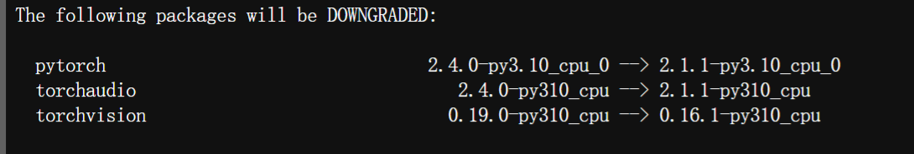

```shell
conda create -n fm-2b python=3.10
conda install pytorch torchvision torchaudio cudatoolkit=11.8 -c pytorch
conda install pytorch==2.1.1 torchvision==0.16.1 torchaudio==2.1.1 pytorch-cuda=11.8 -c pytorch -c nvidia

>>>python
>>> import torch
>>> torch.__version__
>>>exit()

pip install git+https://gh.llkk.cc/https://github.com/thunlp/OpenDelta.git

#wget https://github.com/Dao-AILab/flash-attention/releases/download/v2.6.3/flash_attn-2.6.3+cu118torch2.4cxx11abiFALSE-cp310-cp310-linux_x86_64.whl
#pip install flash_attn-2.6.3+cu118torch2.4cxx11abiFALSE-cp310-cp310-linux_x86_64.whl

wget https://gh.llkk.cc/https://github.com/Dao-AILab/flash-attention/releases/download/v2.4.2/flash_attn-2.4.2+cu118torch2.1cxx11abiFALSE-cp310-cp310-linux_x86_64.whl
pip install 
pip install bmtrain==1.0.0 
pip install einops
pip install pytrie
pip install transformers
pip install matplotlib
pip install h5py
pip install sentencepiece
pip install protobuf==3.20.0 
pip install tensorboard
pip install tensorboardX

git clone https://osredm.com/jiuyuan/CPM-9G-8B.git

python convert_json2index.py \
--path ../data_process/data \ #存放jsonl文件的目录
--language zh \ #只能选择zh（中文）或者en（英文）
--output ../data_process/data_index \ #存放生成的index的目录，与原先存放jsonl文件的目录不能相同
--hdfs_name index  #index文件的文件名
```



