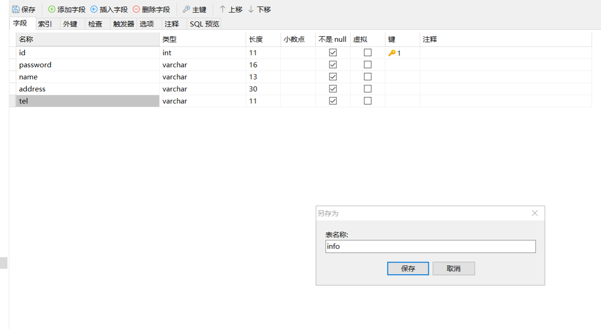

```markdown
# Vue 3 + TypeScript + Vite

pnpm create vite@latest electron-vue
pnpm i
pnpm run dev
pnpm add electron -D    // 添加electron依赖,这一步经常出错，终归问题是网络问题，解决方案如下
pnpm add concurrently

```

## 解决electron安装失败问题
+ 报错信息


可以看出connect timeout ,显示超时

+ 在项目下新建.npmrc文件

```markdown
touch .npmrc
```

+ 添加如下内容

```markdown
# 将pnpm变成扁平化架构，pnpm专用
node-linker=hoisted
# 设置阿里仓库源
registry="https://registry.npmmirror.com"
# 在国内使用pnpm安装electron需要配置一下electron的下载路径
ELECTRON_MIRROR="https://npmmirror.com/mirrors/electron/"
```

+ 安装

```markdown
pnpm add electron -D
```


解决方案来自[https://juejin.cn/post/7263483823773351993](https://juejin.cn/post/7263483823773351993)


```plain
<template>
    <div class="fullscreen">
        <div class="container">
            <div class="first">
                <div class="title">电开</div>
                <div class="desc">关于<span @click="aboutWaiFChat">歪fCHat</span></div>
            </div>
            <div class="second">
                <input placeholder="请输入你的手机号" pattern="\d+" class="tel" name="tel" type="tel">
                <input placeholder="请输入你的密码" pattern="\d+" class="passwd" name="passwd" type="passwd">

                <button>
                    <span>登录</span>
                </button>
                <p>还没有账号？<a href="#" @click.prevent="register">去注册</a></p>
            </div>
        </div>
    </div>
</template>

<style scoped>
.fullscreen {
    position: fixed; /* 固定定位，覆盖整个视口 */
    top: 0;
    left: 0;
    width: 100%;
    height: 100%;
    background-color: #f0f0f0; /* 背景颜色 */
}

.container {
    display: grid; /* 使用 Grid 布局 */
    grid-template-columns: 1fr 1fr; /* 两列 */
    height: 100%; /* 使容器高度为100% */
    align-items: center; /* 垂直居中 */
    justify-items: center; /* 水平居中 */
}

.first {
    position: relative; /* 使伪元素相对于此元素定位 */
    display: flex;
    flex-direction: column;
    align-items: center;
}

.first::before {
    content: '';
    position: absolute;
    top: 40%;
    left: 30%;
    width: 280px;
    height: 100px;
    background: linear-gradient(to right, rgba(255, 0, 150, 0.5), rgba(0, 204, 255, 0.5)); /* 渐变背景 */
    filter: blur(70px); /* 模糊效果 */
    transition: all 0.5s;
    z-index: 1; /* 确保在背景 */
}

.title {
    position: relative; /* 确保文本在伪元素之上 */
    z-index: 2; /* 确保文本在伪元素之上 */
    font-size: 40px;
    font-weight: bold;
    color: var(--login-text-color);
}

.desc {
    position: relative; /* 确保文本在伪元素之上 */
    z-index: 2; /* 确保文本在伪元素之上 */
    font-size: 15px;
    color: var(--login-about-color);
}

/* ... existing code for .second and other styles ... */
</style>
```


想用但是还没有实现的效果，可以加在更新状态中

[Loader by SelfMadeSystem made with CSS | Uiverse.io](https://uiverse.io/SelfMadeSystem/pretty-treefrog-77)

可以加一个电器开发部的动态加载动画

[Button by 0xnihilism made with CSS | Uiverse.io](https://uiverse.io/0xnihilism/quiet-dog-6)

可以加到图标点击中

[Form by AnthonyPreite made with CSS | Uiverse.io](https://uiverse.io/AnthonyPreite/cowardly-cougar-44)

[Form by Smit-Prajapati made with CSS | Uiverse.io](https://uiverse.io/Smit-Prajapati/swift-liger-76)


[Examples - Apache ECharts](https://echarts.apache.org/examples/zh/editor.html?c=line-race)

[Examples - Apache ECharts](https://echarts.apache.org/examples/zh/editor.html?c=bar-animation-delay)

[Examples - Apache ECharts](https://echarts.apache.org/examples/zh/editor.html?c=multiple-y-axis)

[Examples - Apache ECharts](https://echarts.apache.org/examples/zh/editor.html?c=bar-gradient)


测试mysql 数据库

地址: 156.238.247.87  
用户名： root

密码： new_password


```sql
ALTER USER 'root'@'localhost' IDENTIFIED WITH mysql_native_password BY 'root14171417';
```

### 湖北襄阳小喵喵后端数据库
:::info
地址：111.170.163.14

用户名： root

密码： root14171417

:::





```plain
要解决 Register 组件无法显示的问题，可以尝试以下步骤：
确保 formData 正确初始化：
确保 formData 是响应式的，并且在模板中正确使用。你可以在 <script> 部分确认如下代码：
检查模板中的数据绑定：
确保在模板中使用 formData 时，使用 v-model 绑定到 formData.value。例如：
如果你在模板中直接使用 formData，可能会导致问题。
3. 检查异步请求：
确保 register 函数中的 fetch 请求是正确的。你可以在 try 块中添加一些调试信息：
检查控制台错误：
打开浏览器的开发者工具，查看控制台是否有任何错误信息。如果有错误，尝试根据错误信息进行修复。
5. 样式问题：
检查 CSS 样式，确保没有隐藏组件的样式。可以尝试临时移除样式，看看组件是否显示。
6. Vue 版本：
确保你使用的 Vue 版本与代码兼容，某些 API 在不同版本中可能会有所不同。
如果你按照这些步骤检查后仍然无法解决问题，请提供更多的代码或错误信息，以便我能更好地帮助你。
  Register.vue:47  [Vue warn]: Property "formData" was accessed during render but is not defined on instance. 
  at <Register> 
  at <App>      main.ts:9  [Vue warn]: Unhandled error during execution of render function 
  at <Register> 
  at <App>      Register.vue:47  Uncaught TypeError: Cannot read properties of undefined (reading 'name')
    at Proxy._sfc_render ( Register.vue:47:38 )
    at renderComponentRoot ( chunk-COMSXHOL.js?v=6712ba13:8541:17 )
    at ReactiveEffect.componentUpdateFn [as fn] ( chunk-COMSXHOL.js?v=6712ba13:7363:46 )
    at ReactiveEffect.run ( chunk-COMSXHOL.js?v=6712ba13:479:19 )
    at setupRenderEffect ( chunk-COMSXHOL.js?v=6712ba13:7498:5 )
    at mountComponent ( chunk-COMSXHOL.js?v=6712ba13:7273:7 )
    at processComponent ( chunk-COMSXHOL.js?v=6712ba13:7226:9 )
    at patch ( chunk-COMSXHOL.js?v=6712ba13:6742:11 )
    at ReactiveEffect.componentUpdateFn [as fn] ( chunk-COMSXHOL.js?v=6712ba13:7370:11 )
    at ReactiveEffect.run ( chunk-COMSXHOL.js?v=6712ba13:479:19 )

根据你提供的错误信息，问题出在 formData 在组件的渲染过程中未定义。这通常是因为在 Vue 3 中使用 setup 函数时，响应式数据需要通过 return 语句暴露给模板。请按照以下步骤进行修复：
1. 确保在 setup 函数中定义并返回 formData：
确保你的 Register.vue 文件中的 setup 函数如下所示：
在模板中使用 formData：
确保在模板中使用 formData 的方式是正确的，例如：
更新说明：
确保在 setup 函数中定义并返回 formData，这样模板才能访问到它。
在表单提交时，使用 @submit.prevent 来防止默认的表单提交行为。
按照这些步骤进行修改后，重新启动应用程序，检查 Register 组件是否正常显示。如果还有问题，请提供更多的代码或错误信息。
```

> 如果把studentid赋给id的话，那么就超出了int的整数限制了，这里我改成vchar，字符串类型，很方便
>


今日在线时长是是需要通过用户登录之后使用计时器记录之后返回后端数据库，然后从后端数据库请求拿到的，我这里写了一个在线时长添加的api接口，请求 URL:  
GET [http://localhost:666/api/time/add?id=11&date=2024-10-06&daytime=11&hourtime=2069](http://localhost:666/api/time/add?id=11&date=2024-10-06&daytime=11&hourtime=2069)  
这里我解释一下每个字段的含义，id的话就是登陆的时候填写的studentid，date是当天的日期，daytime是此时的时间点，11代表上午11-12这个时间段，hourtime代表这个小时内的在线时长秒数

感谢你提供的详细信息。根据你的描述，你希望在用户登录后使用计时器记录在线时长，并通过 API 将这些数据发送到后端数据库。你已经提供了一个用于添加在线时长的 API 接口。接下来，我将帮助你整合这个功能，包括如何在前端记录在线时长并发送请求到后端。

1. 前端计时器实现  
在用户登录后，你可以在 Login.vue 中实现一个计时器来记录在线时长。以下是一个示例，展示如何在用户登录后开始计时，并在每个小时结束时将数据发送到后端。
2. 代码解释  
在线时长记录：  
使用 onlineDuration 变量来记录用户在线的秒数。  
使用 setInterval 每秒增加 onlineDuration 的值。  
发送在线时长：  
sendOnlineDuration 函数构建请求 URL，并使用 fetch 发送 GET 请求到后端 API。  
每小时调用 sendOnlineDuration，并在发送后重置 onlineDuration。  
组件生命周期管理：  
在组件挂载时开始定时发送在线时长。  
在组件卸载时清理计时器，避免内存泄漏。
3. 后端 API  
你提供的后端 API 代码看起来是正确的，能够处理在线时长的添加请求。确保后端服务正常运行，并能够接收来自前端的请求。
4. 测试功能
5. 启动后端服务，确保 API 可用。  
启动前端应用，登录后检查控制台，确认在线时长是否正确记录并发送到后端。  
在后端数据库中检查 time 表，确认数据是否成功插入。
6. 进一步的改进  
错误处理：可以在发送请求时添加更详细的错误处理，以便更好地调试和处理网络问题。  
用户体验：可以在发送在线时长时添加加载指示器，提升用户体验。  
希望这些信息能帮助你实现在线时长记录功能！如果还有其他问题，请随时告诉我


```markdown
你刚才再Login.vue中使用了计时器来记录时长，请修改Todaytime.vue,这里你直接用写的另一个查看用户时长的接口，请求 URL:
GEThttp://localhost:666/api/time/get?id=1&date=2024-10-06
这里我解释一下字段的含义，id也同样指的是studentid,date是指当天的日期，然后就会返回当天的时间段和时长
[
 {
 "daytime": 0,
 "hourtime": 1079
 },
 {
 "daytime": 11,
 "hourtime": 818
 },
 {
 "daytime": 21,
 "hourtime": 1680
 }
]
然后我需要你使用折线图在Todatime.vue中将当天的每个时段的时长展示出来
好的，我们可以在 TodayTime.vue 中实现一个折线图来展示用户当天的在线时长。我们将使用 echarts 来绘制折线图，并通过你提供的 API 接口获取数据。代码解释
数据获取：
使用 fetchOnlineDuration 函数从后端 API 获取在线时长数据。
通过 studentid 和 date 构建请求 URL。
图表渲染：
使用 renderChart 函数将获取的数据传递给 ECharts。
将 daytime 和 hourtime 分别提取为 x 轴和 y 轴的数据。
使用 echarts.init 初始化图表，并设置图表的配置选项。
3. 生命周期钩子：
在 onMounted 钩子中调用 fetchOnlineDuration 函数获取数据，并渲染图表。
3. 测试功能
1. 确保后端服务正常运行，并能够处理 GET 请求。
启动前端应用，访问 TodayTime.vue 组件，确认折线图能够正确显示当天的在线时长。
2. 进一步的改进
错误处理：可以在图表渲染时添加错误处理，以便在数据获取失败时显示相应的提示。
样式调整：根据需要调整图表的样式和布局，以适应你的应用设计。
希望这些信息能帮助你实现在线时长的展示功能！如果还有其他问题，请随时告诉我。
```


<font style="color:rgb(214, 214, 221);background-color:rgb(33, 33, 33);">用户登录成功之后开启全程计时，我们需要记录的是此用户试用这个软件的具体时间的具体时长，我这里写的接口是http://localhost:666/api/time/add?id=${studentId}&date=${date}&daytime=${daytime}&hourtime=${hourtime}</font>  
<font style="color:rgb(214, 214, 221);background-color:rgb(33, 33, 33);">studentid是登录的时候填写的，可以获取到当成以后的全局变量，date代表现在是日期，daytime代表现在的时间点，比如说11代表11：00-12：00, hourtime代表在daytime这一小时内的在线时长，如果用户退出了软件，则停止计时</font>


### mysql查数据表命令
在MySQL中，可以使用多种命令来查看数据库中的表和表结构。

**查看所有数据库**

<font style="color:rgb(17, 17, 17);background-color:rgb(245, 245, 245);">SHOW DATABASES;</font>

**使用特定数据库**

<font style="color:rgb(27, 106, 199);background-color:rgb(245, 245, 245);">USE</font><font style="color:rgb(17, 17, 17);background-color:rgb(245, 245, 245);"> </font><font style="color:rgb(17, 17, 17);background-color:rgb(245, 245, 245);">databaseName;</font>

**查看当前数据库中的所有表**

<font style="color:rgb(17, 17, 17);background-color:rgb(245, 245, 245);">SHOW TABLES;</font>

**查看特定表的结构**

<font style="color:rgb(17, 17, 17);background-color:rgb(245, 245, 245);">DESCRIBE tableName;</font>

**查看特定表的创建语句**

<font style="color:rgb(17, 17, 17);background-color:rgb(245, 245, 245);">SHOW </font><font style="color:rgb(27, 106, 199);background-color:rgb(245, 245, 245);">CREATE TABLE</font><font style="color:rgb(17, 17, 17);background-color:rgb(245, 245, 245);"> tableName ;</font>

这些命令可以帮助你快速了解数据库中的表及其结构。例如，_**<font style="color:rgb(68, 68, 68);background-color:rgb(249, 249, 249);">SHOW TABLES</font>**_ 命令会列出当前数据库中的所有表，而 _**<font style="color:rgb(68, 68, 68);background-color:rgb(249, 249, 249);">DESCRIBE tableName</font>**_ 命令则会显示特定表的列信息，包括列名、数据类型等。

**示例**

我们有一个名为 _**<font style="color:rgb(68, 68, 68);background-color:rgb(249, 249, 249);">info</font>**_ 的小喵喵数据库，并且想查看其中的所有表和某个特定表的结构：

```plain
C:\Users\respect>mysql -h 111.170.163.14 -u root -p
Enter password: ************
Welcome to the MySQL monitor.  Commands end with ; or \g.
Your MySQL connection id is 94
Server version: 8.0.40-0ubuntu0.22.04.1 (Ubuntu)

Copyright (c) 2000, 2024, Oracle and/or its affiliates.

Oracle is a registered trademark of Oracle Corporation and/or its
affiliates. Other names may be trademarks of their respective
owners.

Type 'help;' or '\h' for help. Type '\c' to clear the current input statement.

mysql> SHOW CREATE TABLE info
    -> ^C
mysql> select * from test;
ERROR 1046 (3D000): No database selected
mysql> select info from test;
ERROR 1046 (3D000): No database selected
mysql> SHOW DATABASES;
+--------------------+
| Database           |
+--------------------+
| information_schema |
| mysql              |
| performance_schema |
| sys                |
| test               |
+--------------------+
5 rows in set (0.04 sec)

mysql> use test;
Database changed
mysql> show tables;
+----------------+
| Tables_in_test |
+----------------+
| info           |
| time           |
+----------------+
2 rows in set (0.06 sec)

mysql> describe info;
+-------------+-------------+------+-----+---------+-------+
| Field       | Type        | Null | Key | Default | Extra |
+-------------+-------------+------+-----+---------+-------+
| id          | varchar(30) | NO   | PRI | NULL    |       |
| name        | varchar(13) | NO   |     | NULL    |       |
| password    | varchar(16) | NO   |     | NULL    |       |
| studentid   | varchar(20) | NO   |     | NULL    |       |
| major       | varchar(30) | NO   |     | NULL    |       |
| tel         | varchar(20) | NO   |     | NULL    |       |
| qq          | varchar(20) | NO   |     | NULL    |       |
| seat-room   | varchar(20) | YES  |     | NULL    |       |
| seat-number | varchar(20) | YES  |     | NULL    |       |
+-------------+-------------+------+-----+---------+-------+
9 rows in set (0.07 sec)

mysql> show create table info;
+-------+------------------------------------------------------------------------------------------------------------------------------------------------------------------------------------------------------------------------------------------------------------------------------------------------------------------------------------------------------------------------------------------------------------------------------------------------------------------------------------------------------------------------------------------------------------------------------------------------------------------------------------------------------------------------------------------------------------------------------------------------------------------------------------------------+
| Table | Create Table


                                                         |
+-------+------------------------------------------------------------------------------------------------------------------------------------------------------------------------------------------------------------------------------------------------------------------------------------------------------------------------------------------------------------------------------------------------------------------------------------------------------------------------------------------------------------------------------------------------------------------------------------------------------------------------------------------------------------------------------------------------------------------------------------------------------------------------------------------------+
| info  | CREATE TABLE `info` (
  `id` varchar(30) COLLATE utf8mb4_general_ci NOT NULL,
  `name` varchar(13) CHARACTER SET utf8mb4 COLLATE utf8mb4_general_ci NOT NULL,
  `password` varchar(16) COLLATE utf8mb4_general_ci NOT NULL,
  `studentid` varchar(20) CHARACTER SET utf8mb4 COLLATE utf8mb4_general_ci NOT NULL,
  `major` varchar(30) COLLATE utf8mb4_general_ci NOT NULL,
  `tel` varchar(20) CHARACTER SET utf8mb4 COLLATE utf8mb4_general_ci NOT NULL,
  `qq` varchar(20) CHARACTER SET utf8mb4 COLLATE utf8mb4_general_ci NOT NULL,
  `seat-room` varchar(20) CHARACTER SET utf8mb4 COLLATE utf8mb4_general_ci DEFAULT NULL,
  `seat-number` varchar(20) COLLATE utf8mb4_general_ci DEFAULT NULL,
  PRIMARY KEY (`id`)
) ENGINE=InnoDB DEFAULT CHARSET=utf8mb4 COLLATE=utf8mb4_general_ci |
+-------+------------------------------------------------------------------------------------------------------------------------------------------------------------------------------------------------------------------------------------------------------------------------------------------------------------------------------------------------------------------------------------------------------------------------------------------------------------------------------------------------------------------------------------------------------------------------------------------------------------------------------------------------------------------------------------------------------------------------------------------------------------------------------------------------+
1 row in set (0.04 sec)

mysql>
```


useOnlineDurationStore.js  2024-11.21晚

```plain
// // src/stores/useOnlineDurationStore.js
// import { defineStore } from 'pinia';

// export const useOnlineDurationStore = defineStore('onlineDuration', {
//   state: () => ({
//     onlineDuration: 0,
//     timer: null
//   }),
//   actions: {
//     startTimer() {
//       if (this.timer) clearInterval(this.timer);
//       this.timer = setInterval(() => {
//         this.onlineDuration += 1;
//         console.log('当前在线时长:', this.onlineDuration);
//       }, 1000);
//     },
//     stopTimer() {
//       if (this.timer) {
//         clearInterval(this.timer);
//         this.timer = null;
//       }
//     },
//     resetTimer() {
//       this.onlineDuration = 0;
//     }
//   }
// });
```


login.vue 2024-11-21晚

```plain
 <template>
    <div class="fullscreen">
        <div class="container">
            <div class="first">
                <div class="title">{{displayedDesc}}</div>
                <div class="desc">关于<span >电器开发部</span></div>
            </div>
            <div class="second">
                <input v-model="studentid" placeholder="请输入你的学号" pattern="\d+" class="studentid" name="studentid" type="text">
                <input v-model="password" placeholder="请输入你的密码" pattern="\d+" class="password" name="password" type="password">

                <button @click="login">
                    <div class="svg-wrapper-1">
                        <div class="svg-wrapper">
                            <svg xmlns="http://www.w3.org/2000/svg" viewBox="0 0 24 24" width="24" height="24">
                                <path fill="none" d="M0 0h24v24H0z"></path>
                                <path fill="currentColor"
                                    d="M1.946 9.315c-.522-.174-.527-.455.01-.634l19.087-6.362c.529-.176.832.12.684.638l-5.454 19.086c-.15.529-.455.547-.679.045L12 14l6-8-8 6-8.054-2.685z">
                                </path>
                            </svg>
                        </div>
                    </div>
                    <span>登录</span>
                </button>
                <p>还没有账号？<a href="#" @click.prevent="register">去注册</a></p>
            </div>
        </div>
    </div>
</template>

<script setup lang="ts">
import { ref, onMounted, onBeforeUnmount } from 'vue';
import { useRouter } from 'vue-router';
import { defineEmits } from 'vue';
import { useOnlineDurationStore } from '../stores/useOnlineDurationStore';

const router = useRouter();
const studentid = ref('');
const password = ref('');
const onlineDurationStore = useOnlineDurationStore();
const emit = defineEmits(['login-success']); // 定义 emit
const displayedDesc = ref(''); // 用于显示的文本
const fullDesc = '电器开发部'; // 完整的描述文本

// 打字机效果函数
const typeWriter = (text, delay) => {
    let index = 0;
    displayedDesc.value = ''; // 清空当前文本

    const type = () => {
        if (index < text.length) {
            displayedDesc.value += text.charAt(index); // 添加下一个字符
            index++;
            setTimeout(type, delay); // 设置延迟
        } else {
            displayedDesc.value = text; // 完成后显示完整文本
        }
    };

    type(); // 开始打字机效果
};

onMounted(() => {
    typeWriter(fullDesc, 400); // 调用打字机效果，设置每个字符的延迟
});

const login = async () => {
  try {
    const response = await fetch('http://localhost:666/list/all');

    if (!response.ok) {
      throw new Error('网络错误');
    }

    const users = await response.json();

    const user = users.find(
      (user: any) => user.studentid === studentid.value && user.password === password.value
    );

    if (user) {
      console.log('登录成功');
      emit('login-success'); // 触发事件
      onlineDurationStore.startTimer();
        router.push('/zy'); // 延迟跳转
    } else {
      alert('学号或密码错误');
      studentid.value = ''; // 清空学号输入框
      password.value = ''; // 清空密码输入框
    }
  } catch (error) {
    console.error('登录失败,请联系管理员:', error);
    studentid.value = ''; // 清空学号输入框
    password.value = ''; // 清空密码输入框
  }
};
</script>

<style scoped>
.fullscreen {
    position: fixed;
    /* 固定定位，覆盖整个视口 */
    top: 0;
    left: 0;
    width: 100%;
    height: 100%;
    background-color: rgba(254, 254, 254, 0.1);
    /* 半透明背景 */
    backdrop-filter: blur(500px);
    /* 毛玻璃效果 */
    -webkit-backdrop-filter: blur(10px);
    /* 兼容性 */
    z-index: 999;
    /* 确保在最上层 */
}

.container {
    display: grid;
    grid-template-columns: 1fr 1fr;
    grid-template-rows: 1fr;
    gap: 0px 0px;
    grid-auto-flow: row;
    grid-template-areas:
        "first second";
    height: 100%;
    /* 使容器高度为100% */
    align-items: center;
    /* 垂直居中 */
    justify-items: center;
    /* 水平居中 */
}

.gradient-box {
    background: linear-gradient(135deg, rgba(255, 0, 150, 0.5), rgba(0, 204, 255, 0.5)); /* 渐变背景 */
    backdrop-filter: blur(10px); /* 毛玻璃效果 */
    -webkit-backdrop-filter: blur(10px); /* 兼容性 */
    border-radius: 16px; /* 圆角 */
    padding: 20px; /* 内边距 */
    text-align: center; /* 文本居中 */
    clip-path: polygon(20% 0%, 100% 0%, 100% 80%, 80% 100%, 0% 100%, 0% 20%); /* 不规则形状 */
}
.first {
    grid-area: first;
    margin-left: -120px;
}

.first::before {
    content: '';
    position: absolute;
    top: 35%;
    left: 7%;
    width: 30vw;
    height: 30vh;
    background: linear-gradient(to right, rgba(255, 0, 150, 1), rgba(0, 204, 255, 1),rgba(65, 20, 159, 0.8)); /* 渐变背景 */
    filter: blur(3em); /* 模糊效果 */
    transition: all 0.5s;
    z-index: 1; /* 确保在背景 */

}

.title {
    position: relative; /* 确保文本在伪元素之上 */
    z-index: 2; /* 确保文本在伪元素之上 */
    font-size: 40px;
    font-weight: bold;
    color: var(--login-text-color);
}
.desc {
    position: relative; /* 确保文本在伪元素之上 */
    z-index: 2; /* 确保文本在伪元素之上 */
    font-size: 19px;
    color: var(--login-about-color);
}
.second {
    grid-area: second;
    display: flex;
    flex-direction: column;
    align-items: center;
    justify-content: space-between;
    margin-left: -100px;
}


/* From www.lingdaima.com */
button {
 font-family: inherit;
 font-size: 20px;
 background: royalblue;
 color: white;
 padding: 0.7em 3em;
 padding-left: 4em;
 display: flex;
 align-items: center;
 border: none;
 border-radius: 16px;
 overflow: hidden;
 transition: all 0.2s;
}

button span {
 display: block;
 margin-left: 0.1em;
 transition: all 0.3s ease-in-out;
}

button svg {
 display: block;
 transform-origin: center center;
 transition: transform 0.3s ease-in-out;
}

button:hover .svg-wrapper {
 animation: fly-1 0.6s ease-in-out infinite alternate;
}

button:hover svg {
 transform: translateX(1.2em) rotate(45deg) scale(1.1);
}

button:hover span {
 transform: translateX(5em);
}

button:active {
 transform: scale(0.95);
}

@keyframes fly-1 {
 from {
  transform: translateY(0.1em);
 }

 to {
  transform: translateY(-0.1em);
 }
}


/* From Uiverse.io by Creatlydev */
.studentid {
    width: 220px;
    padding: 12px;
    border: none;
    border-radius: 10px;
    box-shadow: 2px 2px 7px 0 rgb(0, 0, 0, 0.2);
    outline: none;
    color: dimgray;
    margin-bottom: 20px;
    /* 增加底部外边距来调整距离 */
}

.studentid:invalid {
    animation: justshake 0.3s forwards;
    color: rgb(89, 102, 80);
}

.password {
    width: 220px;
    padding: 12px;
    border: none;
    border-radius: 10px;
    box-shadow: 2px 2px 7px 0 rgb(0, 0, 0, 0.2);
    outline: none;
    color: dimgray;
    margin-bottom: 30px;
}

.password:invalid {
    animation: justshake 0.3s forwards;
    color: rgb(89, 102, 80);
}

@keyframes justshake {
    25% {
        transform: rotate(5deg);
    }

    50% {
        transform: rotate(-5deg);
    }

    75% {
        transform: rotate(5deg);
    }
}

input {
  outline: none; /* 确保没有样式影响输入框 */
  border: 1px solid #ccc; /* 默认边框样式 */
  padding: 8px; /* 内边距 */
  border-radius: 4px; /* 圆角 */
  margin-bottom: 10px; /* 底部外边距 */
}

input:focus {
  border-color: #66afe9; /* 聚焦时的边框颜色 */
  box-shadow: 0 0 5px rgba(102, 175, 233, 0.6); /* 聚焦时的阴影效果 */
}
</style>  


```


```plain
<template>
  <router-view />
</template>

<script setup>
import { onMounted, onBeforeUnmount } from 'vue';
import { useOnlineDurationStore } from './stores/useOnlineDurationStore';

const onlineDurationStore = useOnlineDurationStore();

onMounted(() => {
  onlineDurationStore.startTimer();
});

onBeforeUnmount(() => {
  onlineDurationStore.stopTimer();
});
</script>

<style scoped>
/* 这里可以添加全局样式 */
</style>

```


在使用复合主键 (id, date, daytime) 的情况下，您需要确保在 UPDATE 请求中提供所有这些字段，以唯一标识要更新的记录。虽然 GET 请求通常用于获取数据，但在某些情况下，您可能会使用 GET 请求来更新数据（尽管这不是推荐的做法，因为 GET 请求应该是幂等的且不应改变服务器状态）。  
如果您坚持使用 GET 请求来更新数据，您可以通过 URL 参数传递所有必要的信息。以下是如何构造 GET 请求来调用 update 接口的示例：

1. 确保后端接口支持 GET 请求  
您的 update 方法已经支持通过 URL 参数接收数据：  
time.js

```plain
exports.update = (req, res) => {        //通过id、date和daytime更新数据
    var sql = 'UPDATE time SET hourtime = ? WHERE id = ? AND date = ? AND daytime = ?'
    db.query(sql, [req.query.hourtime, req.query.id, req.query.date, req.query.daytime], (err, data) => {
        if (err) {
            return res.send('错误：' + err.message)
        }
        if (data.changedRows > 0) {
            res.send({
                status: 200,
                message: 'success',
                data: {
                    id: req.query.id,
                    date: req.query.date,
                    daytime: req.query.daytime,
                    hourtime: req.query.hourtime
                }
            })
        } else {
            res.send({
                status: 202,
                message: 'error'
            })
        }
    })
}
```

2. 构造 GET 请求  
您可以通过以下方式构造 GET 请求来更新数据：
3. 注意事项  
安全性：使用 GET 请求来更新数据可能会带来安全问题，因为 URL 参数可能会被缓存或记录在日志中。通常，POST 或 PUT 请求更适合用于更新操作。  
幂等性：GET 请求通常被认为是幂等的，即多次相同的请求应产生相同的结果而不改变服务器状态。使用 GET 来更新数据违反了这一原则。  
数据长度限制：URL 的长度是有限的，过长的参数可能会导致请求失败。
4. 推荐的做法  
尽管可以使用 GET 请求来更新数据，但更推荐使用 POST 或 PUT 请求来进行更新操作。以下是如何使用 POST 请求来更新数据的示例：  
修改后端接口以支持 POST 请求

```plain

使用 POST 请求
exports.update = (req, res) => {        //通过id、date和daytime更新数据
    const { id, date, daytime, hourtime } = req.body;
    var sql = 'UPDATE time SET hourtime = ? WHERE id = ? AND date = ? AND daytime = ?';
    db.query(sql, [hourtime, id, date, daytime], (err, data) => {
        if (err) {
            return res.send('错误：' + err.message);
        }
        if (data.changedRows > 0) {
            res.send({
                status: 200,
                message: 'success',
                data: {
                    id,
                    date,
                    daytime,
                    hourtime
                }
            });
        } else {
            res.send({
                status: 202,
                message: 'error'
            });
        }
    });
}
```

5. 更新路由配置  
确保在 server/router.js 中配置了相应的路由：  
router.js  
通过使用 POST 请求，您可以更安全和符合 RESTful 风格地进行数据更新操作。


# 计时逻辑与流程
**改动说明**：

+ **确保路由配置正确**：POST 请求的路由已经正确配置，如 /api/time/update 和 /api/time/record。

### 4. 工作流程梳理
以下是优化后的在线计时与数据发送的工作流程：

+ **用户登录**：
+ 用户在 Login.vue 输入学号和密码，点击登录按钮。
+ 前端发送 GET 请求到后端获取用户信息并进行验证。
+ 登录成功后，前端将 studentId 保存到 Pinia Store 和本地存储，并启动计时器。
+ **启动计时器**：
+ 在 useOnlineDurationStore.js 中，startTimer 方法启动两个计时器：
+ **计时器1**：每秒递增 onlineDuration，记录总在线时长（秒）。
+ **计时器2**：每1分钟检查当前日期和时段（小时数），并发送在线时长数据：
+ 获取当前 date（格式：YYYY-MM-DD）和 daytime（0-23）。
+ 如果当前的 date 或 daytime 与上次发送的不一致，进行数据发送。
+ 发送数据后，重置 onlineDuration 为0。
+ **数据发送**：
+ 前端通过 POST 请求发送包含 id、date、daytime 和 hourtime 的数据到后端 /api/time/update 接口。
+ 后端接收到请求后，通过复合主键 (id, date, daytime) 更新 hourtime。
+ **计时器停止**：
+ 当用户退出应用或关闭页面时，App.vue 中的 stopTimerOnExit 方法停止所有计时器，确保资源释放。

### 5. 验证与测试
**步骤**：

+ **启动后端服务器**：
+ 确保后端服务器在运行，并监听 http://localhost:666。
+ **登录并启动计时器**：
+ 登录后，计时器应启动，每秒递增 onlineDuration。
+ 每1分钟应发送一次包含当前 date 和 daytime 的 hourtime 数据。
+ **观察日志**：
+ 控制台应显示如下日志：

<font style="color:rgb(214, 214, 221);">     设置 studentId: 1</font>

<font style="color:rgb(214, 214, 221);">     启动计时器</font>

<font style="color:rgb(214, 214, 221);">     当前在线时长（秒）: 1</font>

<font style="color:rgb(214, 214, 221);">     ...</font>

<font style="color:rgb(214, 214, 221);">     准备发送数据: { date: '2024-11-21', daytime: 0, </font><font style="color:rgb(214, 214, 221);">hourtime: 1 }</font>

<font style="color:rgb(214, 214, 221);">     在线时长已发送: { id: 1, date: '2024-11-21', </font><font style="color:rgb(214, 214, 221);">daytime: 0, hourtime: 1 }</font>

+ **验证数据库**：
+ 登录后，数据库中的 time 表应有对应记录。
+ 每次发送 UPDATE 请求后，相应记录的 hourtime 应更新。
+ **处理跨日和跨时段**：
+ 保持在线状态跨越一天或跨越小时数（如从23点到0点），确保新的 date 和 daytime 正确记录，并在切换时段时发送正确的数据。

### 6. 进一步优化与建议
+ **错误处理与重试机制**：
+ 增强错误处理，例如在发送失败时进行重试，或将失败的数据缓存在本地以便后续重试。
+ **数据累加**：
+ 当前方案每次发送后重置 onlineDuration，如果需要累加总在线时长，可以考虑不重置，或者在数据库中维护一个总计字段。
+ **用户退出时发送最后的数据**：
+ 在用户退出或关闭页面时，确保发送当前的在线时长数据，以防止数据丢失。
+ **优化**** ****recordTime**** ****方法**：
+ 根据实际需求，可能需要优化 recordTime 方法，确保数据的准确性和完整性。

### 7. 完整性检查
确保以下文件和逻辑已正确实现，并进行全面测试：

+ **useOnlineDurationStore.js**：
+ 正确设置和获取 studentId。
+ 计时器逻辑正确，能够动态更新 date 和 daytime。
+ 数据发送逻辑正确，避免主键重复错误。
+ **Login.vue**：
+ 登录成功后，能够正确设置 studentId 并启动计时器。
+ 不再有停止计时器的逻辑，确保页面跳转后计时器持续运行。
+ **App.vue**：
+ 应用加载时能从本地存储中获取 studentId 并启动计时器。
+ 应用卸载时能正确停止计时器。
+ **后端**** ****time.js**：
+ update 方法通过复合主键 (id, date, daytime) 正确更新 hourtime。
+ recordTime 方法能够动态获取 daytime 并避免主键重复错误。
+ **路由配置**：
+ 确保后端路由正确配置，支持 POST 请求的 /api/time/update 和 /api/time/record 接口。

## 总结
通过上述改进，您的计时方案能够动态记录并更新用户的在线时长，避免主键重复错误，并符合 RESTful 设计规范。以下是关键要点的总结：

+ **动态获取日期和时段**：确保在每次发送数据时，实时获取当前的 date 和 daytime，避免因时间变化导致的数据错误。
+ **使用合适的请求方法**：采用 POST 请求进行数据更新，提升安全性和符合规范。
+ **统一计时器管理**：将计时器的启动和停止逻辑集中在一个地方，避免逻辑混乱和资源泄漏。
+ **优化发送间隔**：根据实际需求调整数据发送的间隔，确保数据的准确性和及时性。
+ **增强错误处理**：完善错误处理机制，确保在网络或服务器出现问题时能继续正常运行或进行必要的重试。

希望这些建议和优化能够帮助您完善在线计时功能，实现稳定、准确的数据记录。如果在实施过程中遇到其他问题，欢迎继续咨询！


## 流程梳理
### 1. 用户登录
+ 用户在 Login.vue 输入学号和密码，点击登录按钮。
+ 前端发送 GET 请求到后端 /list/all 获取所有用户数据并进行验证。
+ 登录成功后，前端将 studentId 保存到 Pinia Store 和本地存储，并启动计时器。

### 2. 启动计时器
在 useOnlineDurationStore.js 中，startTimer 方法执行以下操作：

+ **启动在线时长计时器**：
+ 每秒递增 onlineDuration，记录总在线时长（秒）。
+ **启动数据发送计时器**：
+ 每分钟检查当前日期和时段。
+ 计算 hourtime（在线时长的分钟数）。
+ 通过 POST 请求将 id, date, hourtime 发送到后端 /api/time/record。
+ 成功后重置 onlineDuration 为0。

### 3. 数据发送
前端通过 recordTime 方法发送数据，后端执行 INSERT ... ON DUPLICATE KEY UPDATE，确保数据的插入或更新。

### 4. 计时器停止
当用户退出应用或关闭页面时，App.vue 中的 stopTimerOnExit 方法将停止所有计时器，确保资源释放。

## 验证与测试
+ **启动后端服务器**：
+ 确保后端服务器在运行，并监听 http://localhost:666。
+ **登录并启动计时器**：
+ 登录后，计时器应启动，每秒递增 onlineDuration。
+ 每分钟应发送一次包含当前 date 和 hourtime 的数据。
+ **观察日志**：
+ 控制台应显示：

<font style="color:rgb(214, 214, 221);">     设置 studentId: 1</font>

<font style="color:rgb(214, 214, 221);">     启动计时器</font>

<font style="color:rgb(214, 214, 221);">     当前在线时长（秒）: 1</font>

<font style="color:rgb(214, 214, 221);">     ...</font>

<font style="color:rgb(214, 214, 221);">     准备发送数据: { date: '2024-11-21', hourtime: 1 }</font>

<font style="color:rgb(214, 214, 221);">     在线时长已发送: 时间记录成功</font>

+ **验证数据库**：
+ 登录后，数据库中的 time 表应有对应记录。
+ 每次发送 recordTime 请求后，相应记录的 hourtime 应更新或插入新记录。
+ **处理跨日和跨时段**：
+ 保持在线状态跨越一天或跨越小时数（如从23点到0点），确保新的 date 和 daytime 正确记录，并在切换时段时发送正确的数据。

## 进一步优化与建议
+ **错误处理与重试机制**：
+ 增强错误处理，例如在发送失败时进行重试，或将失败的数据缓存在本地以便后续重试。
+ **记录总在线时长**：
+ 如果需要记录累计的总在线时长，可以在数据库中维护一个总计字段，或者在前端累加并定期发送。
+ **用户退出时发送最后的数据**：
+ 在用户退出或关闭页面时，确保发送当前的在线时长数据，以防止数据丢失。
+ **优化**** ****recordTime**** ****方法**：
+ 根据实际需求，可能需要优化 recordTime 方法，确保数据的准确性和完整性。例如，避免在极短时间内重复发送数据。

## 总结
通过将前端的时间记录逻辑统一为使用 recordTime 方法，您可以确保在任何情况下（记录存在或不存在）都能够正确地记录在线时长，避免主键重复错误。同时，遵循 RESTful 设计规范，使用 POST 请求进行数据更新，提高了系统的安全性和健壮性。

如果在实施过程中遇到其他问题，欢迎继续咨询！

Add context

  


当前在线时长（秒）: 27

 当前在线时长（秒）: 28

 当前在线时长（秒）: 29

 准备发送数据: {date: '2024-11-21', hourtime: 0}

useOnlineDurationStore.js:100 在线时长已发送: success

 当前在线时长（秒）: 1

 准备发送数据: {date: '2024-11-21', hourtime: 0}

useOnlineDurationStore.js:100 在线时长已发送: success

 当前在线时长（秒）: 1

 准备发送数据: {date: '2024-11-21', hourtime: 0}

useOnlineDurationStore.js:100 在线时长已发送: success

 当前在线时长（秒）: 1

 准备发送数据: {date: '2024-11-21', hourtime: 0}

useOnlineDurationStore.js:100 在线时长已发送: success

 当前在线时长（秒）: 1

 准备发送数据: {date: '2024-11-21', hourtime: 0}

useOnlineDurationStore.js:100 在线时长已发送: success

 当前在线时长（秒）: 1

 准备发送数据: {date: '2024-11-21', hourtime: 0}date: "2024-11-21"hourtime: 0[[Prototype]]: Objectconstructor: ƒ Object()hasOwnProperty: ƒ hasOwnProperty()isPrototypeOf: ƒ isPrototypeOf()propertyIsEnumerable: ƒ propertyIsEnumerable()toLocaleString: ƒ toLocaleString()toString: ƒ toString()valueOf: ƒ valueOf()__defineGetter__: ƒ __defineGetter__()__defineSetter__: ƒ __defineSetter__()__lookupGetter__: ƒ __lookupGetter__()__lookupSetter__: ƒ __lookupSetter__()__proto__: (...)get __proto__: ƒ __proto__()set __proto__: ƒ __proto__()

useOnlineDurationStore.js:100 在线时长已发送: success

 当前在线时长（秒）: 1

 当前在线时长（秒）: 2

 当前在线时长（秒）: 3

  
确保 `daytime` 字段由后端动态获取，并且数据库操作成功。

## 总结
通过上述步骤，您可以：

1. **防止 **`sendTimer`** 多次启动**：确保 `startTimer` 只调用一次，避免多个 `sendTimer` 同时运行。
2. **优化数据发送逻辑**：只有在线时长达到60秒时才发送数据，避免发送`hourtime`为0的数据。
3. **增强日志记录**：通过增加详细日志，帮助快速定位问题。
4. **确保后端接口正确处理请求**：确保 `recordTime` 接口仅接收必要字段，并正确处理 `daytime` 字段。

如果问题依旧存在，请检查以下内容：

+ **前端是否有其他地方调用 **`startTimer`：确保 `startTimer` 只在必要时调用。
+ **后端表结构是否正确**：确认 `time` 表的复合主键 `(id, date, daytime)` 已正确设置。
+ **网络延迟或请求失败是否影响数据发送**：确保网络稳定，发送请求不被中断。

希望这些建议能帮助您解决问题。如果还有其他疑问或需要进一步的帮助，欢迎继续讨论！


采用每分钟计时，不会漏加


  const date = now.toISOString().split('T')[0]; // 格式: YYYY-MM-DD


```javascript
// // src/stores/useOnlineDurationStore.js
// import { defineStore } from 'pinia';

// export const useOnlineDurationStore = defineStore('onlineDuration', {
//   state: () => ({
//     onlineDuration: 0,
//     timer: null
//   }),
//   actions: {
//     startTimer() {
//       if (this.timer) clearInterval(this.timer);
//       this.timer = setInterval(() => {
//         this.onlineDuration += 1;
//         console.log('当前在线时长:', this.onlineDuration);
//       }, 1000);
//     },
//     stopTimer() {
//       if (this.timer) {
//         clearInterval(this.timer);
//         this.timer = null;
//       }
//     },
//     resetTimer() {
//       this.onlineDuration = 0;
//     }
//   }
// });


// src/stores/useOnlineDurationStore.js
import { defineStore } from 'pinia';

export const useOnlineDurationStore = defineStore('onlineDuration', {
  state: () => ({
    onlineDuration: 0, // 总在线时长（秒）
    timer: null,
    sendTimer: null, // 用于定期发送数据的计时器
    studentId: '', // 全局用户ID
  }),
  actions: {
    setStudentId(id) {
      this.studentId = id;
      console.log('设置 studentId:', id); // 添加日志
    },
    startTimer() {
      if (this.timer || this.sendTimer) {
        console.log('计时器已在运行中');
        return;
      }

      if (!this.studentId) {
        console.error('studentId 未设置，无法启动计时器');
        return;
      }

      console.log('启动计时器');

      // 每秒增加在线时长
      this.timer = setInterval(() => {
        this.onlineDuration += 1;
        console.log('当前在线时长（秒）:', this.onlineDuration);
      }, 1000);

      // 每1分钟发送一次数据
      this.sendTimer = setInterval(async () => {
        if (this.onlineDuration < 60) {
          console.log('在线时长不足60秒，不发送数据');
          return;
        }

        const now = new Date();
        const year = now.getFullYear();
        const month = String(now.getMonth() + 1).padStart(2, '0'); // 月份从0开始，需要加1
        const day = String(now.getDate()).padStart(2, '0');
        const date = `${year}-${month}-${day}`; // 格式: YYYY-MM-DD

        const hourtime = Math.floor(this.onlineDuration / 60); // 将秒转换为分钟

        if (hourtime > 0) {
          console.log('准备发送数据:', { date, hourtime });

          try {
            const response = await fetch('http://localhost:666/api/time/record', {
              method: 'POST',
              headers: {
                'Content-Type': 'application/json'
              },
              body: JSON.stringify({
                id: this.studentId,
                date: date,
                hourtime: hourtime
              })
            });

            // 处理非 JSON 响应
            const contentType = response.headers.get('content-type');
            let data;
            if (contentType && contentType.includes('application/json')) {
              data = await response.json();
            } else {
              const text = await response.text();
              throw new SyntaxError(`无效的 JSON 响应: ${text}`);
            }

            if (data.status === 200) {
              console.log('在线时长已发送:', data.message);
              this.onlineDuration = 0; // 重置在线时长
            } else {
              console.error('更新失败:', data.message);
            }
          } catch (error) {
            console.error('发送在线时长失败:', error);
          }
        } else {
          console.log('计算后的 hourtime 为 0，不发送数据');
        }
      }, 60000); // 60000 毫秒 = 1 分钟
    },
    stopTimer() {
      console.log('停止计时器');
      if (this.timer) {
        clearInterval(this.timer);
        this.timer = null;
      }
      if (this.sendTimer) {
        clearInterval(this.sendTimer);
        this.sendTimer = null;
      }
    },
    resetTimer() {
      this.onlineDuration = 0;
      console.log('重置在线时长');
    }
  }
});
```


服了老六，有这好东西不早拿出来

[跳转提示-稀土掘金](https://link.juejin.cn/?target=https%3A%2F%2Fgithub.com%2FXutaotaotao%2Felectron-prokit%3Fmode%3Ddark)


[.git.zip](https://www.yuque.com/attachments/yuque/0/2024/zip/40770342/1732442915835-21d2b89d-9b54-4a24-bebb-feee440101a3.zip)

/[努力鸭-1.0.0-Setup.zip](https://www.yuque.com/attachments/yuque/0/2024/zip/40770342/1732632351663-bc1d1653-eafc-4245-9365-5a9fd226e1ad.zip)


[electron-vite | 下一代 Electron 开发构建工具](https://cn.electron-vite.org/)

[Electron⚡️Vite | Electron⚡️Vite](https://electron-vite.github.io/)

