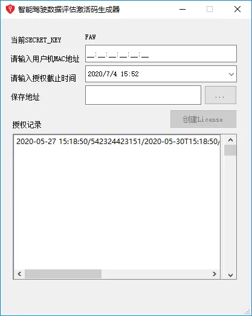
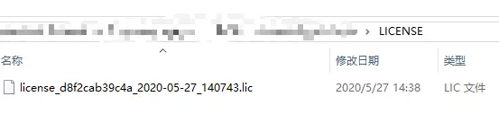

## [python实战开发]软件许可证License文件生成


0.0742020.07.04 15:57:35字数 1,019阅读 3,150

## 软件许可证文件生成软件
> 在写好软件以后，往往需要将软件打包发送给用户进行使用。但是若只希望给特定的用户进行使用，那么就需要将软件设置License（许可证）。本篇文章就来提供一种生成license文件的思路。
>



激活码生成器

## 1、前言
软件开发商完成一个软件的模块，希望交付给用户进行使用。软件开发商一般是希望只授权给某些用户使用，而不希望软件被其他未授权用户进行使用。因此需要开发一个软件授权的机制。  
当用户安装或者第一次使用软件的时候，软件是没有被授权的。当用户希望将软件绑定到某一台特定的计算机进行使用时，需要将目标计算机的MAC地址告知软件开发商，收到开发商的授权以后就能正常使用软件了。  
软件开发商收到授权请求时，获得软件安装的目标计算机的MAC地址。通过一套绑定mac地址的算法，生成了一个license，并且具有license失效的时间。生成的license同软件中内置的同一套算法生成的信息进行比对，如果比对上，那么授权成功。如果比对不上或者授权过期，那么授权失败。

## 2、软件License的实现办法
[暂无]

## 3、使用PyQt5开发
### 3.1 框架
1、获取目标计算机的mac地址  
2、设置license过期的时间  
3、对mac和授权时间进行加密

### 3.2 算法
算法的核心就是，对mac地址进行hash计算。为了增加生成的license文件的困难度，在mac地址之前再加上一个特定的字符，让该license生成软件的破解难度可以稍微提高。例如在这里的示例代码中，特定字符暂定为`first_key`。

> Hash算法的特点是，HASH的设计以无法解为目的；简单说来就是正向简单，逆向困难。
>

```plain
#1、得到密钥，通过hash算法计算目标计算机的mac地址
        psw = hash_msg('first_key' + str(self.mac_addr))
#2、新建一个license_str 的字典，用于保存真实的mac地址，license失效时间，加密后的字符串
        license_str = {}
        license_str['mac'] = self.mac_addr
        license_str['time_str'] = self.active_date
        license_str['psw'] = psw
```

生成的lincense_str作为一个字典，写入license文件中，是可以很直接地看出其组成。  
因此为了更进一步加密，保证写入license文件中地信息是无序且无意义地字符串，采用AEScoder进行加密

```plain
from AEScoder import PrpCrypt
        pc = PrpCrypt('keyskeyskeyskeys')  # 初始化密钥
        s_encrypt = pc.encrypt(str(license_str()))   # <class 'bytes'>
```

AES只有一个密钥，这个密钥既用来加密，也用于解密。例如在上面地示例代码中，采用了`keyskeyskeyskeys`作为密钥。该密钥在license生成软件中作为加密密钥，同时在使用license地软件中作为解密密钥。

```plain
from AEScoder import PrpCrypt
        pc = PrpCrypt('keyskeyskeyskeys')  # 初始化密钥
        d = pc.decrypt(s_encrypt)  # 解密
```

将生成的license文件保存到特定的文件中，即完成了license的生成。

```plain
# file_path即保存的文件路径
# mac_str 是目标计算机的mac地址字符串
# time_str 是授权目标计算机的使用时间，可以认为是license文件的失效时间
        file_path = self.file_path + '/license_'+ mac_str + '_' + time_str + '.lic'
        s_encrypt = str(s_encrypt, encoding = "utf-8")   #  bytes to str
        with open(file_path, 'w', encoding='utf-8') as lic:
            lic.write(str(s_encrypt))
            lic.close()
```

### 3.3 代码实现
### 利用Hash算法对一段字符进行运算
python中实现对一段字符的运算时比较简单的，如下提供了一个示例代码。

```plain
import hashlib
def hash_msg(msg):
    sha256 = hashlib.sha256()
    sha256.update(msg.encode('utf-8'))
    res = sha256.hexdigest()
    return res
```

### 获取本机的mac地址
```plain
def get_mac_address():
    mac = uuid.UUID(int = uuid.getnode()).hex[-12:]
    return ":".join([mac[e:e+2] for e in range(0,11,2)])
```

### pyqt5实现界面
```plain
class MainWindow(QMainWindow):
    def __init__(self):
        QMainWindow.__init__(self)
        loadUi("Generator.ui", self)
        self.resize(405,480)
        self.setMinimumSize(QtCore.QSize(415,490))
        self.setMaximumSize(QtCore.QSize(415,490))
        self.setWindowTitle('******软件激活码生成器')
        self.setWindowIcon(QIcon('admin.ico'))
if __name__ == "__main__":
    app = QApplication(sys.argv)
    window = MainWindow()
    window.show()
    sys.exit(app.exec_())
```

### 生成的license文件的字符串


licensence文件

```plain
665dbda2a88fc8694d0df10e120236fd481087bd3e4d02c86f36ecba5d10eec24f5f0f5c8afb24cd8ee10c72df3c1d567a796c03a5095be96fdd1438e8121f0d780e6fc00784a1be9788661a7b18ed6e73e2ec337b251ede0f0be8f7287e63f0c69f202550dd45db55b62da9c886ba9da25165a6dd253ea9efe5a29e9637941c0d0a0b1cc1c6f01225e6f61eaf520f24
```

如果您感兴趣，可以通过以上算法生成激活码。

## 4、程序打包
使用PyInstaller将license文件生成软件进行打包  
一般常规的打包代码是：

```plain
python -m PyInstaller -F license_generator.py
```

如果想要给软件增加一个好看的图标，可以在打包的代码中加上打包图标的参数。

```plain
python -m PyInstaller -F license_generator.py -i icon.ico
```

在使用pyinstaller模块对pyqt5的程序进行打包的时候往往需要增加几行代码，用于指定其路径。

```plain
def app_path():
    """Returns the base application path."""
    if hasattr(sys, 'frozen'):
        # Handles PyInstaller
        return os.path.dirname(sys.executable) # 使用pyinstaller打包后的exe目录
    return os.path.dirname(__file__) # 没打包前的py目录

PROJECT_PATH = app_path()
```

## 5、结尾
1、该方法仅提供一种思路，即对mac地址和实效时间进行加密，生成字符。  
2、如果需要提供源代码进行调试，或者代为开发请联系。

最后编辑于 

：2020.07.04 16:09:29

更多精彩内容，就在简书APP


"谢谢亲的赞赏哦~"

还没有人赞赏，支持一下


+ 序言：七十年代末，一起剥皮案震惊了整个滨河市，随后出现的几起案子，更是在滨河造成了极大的恐慌，老刑警刘岩，带你破解...

[沈念sama](https://www.jianshu.com/u/dcd395522934)阅读 206,214评论 6赞 481

+ 序言：滨河连续发生了三起死亡事件，死亡现场离奇诡异，居然都是意外死亡，警方通过查阅死者的电脑和手机，发现死者居然都...
+ 文/潘晓璐 我一进店门，熙熙楼的掌柜王于贵愁眉苦脸地迎上来，“玉大人，你说我怎么就摊上这事。” “怎么了？”我有些...
+ 文/不坏的土叔 我叫张陵，是天一观的道长。 经常有香客问我，道长，这世上最难降的妖魔是什么？ 我笑而不...
+ 正文 为了忘掉前任，我火速办了婚礼，结果婚礼上，老公的妹妹穿的比我还像新娘。我一直安慰自己，他们只是感情好，可当我...

[茶点故事](https://www.jianshu.com/u/0f438ff0a55f)阅读 64,224评论 5赞 371

+ 文/花漫 我一把揭开白布。 她就那样静静地躺着，像睡着了一般。 火红的嫁衣衬着肌肤如雪。 梳的纹丝不乱的头发上，一...
+ 那天，我揣着相机与录音，去河边找鬼。 笑死，一个胖子当着我的面吹牛，可吹牛的内容都是我干的。 我是一名探鬼主播，决...
+ 文/苍兰香墨 我猛地睁开眼，长吁一口气：“原来是场噩梦啊……” “哼！你这毒妇竟也来了？” 一声冷哼从身侧响起，我...
+ 序言：老挝万荣一对情侣失踪，失踪者是张志新（化名）和其女友刘颖，没想到半个月后，有当地人在树林里发现了一具尸体，经...
+ 正文 独居荒郊野岭守林人离奇死亡，尸身上长有42处带血的脓包…… 初始之章·张勋 以下内容为张勋视角 年9月15日...

[茶点故事](https://www.jianshu.com/u/0f438ff0a55f)阅读 35,925评论 2赞 323

+ 正文 我和宋清朗相恋三年，在试婚纱的时候发现自己被绿了。 大学时的朋友给我发了我未婚夫和他白月光在一起吃饭的照片。...

[茶点故事](https://www.jianshu.com/u/0f438ff0a55f)阅读 38,018评论 1赞 333

+ 序言：一个原本活蹦乱跳的男人离奇死亡，死状恐怖，灵堂内的尸体忽然破棺而出，到底是诈尸还是另有隐情，我是刑警宁泽，带...
+ 正文 年R本政府宣布，位于F岛的核电站，受9级特大地震影响，放射性物质发生泄漏。R本人自食恶果不足惜，却给世界环境...

[茶点故事](https://www.jianshu.com/u/0f438ff0a55f)阅读 39,234评论 3赞 307

+ 文/蒙蒙 一、第九天 我趴在偏房一处隐蔽的房顶上张望。 院中可真热闹，春花似锦、人声如沸。这庄子的主人今日做“春日...
+ 文/苍兰香墨 我抬头看了看天上的太阳。三九已至，却和暖如春，着一层夹袄步出监牢的瞬间，已是汗流浃背。 一阵脚步声响...
+ 我被黑心中介骗来泰国打工， 没想到刚下飞机就差点儿被人妖公主榨干…… 1. 我叫王不留，地道东北人。 一个月前我还...
+ 正文 我出身青楼，却偏偏与公主长得像，于是被迫代替她去往敌国和亲。 传闻我的和亲对象是个残疾皇子，可洞房花烛夜当晚...

[茶点故事](https://www.jianshu.com/u/0f438ff0a55f)阅读 42,762评论 2赞 345

### 被以下专题收入，发现更多相似内容
  


> 来自: [[python实战开发]软件许可证License文件生成 - 简书](https://www.jianshu.com/p/9e5d35b14e04)
>

