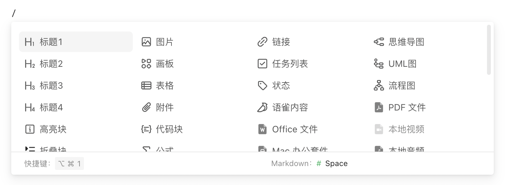
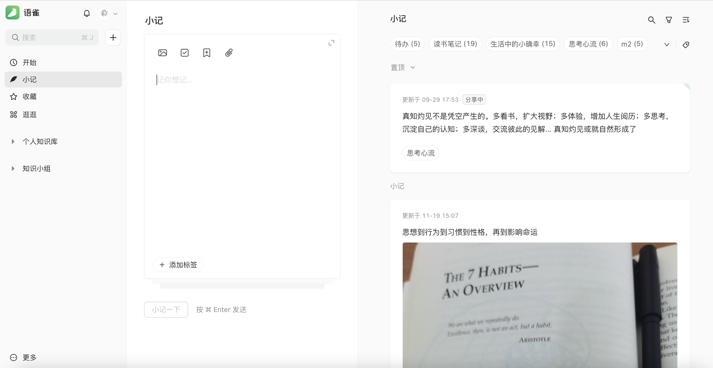

Hi，欢迎来到语雀～

语雀文档是一个给个人和团队提供的写好文档的工具，我们希望每个人都可以快速、舒适的记录自己的所思所想，为此，语雀的文档编辑器提供了强大的能力。

# 📝 文档
+ 支持多人协同

语雀文档支持多人同时编辑一篇文档。

+ 丰富的文本样式

支持 **粗体**、_斜体_、<u>下划线</u>、~~删除线~~、<sup>上标</sup>、<sub>下标</sub>、`代码`、<font style="color:#F759AB;">高亮</font><font style="background-color:#FFFB8F;">颜色</font> 等文本样式

+ 丰富的插入方式

支持插入**图片、表格、画板、公式、代码、思维导图、流程图、本地文件、高亮块、分栏、折叠块**等内容**。**

通过左上角加号面板，内容输入区斜杠面板`/`<font style="background-color:rgba(0, 0, 0, 0);">，可以找到所有语雀的特色卡片。</font>

+ 通过粘贴链接、@提及人或内容，`/语雀内容`，可以构建基于文档的知识网络

## 一、常用内容


在语雀文档中，你可以轻松的插入一些常用的内容格式，除了通过顶部编辑工具栏插入以外，我们也支持快捷键、`/`斜杠插入和 Markdown 语法快速插入。

> 这是一段**引用**。
>

<details class="lake-collapse"><summary id="u134023f4"><span class="ne-text">这段内容可以被折叠</span></summary><p id="uc69a14b9" class="ne-p"><span class="ne-text">折叠内容</span></p><p id="u9602257d" class="ne-p"><span class="ne-text">折叠内容</span></p></details>
+ 无序列表
    - 按下`tab键`增加缩进
1. 有序列表
    1. 按下`tab键`增加缩进

记录任务列表

- [ ] 未完成的任务
- [x] 已完成的任务

---

## 二、特色卡片
<font style="background-color:rgba(0, 0, 0, 0);">「卡片」是语雀最有特色的功能，你可以通过「卡片」，在文档中插入图片、表格、附件、日历、代码块、LaTex公式、思维导图、流程图等等等等，此处例举几个特色卡片。</font>

<font style="background-color:rgba(0, 0, 0, 0);">你可以在左上角的加号面板</font><font style="background-color:rgba(0, 0, 0, 0);"> 和内容输入区的斜杠面板</font>`<font style="background-color:rgba(0, 0, 0, 0);">/</font>`<font style="background-color:rgba(0, 0, 0, 0);">中找到和插入所有语雀的特色卡片，详情见</font>

[插入特色卡片](https://www.yuque.com/yuque/gpvawt/fq1pad)

|  |  |
| --- | --- |


### 1、图示万物：画板
支持在文档内新增画板，并在画板中自由绘制思维导图/流程图等。


快速绘制简洁优雅的流程图，支持快速设置样式和排列。


### 2、缤纷布局
支持直接插入不同颜色的**高亮块**

:::color2
绿色高亮块


:::

:::info
蓝色高亮块


:::

:::warning
黄色高亮块


:::

支持插入**折叠块**：

<details class="lake-collapse"><summary id="u662e2344"><span class="ne-text">折叠块</span></summary><p id="u84b56981" class="ne-p"><span class="ne-text">输入一些会被折叠的内容</span></p></details>


### 3、程序员专区：代码块和公式
支持插入代码块，同时支持多种颜色主题：

```javascript
export default class QuickSort extends Sort {
  sort(originalArray) {
    const array = [...originalArray];

    if (array.length <= 1) {
      return array;
    }

    // Init left and right arrays.
    const leftArray = [];
    const rightArray = [];

    // Take the first element of array as a pivot.
    const pivotElement = array.shift();
    const centerArray = [pivotElement];

    // Split all array elements between left, center and right arrays.
    while (array.length) {
      const currentElement = array.shift();

      // Call visiting callback.
      this.callbacks.visitingCallback(currentElement);

      if (this.comparator.equal(currentElement, pivotElement)) {
        centerArray.push(currentElement);
      } else if (this.comparator.lessThan(currentElement, pivotElement)) {
        leftArray.push(currentElement);
      } else {
        rightArray.push(currentElement);
      }
    }
    // Sort left and right arrays.
    const leftArraySorted = this.sort(leftArray);
    const rightArraySorted = this.sort(rightArray);

    return leftArraySorted.concat(centerArray, rightArraySorted);
  }
}
```

```javascript
export default class QuickSort extends Sort {
  sort(originalArray) {
    const array = [...originalArray];

    if (array.length <= 1) {
      return array;
    }

    // Init left and right arrays.
    const leftArray = [];
    const rightArray = [];

    // Take the first element of array as a pivot.
    const pivotElement = array.shift();
    const centerArray = [pivotElement];

    // Split all array elements between left, center and right arrays.
    while (array.length) {
      const currentElement = array.shift();

      // Call visiting callback.
      this.callbacks.visitingCallback(currentElement);

      if (this.comparator.equal(currentElement, pivotElement)) {
        centerArray.push(currentElement);
      } else if (this.comparator.lessThan(currentElement, pivotElement)) {
        leftArray.push(currentElement);
      } else {
        rightArray.push(currentElement);
      }
    }
    // Sort left and right arrays.
    const leftArraySorted = this.sort(leftArray);
    const rightArraySorted = this.sort(rightArray);

    return leftArraySorted.concat(centerArray, rightArraySorted);
  }
}
```

支持嵌入Latex语法公式：


### 4、本地文件和附件
通过插入面板，或直接拖入文件，支持将 Word、Excel、PPT、PDF、Keynote、Pages、Numbers、Axure、Photoshop、Xmind、HEIC图片 等几十种文件引入到文档内直接预览。（查看预览需登录）


[我要怎么开始用语雀.pdf](https://www.yuque.com/attachments/yuque/0/2023/pdf/40770342/1702112012905-16237908-fd12-4653-a75b-9d0cc5d7076c.pdf)

### 5、语雀内容与知识网络
知识常常需要互相引用，通过「语雀内容」你可以将任何一篇语雀文档、表格等内容引入到你的文档中，我们支持文字标题、卡片、嵌入三种展示形式。


**标题**：[为什么选择语雀](https://www.yuque.com/yuque/ng1qth/why)

**卡片：**

[为什么选择语雀](https://www.yuque.com/yuque/ng1qth/why)

**嵌入：**

[为什么选择语雀](https://www.yuque.com/yuque/ng1qth/why)

发布后可在阅读页查看文档关联的知识网络。


# 🖊 小记
小记是语雀中碎片化内容记录工具，它可以帮你快速记录所思所想、收藏网页、整理待办，支持标签分类与归档。用小记收集的灵感，还可以合并成文档，成为结构化知识沉淀。




小记继承了编辑器的强大编辑能力，同时保留了轻便的特色。小记不仅仅可以在网页端使用，在桌面端以及移动端更提供了具相应地特色能力：

:::info
**移动端**

1. 支持系统分享菜单，可以将其他APP的内容发送到语雀。详见[📥  图文转存到语雀小记](https://www.yuque.com/yuque/ekrzd1/wrxpm7)
2. 支持丰富的桌面小组件，包括新建小记、小记列表等。详见[📱 方便的桌面小组件](https://www.yuque.com/yuque/ekrzd1/czloii)
3. 支持生成长图分享，详见[🔗 如何分享小记](https://www.yuque.com/yuque/ekrzd1/otuile#JxuhK)
4. 支持离线使用

:::

:::tip
**桌面端**

1. 支持快捷键唤起记录小窗口，一键记录内容[📝 语雀小记使用指南](https://www.yuque.com/yuque/ekrzd1/dqdt6f#r0tiy)
2. 支持离线使用小记（开发中）


<font style="color:#8A8F8D;">更多特色能力敬请期待</font>

:::


<font style="background-color:rgba(0, 0, 0, 0);">更多详情请看</font><font style="background-color:rgba(0, 0, 0, 0);">👉</font><font style="background-color:rgba(0, 0, 0, 0);">：</font>[小记](https://www.yuque.com/yuque/ekrzd1)

# 📗 知识库
文档整理至关重要，做好文档整理，可以让你的知识真正积累起来，成为一生的财富，那如何利用语雀做好文档整理呢？

语雀提供了“**知识库**”用来解决文档整理。知识库有点像电脑上的文件夹，用来存放你的文档。当一个知识库有多篇文档时，这个知识库会形成一个目录，这也是语雀的特色，可以让这个知识库变得井井有条。

当你第一次使用语雀时，可以点击右上角的“**<font style="color:#52C41A;">+</font>****新建**”，然后点击右上角的“新建知识库”，开始构建你的知识体系✍🏻。


<font style="background-color:rgba(0, 0, 0, 0);">更多详情请看</font><font style="background-color:rgba(0, 0, 0, 0);">👉</font><font style="background-color:rgba(0, 0, 0, 0);">：</font>[<font style="background-color:rgba(0, 0, 0, 0);">知识库是什么</font>](https://www.yuque.com/yuque/thyzgp/repository)

# <font style="color:rgb(0, 0, 0);">📱</font><font style="color:rgb(0, 0, 0);"> </font>多端同步
语雀提供移动端 app、ipad 端、web 端、桌面端，并且支持多端同步，[点此下载](https://www.yuque.com/download)语雀客户端。


