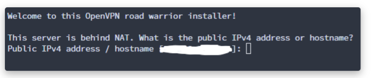
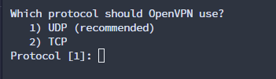
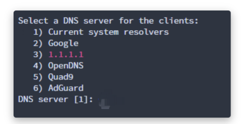

+ 开放防火墙

```shell
#centos
yum install ufw

#ubuntu
apt-get install ufw

ufw enable  # 选择y
ufw allow 22
ufw allow 53
ufw allow 67
ufw allow 68
ufw allow 69
ufw allow 3306
ufw enable #选择y


```

+ 拉取脚本

```shell
#https://github.com/HPUhushicheng/openvpn-install-script

git clone https://hub.gitmirror.com/https://github.com/HPUhushicheng/openvpn-install-script.git && cd openvpn-install-script && bash openvpn-install.sh
```

or

```plain
wget https://hub.gitmirror.com/https://github.com/HPUhushicheng/openvpn-install-script/blob/main/openvpn-install.sh && bash openvpn-install.sh
```


#### 运行之后，选择自己的IP地址


##### 然后到下一步直接回车


#### 填一下67


#### 下一步选择3 1.1.1.1


#### 名字随便给一个，随后敲击两次回车，进入安装


#### 把net.ovpn下载下来导入到openvpn，连上校园网，不要认证，就行了


