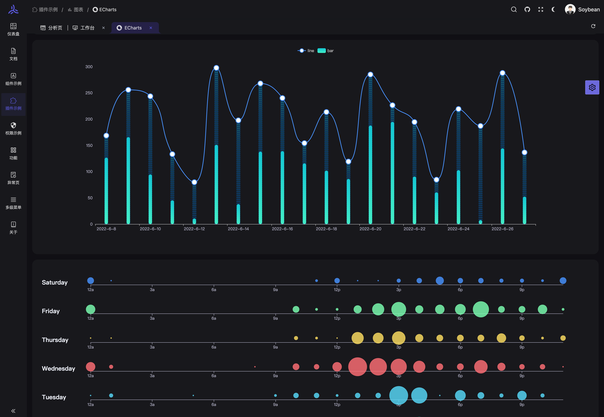

 	

## Soybean Admin

## 简介
[Soybean Admin](https://github.com/honghuangdc/soybean-admin) 是一个基于 Vue3、Vite3、TypeScript、NaiveUI、Pinia 和 UnoCSS 的清新优雅的中后台模版，它使用了最新流行的前端技术栈，内置丰富的主题配置，有着极高的代码规范，基于文件的路由系统以及基于 Mock 的动态权限路由，开箱即用的中后台前端解决方案，也可用于学习参考。

## 特性
+ **最新流行技术栈**：使用 Vue3/Vite 等前端前沿技术开发, 使用高效率的 npm 包管理器 pnpm
+ **TypeScript**: 应用程序级 JavaScript 的语言
+ **主题**：丰富可配置的主题、暗黑模式，基于原子 css 框架 - UnoCss 的动态主题颜色
+ **代码规范**：丰富的规范插件及极高的代码规范
+ **文件路由系统**：基于文件的路由系统，根据页面文件自动生成路由声明、路由导入和路由模块
+ **权限路由**：提供前端静态和后端动态两种路由模式，基于 mock 的动态路由能快速实现后端动态路由
+ **请求函数**：基于 axios 的完善的请求函数封装，提供 Promise 和 hooks 两种请求函数，加入请求结果数据转换的适配器

## 在线预览
+ [Soybean Admin 预览地址](https://soybean.pro/)

## 文档
+ [项目文档预览地址](https://docs.soybean.pro/)

## 代码仓库
+ [github](https://github.com/honghuangdc/soybean-admin)
+ [tauri 版](https://github.com/honghuangdc/soybean-admin/tree/tauri)
+ [精简版](https://github.com/honghuangdc/soybean-admin/tree/thin)
+ [gitee](https://gitee.com/honghuangdc/soybean-admin)
+ [tauri 版](https://gitee.com/honghuangdc/soybean-admin/tree/tauri)
+ [精简版](https://gitee.com/honghuangdc/soybean-admin/tree/thin)

## 更新日志
[CHANGELOG](https://github.com/better-rs/tauri-vue-admin/blob/main/CHANGELOG.md)

## 后端服务
+ [soybean-admin-java](https://github.com/honghuangdc/soybean-admin-java)

## 项目示例图

## 安装使用
+ 环境配置 **本地环境需要安装 pnpm 7.x 、Node.js 14.18+ 和 Git**
+ 克隆代码

git clone https://github.com/honghuangdc/soybean-admin.git

+ 安装依赖
+ 运行
+ 打包

## Docker 部署
+ Docker 部署 Soybean

docker run --name soybean -p 80:80 -d soybeanjs/soybean-admin:v0.9.6

+ 访问 SoybeanAdmin

打开本地浏览器访问`http://localhost`

## 如何贡献
非常欢迎您的加入！[提一个 Issue](https://github.com/honghuangdc/soybean-admin/issues/new) 或者提交一个 Pull Request。

## Git 贡献提交规范
项目已经内置 Angular 提交规范，直接执行 commit 命令即可生成符合 Angular 提交规范的 commit。

项目已用 simple-git-hooks 代替了 husky, 旧版本用了 husky，执行 pnpm soy init-git-hooks 进行初始化配置

## 基于 SoybeanAdmin 二次开发的项目
[electron-mock-admin](https://github.com/lixin59/electron-mock-api): 一个 Mock Api 管理系统，帮助前端开发伙伴快速实现接口的mock。

## 浏览器支持
本地开发推荐使用`Chrome 90+` 浏览器

支持现代浏览器, 不支持 IE

| IE | Edge | Firefox | Chrome | Safari |
| --- | --- | --- | --- | --- |
| not support | last 2 versions | last 2 versions | last 2 versions | last 2 versions |

## 开源作者
[@Soybean](https://github.com/honghuangdc)

## 交流
`Soybean Admin` 是完全开源免费的项目，在帮助开发者更方便地进行中大型管理系统开发，同时也提供微信和 QQ 交流群，使用问题欢迎在群内提问。

 	

 		

微信交流群

 	

 	

 		

QQ交流群

 	

 		

 			

添加本人微信，欢迎来技术交流，业务咨询

 			

 		

## 捐赠
如果你觉得这个项目对你有帮助，可以请 Soybean 喝杯饮料表示支持，Soybean 开源的动力离不开各位的支持和鼓励。

## License
[MIT © Soybean-2021](https://github.com/better-rs/tauri-vue-admin/blob/main/LICENSE)  

> 来自: [better-rs/tauri-vue-admin: A fresh and elegant admin template, based on Vue3,Vite3,TypeScript,NaiveUI and UnoCSS [一个基于Vue3、Vite3、TypeScript、NaiveUI 和 UnoCSS的清新优雅的中后台模版]](https://github.com/better-rs/tauri-vue-admin)
>

