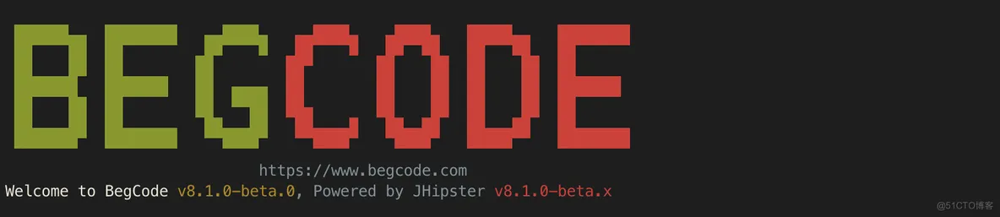
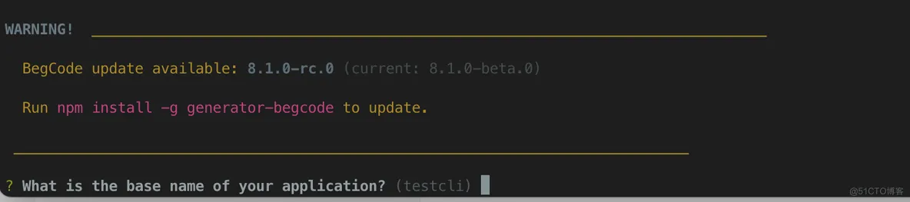
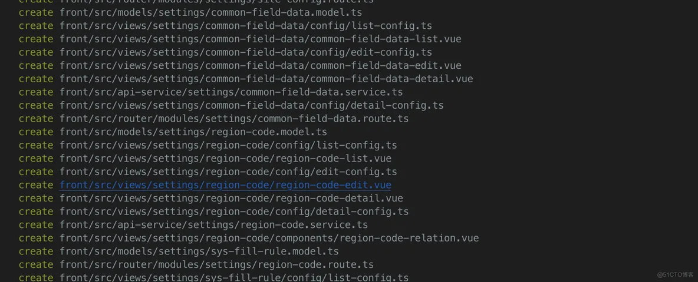
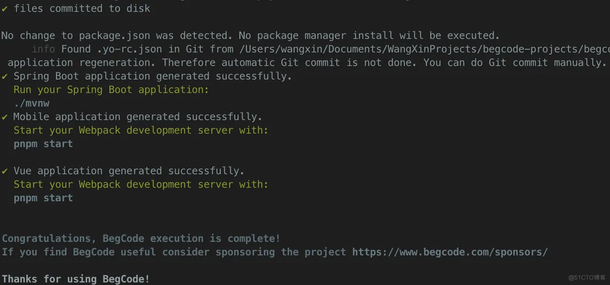
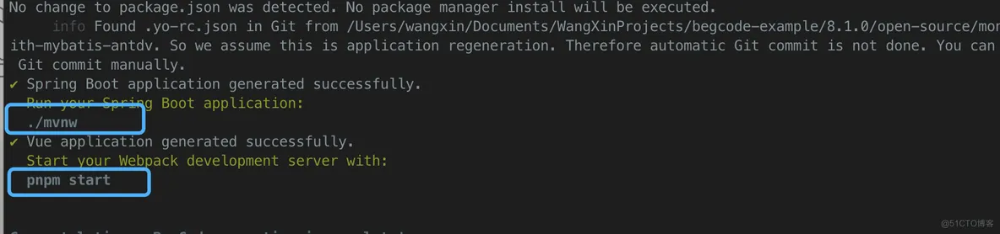
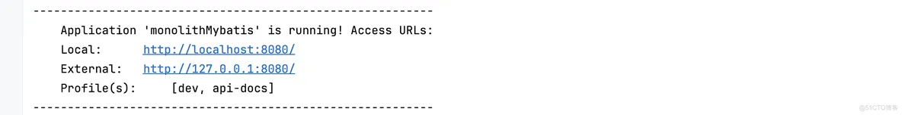
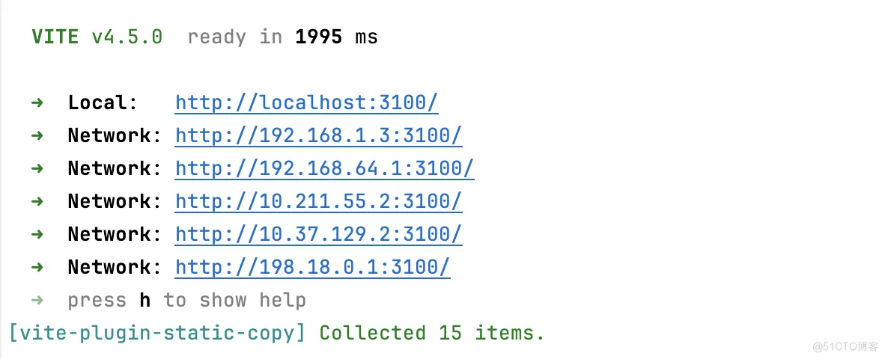
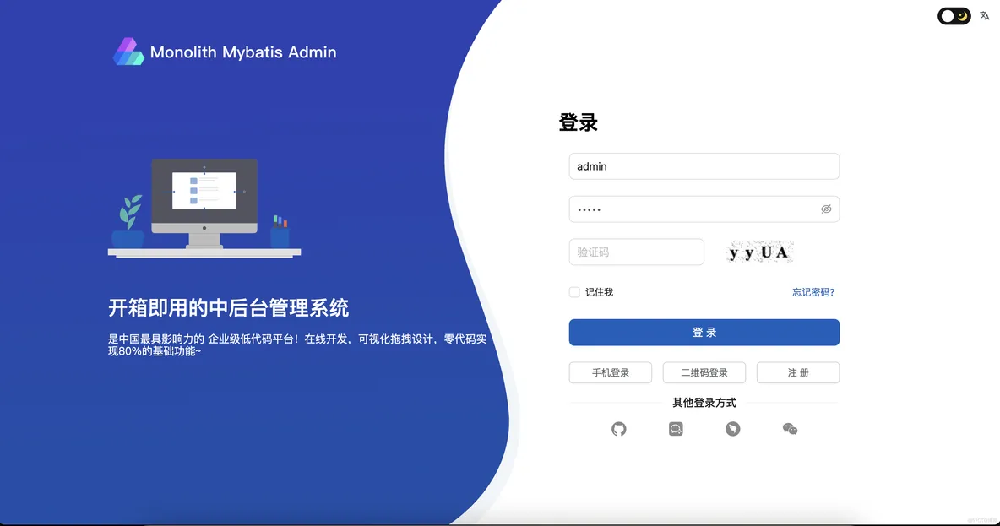

©著作权归作者所有：来自51CTO博客作者wangxinxx的原创作品，请联系作者获取转载授权，否则将追究法律责任 

BegCode生成应用的代码过程非常简单，只需要简单的几个问题就可以了。

### 环境要求
BegCode要求Node和Java环境，所以你首先要安装相应的工具。 JDK版本1.8和17以上可选， Node.js需要18.18或20.6以上的版本。

### 安装BegCode
### 运行并配置
#### 1.运行命令

样子有点丑，先不要计较了，重点看功能。

#### 2.根据问题填写相应的内容，如果涉及选项就使用默认即可。

#### 3.代码生成，体验一下电影里的代码生成过程。

**这里有一点儿要注意**

BegCode通过JDL文件的形式内置了用户管理、角色管理、菜单管理等若干功能，为了实现这些功能代码的生成，在BegCode第一次生成代码并且安装相关的依赖后，还会有一个二次导入jdl文件并生成内置功能代码的过程，所以不要打断BegCode的运行过程，正常等待程序退出。

#### 4. 生成结束。

运行到这里生成过程全部结束了。

#### 5.启动系统

启动后端，使用

启动前端，使用

#### 6.进入系统
后端启动完成：

前端启动完成：

现在可以通过 http://localhost:3100/ 进行系统体验了。

最后来一张登录图

+ **赞**
+ **收藏**
+ **评论**
+ **举报**

**相关文章**  

> 来自: [BegCode生成第一个应用，一键走起！_wangxinxx的技术博客_51CTO博客](https://blog.51cto.com/u_973873/9127333?articleABtest=0)
>

