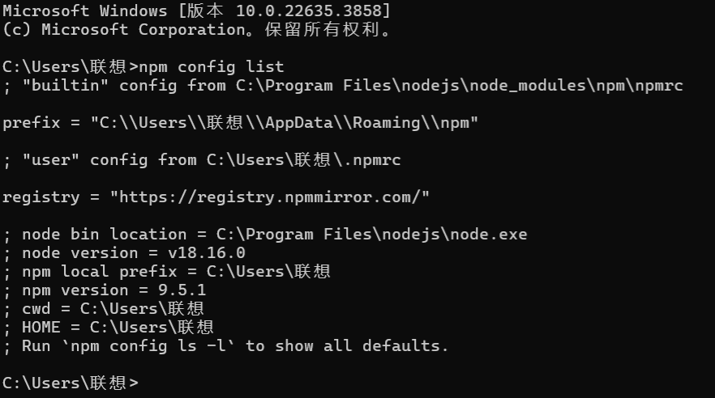
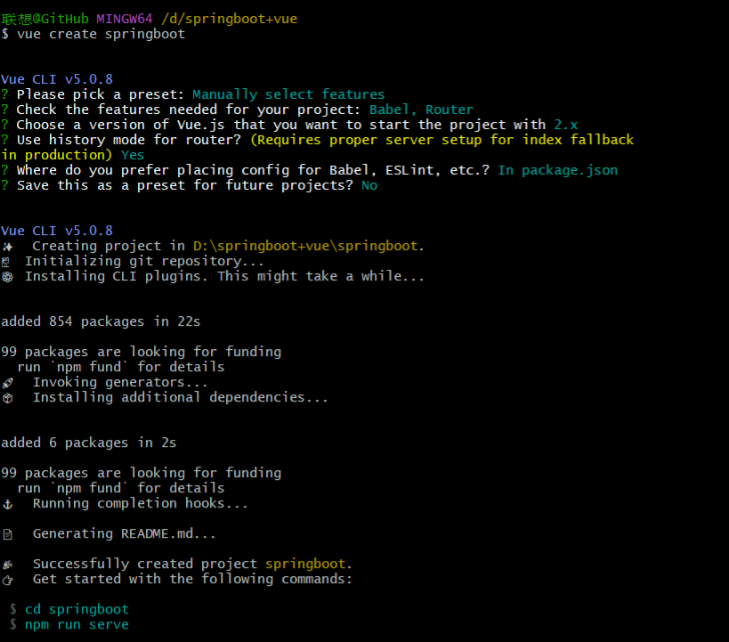
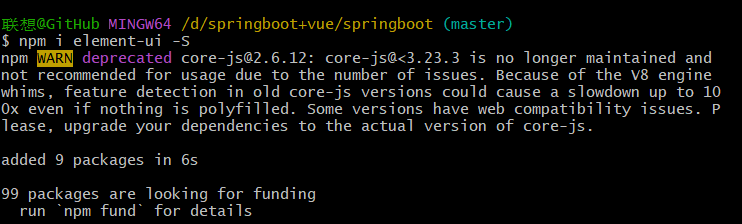
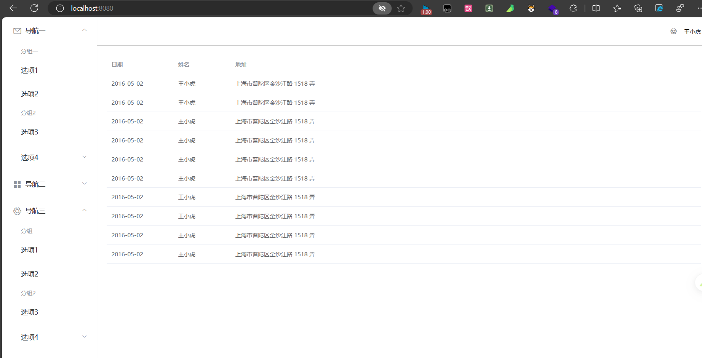
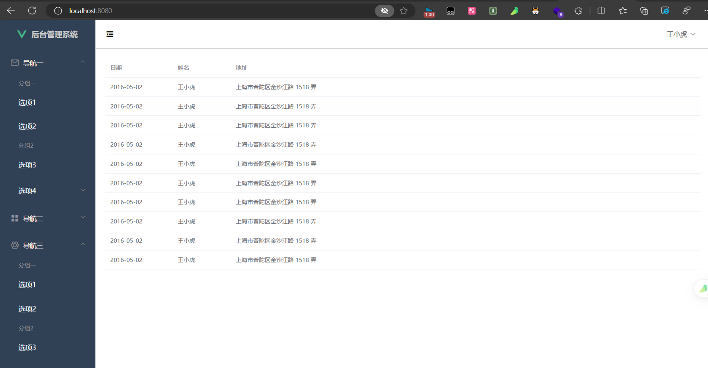
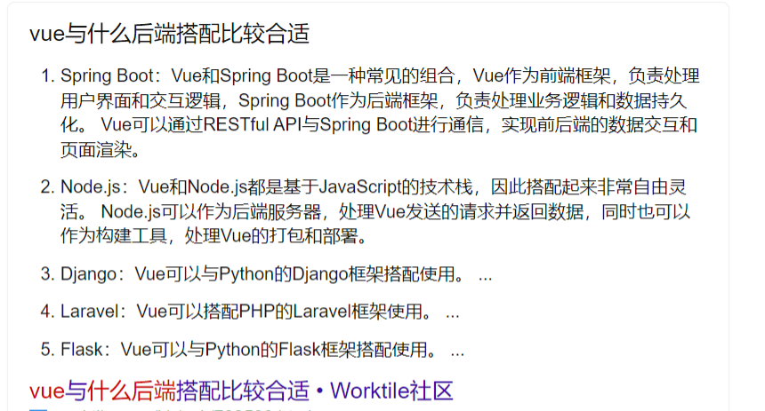

1. 安装vue/cli命令行工具（vue2）

```plain
npm install -g @vue/cli #全局安装

#如果安装之后显示vue not found，
npm config list #显示npm位置
prefix = "C:\\Users\\联想\\AppData\\Roaming\\npm"
这个需要加入环境变量，path中加入C:\Users\联想\AppData\Roaming\npm即可
详细见：https://blog.csdn.net/u013299635/article/details/119847577
```



2. 创建vue项目

```plain
cd D盘任意一个新建文件夹
vue create springboot
```




3. 安装element组件

```plain
npm i element-ui -S
```




4. home.vue页面布局代码

```plain
<template>
  <div style="height:100%">
    <el-container style="height: 100%; ">
  <el-aside width="200px" style="background-color: rgb(238, 241, 246); height:100%" >
    <el-menu :default-openeds="['1', '3']" style="height:100%">
      <el-submenu index="1">
        <template slot="title"><i class="el-icon-message"></i>导航一</template>
        <el-menu-item-group>
          <template slot="title">分组一</template>
          <el-menu-item index="1-1">选项1</el-menu-item>
          <el-menu-item index="1-2">选项2</el-menu-item>
        </el-menu-item-group>
        <el-menu-item-group title="分组2">
          <el-menu-item index="1-3">选项3</el-menu-item>
        </el-menu-item-group>
        <el-submenu index="1-4">
          <template slot="title">选项4</template>
          <el-menu-item index="1-4-1">选项4-1</el-menu-item>
        </el-submenu>
      </el-submenu>
      <el-submenu index="2">
        <template slot="title"><i class="el-icon-menu"></i>导航二</template>
        <el-menu-item-group>
          <template slot="title">分组一</template>
          <el-menu-item index="2-1">选项1</el-menu-item>
          <el-menu-item index="2-2">选项2</el-menu-item>
        </el-menu-item-group>
        <el-menu-item-group title="分组2">
          <el-menu-item index="2-3">选项3</el-menu-item>
        </el-menu-item-group>
        <el-submenu index="2-4">
          <template slot="title">选项4</template>
          <el-menu-item index="2-4-1">选项4-1</el-menu-item>
        </el-submenu>
      </el-submenu>
      <el-submenu index="3">
        <template slot="title"><i class="el-icon-setting"></i>导航三</template>
        <el-menu-item-group>
          <template slot="title">分组一</template>
          <el-menu-item index="3-1">选项1</el-menu-item>
          <el-menu-item index="3-2">选项2</el-menu-item>
        </el-menu-item-group>
        <el-menu-item-group title="分组2">
          <el-menu-item index="3-3">选项3</el-menu-item>
        </el-menu-item-group>
        <el-submenu index="3-4">
          <template slot="title">选项4</template>
          <el-menu-item index="3-4-1">选项4-1</el-menu-item>
        </el-submenu>
      </el-submenu>
    </el-menu>
  </el-aside>
  
  <el-container>
    <el-header style="text-align: right; font-size: 12px; border-bottom: 1px solid #ccc; line-height: 60px; ">
      <el-dropdown>
        <i class="el-icon-setting" style="margin-right: 15px"></i>
        <el-dropdown-menu slot="dropdown">
          <el-dropdown-item>查看</el-dropdown-item>
          <el-dropdown-item>新增</el-dropdown-item>
          <el-dropdown-item>删除</el-dropdown-item>
        </el-dropdown-menu>
      </el-dropdown>
      <span>王小虎</span>
    </el-header>
    
    <el-main>
      <el-table :data="tableData">
        <el-table-column prop="date" label="日期" width="140">
        </el-table-column>
        <el-table-column prop="name" label="姓名" width="120">
        </el-table-column>
        <el-table-column prop="address" label="地址">
        </el-table-column>
      </el-table>
    </el-main>
  </el-container>
</el-container>
  </div>
</template>

<script>


export default {
  name: 'HomeView',
  data() {
      const item = {
        date: '2016-05-02',
        name: '王小虎',
        address: '上海市普陀区金沙江路 1518 弄'
      };
      return {
        tableData: Array(10).fill(item)
      }
    }
}
</script>

```



5. app.vue

```plain
<template>
  <div id="app">
    <router-view/>
  </div>
</template>

<style>
#app{
  height:100%;
}
</style>
```

6. assets文件夹下新建global.css文件

```plain
html,body,div{
    margin: 0;
    padding: 0;
}

html,body{
    height: 100%;
}
```


### 页面布局搭建home.vue
<details class="lake-collapse"><summary id="u2415a18f"><span class="ne-text">home.vue代码</span></summary><pre data-language="vue" id="wDmc6" class="ne-codeblock language-vue"><code>&lt;template&gt;
&lt;el-container style=&quot;min-height: 100vh; &quot;&gt;
  &lt;el-aside :width=&quot;sideWidth +'px'&quot; style=&quot;background-color: rgb(238, 241, 246); height:100%&quot; &gt;
    &lt;el-menu :default-openeds=&quot;['1', '3']&quot; style=&quot;min-height:100%; overflow-x: hidden;&quot;
              background-color=&quot;rgb(48,65,86)&quot;
              text-color=&quot;#fff&quot;
              active-text-color=&quot;#ffd04b&quot;
              :collapse-transition=&quot;false&quot;
              :collapse=&quot;isCollapse&quot;&gt;
      &lt;div style=&quot;height: 60px; line-height: 60px; text-align: center;&quot;&gt;
       &lt;img src=&quot;../assets/logo.png&quot; alt=&quot; &quot; style=&quot;width: 20px;position:relative; top: 5px; margin-right: 10px;&quot;&gt;
       &lt;b style=&quot;color:#ccc&quot; v-show=&quot;logoTextShow&quot; &gt;后台管理系统&lt;/b&gt;
      &lt;/div&gt;
      &lt;el-submenu index=&quot;1&quot;&gt;
        &lt;template slot=&quot;title&quot;&gt;&lt;i class=&quot;el-icon-message&quot;&gt;&lt;/i&gt;&lt;span slot=&quot;title&quot;&gt;导航一&lt;/span&gt;&lt;/template&gt;
        &lt;el-menu-item-group&gt;
          &lt;template slot=&quot;title&quot;&gt;分组一&lt;/template&gt;
          &lt;el-menu-item index=&quot;1-1&quot;&gt;选项1&lt;/el-menu-item&gt;
          &lt;el-menu-item index=&quot;1-2&quot;&gt;选项2&lt;/el-menu-item&gt;
        &lt;/el-menu-item-group&gt;
        &lt;el-menu-item-group title=&quot;分组2&quot;&gt;
          &lt;el-menu-item index=&quot;1-3&quot;&gt;选项3&lt;/el-menu-item&gt;
        &lt;/el-menu-item-group&gt;
        &lt;el-submenu index=&quot;1-4&quot;&gt;
          &lt;template slot=&quot;title&quot;&gt;选项4&lt;/template&gt;
          &lt;el-menu-item index=&quot;1-4-1&quot;&gt;选项4-1&lt;/el-menu-item&gt;
        &lt;/el-submenu&gt;
      &lt;/el-submenu&gt;
      &lt;el-submenu index=&quot;2&quot;&gt;
        &lt;template slot=&quot;title&quot;&gt;&lt;i class=&quot;el-icon-menu&quot;&gt;&lt;/i&gt;&lt;span slot=&quot;title&quot;&gt;导航二&lt;/span&gt;&lt;/template&gt;
        &lt;el-menu-item-group&gt;
          &lt;template slot=&quot;title&quot;&gt;分组一&lt;/template&gt;
          &lt;el-menu-item index=&quot;2-1&quot;&gt;选项1&lt;/el-menu-item&gt;
          &lt;el-menu-item index=&quot;2-2&quot;&gt;选项2&lt;/el-menu-item&gt;
        &lt;/el-menu-item-group&gt;
        &lt;el-menu-item-group title=&quot;分组2&quot;&gt;
          &lt;el-menu-item index=&quot;2-3&quot;&gt;选项3&lt;/el-menu-item&gt;
        &lt;/el-menu-item-group&gt;
        &lt;el-submenu index=&quot;2-4&quot;&gt;
          &lt;template slot=&quot;title&quot;&gt;选项4&lt;/template&gt;
          &lt;el-menu-item index=&quot;2-4-1&quot;&gt;选项4-1&lt;/el-menu-item&gt;
        &lt;/el-submenu&gt;
      &lt;/el-submenu&gt;
      &lt;el-submenu index=&quot;3&quot;&gt;
        &lt;template slot=&quot;title&quot;&gt;&lt;i class=&quot;el-icon-setting&quot;&gt;&lt;/i&gt;&lt;span slot=&quot;tile&quot;&gt;导航三&lt;/span&gt;&lt;/template&gt;
        &lt;el-menu-item-group&gt;
          &lt;template slot=&quot;title&quot;&gt;分组一&lt;/template&gt;
          &lt;el-menu-item index=&quot;3-1&quot;&gt;选项1&lt;/el-menu-item&gt;
          &lt;el-menu-item index=&quot;3-2&quot;&gt;选项2&lt;/el-menu-item&gt;
        &lt;/el-menu-item-group&gt;
        &lt;el-menu-item-group title=&quot;分组2&quot;&gt;
          &lt;el-menu-item index=&quot;3-3&quot;&gt;选项3&lt;/el-menu-item&gt;
        &lt;/el-menu-item-group&gt;
        &lt;el-submenu index=&quot;3-4&quot;&gt;
          &lt;template slot=&quot;title&quot;&gt;选项4&lt;/template&gt;
          &lt;el-menu-item index=&quot;3-4-1&quot;&gt;选项4-1&lt;/el-menu-item&gt;
        &lt;/el-submenu&gt;
      &lt;/el-submenu&gt;
    &lt;/el-menu&gt;
  &lt;/el-aside&gt;
  
  &lt;el-container&gt;
    &lt;el-header style=&quot;font-size: 12px; border-bottom: 1px solid #ccc; line-height: 60px; display: flex;&quot;&gt;
      &lt;div style=&quot;flex: 1; font-size: 18px&quot;&gt;
        &lt;span :class=&quot;collapseBtnClass&quot; style=&quot;cursor: pointer&quot; @click=&quot;collapse&quot;&gt;&lt;/span&gt;
      &lt;/div&gt;
      &lt;el-dropdown style=&quot;width:70px;cursor: pointer;&quot;&gt;
        &lt;span&gt;王小虎&lt;/span&gt;&lt;i class=&quot; el-icon-arrow-down&quot; style=&quot;margin-left: 5px;&quot;&gt;&lt;/i&gt;
        &lt;el-dropdown-menu slot=&quot;dropdown&quot;&gt;
          &lt;el-dropdown-item&gt;个人信息&lt;/el-dropdown-item&gt;
          &lt;el-dropdown-item&gt;退出&lt;/el-dropdown-item&gt;
          &lt;el-dropdown-item&gt;注销&lt;/el-dropdown-item&gt;
        &lt;/el-dropdown-menu&gt;
      &lt;/el-dropdown&gt;

    &lt;/el-header&gt;
    
    &lt;el-main&gt;
      &lt;el-table :data=&quot;tableData&quot;&gt;
        &lt;el-table-column prop=&quot;date&quot; label=&quot;日期&quot; width=&quot;140&quot;&gt;
        &lt;/el-table-column&gt;
        &lt;el-table-column prop=&quot;name&quot; label=&quot;姓名&quot; width=&quot;120&quot;&gt;
        &lt;/el-table-column&gt;
        &lt;el-table-column prop=&quot;address&quot; label=&quot;地址&quot;&gt;
        &lt;/el-table-column&gt;
      &lt;/el-table&gt;
    &lt;/el-main&gt;
  &lt;/el-container&gt;
&lt;/el-container&gt;

&lt;/template&gt;

&lt;script&gt;


export default {
  name: 'HomeView',
  data() {
      const item = {
        date: '2016-05-02',
        name: '王小虎',
        address: '上海市普陀区金沙江路 1518 弄'
      };
      return {
        tableData: Array(10).fill(item),
        collapseBtnClass:&quot;el-icon-s-fold&quot;,
        isCollapse:false,
        logoTextShow:true
      }
    },
    methods:{
      collapse(){ //点击收缩按钮触发
        this.isCollapse = !this.isCollapse
        if (this.isCollapse){ //收缩
          this.sideWidth = 64
          this.collapseBtnClass ='el-icon-s-unfold'
          this.logoTextShow = false
        } else{ //展开
          this.sideWidth = 200
          this.collapseBtnClass = 'el-icon-s-fold'
          this.logoTextShow = true
        }

      }
    }
}
&lt;/script&gt;</code></pre></details>



```plain
<template>
	<cl-crud ref="Crud">
		<cl-row>
			<!-- 刷新按钮 -->
			<cl-refresh-btn />
			<!-- 新增按钮 -->
			<cl-add-btn />
			<!-- 删除按钮 -->
			<cl-multi-delete-btn />
			<!-- 筛选性别 -->
			<cl-filter label="性别">
				<cl-select
					prop="gender"
					:options='[{"label":"女","value":0},{"label":"男","value":1}]'
				/>
			</cl-filter>
			<!-- 筛选年龄 -->
			<cl-filter label="年龄">
				<cl-select prop="age" :options="[]" />
			</cl-filter>
			<!-- 筛选学号 -->
			<cl-filter label="学号">
				<cl-select prop="studentId" :options="[]" />
			</cl-filter>
			<!-- 筛选电话 -->
			<cl-filter label="电话">
				<cl-select prop="phone" :options="[]" />
			</cl-filter>
			<!-- 筛选邮箱 -->
			<cl-filter label="邮箱">
				<cl-select prop="email" :options="[]" />
			</cl-filter>
			<cl-flex1 />
			<!-- 关键字搜索 -->
			<cl-search-key placeholder="搜索姓名、专业班级、宿舍、职位、QQ号、微信号" />
		</cl-row>

		<cl-row>
			<!-- 数据表格 -->
			<cl-table ref="Table" />
		</cl-row>

		<cl-row>
			<cl-flex1 />
			<!-- 分页控件 -->
			<cl-pagination />
		</cl-row>

		<!-- 新增、编辑 -->
		<cl-upsert ref="Upsert" />
	</cl-crud>
</template>

<script lang="ts" name="user-info" setup>
	import { useCrud, useTable, useUpsert } from '@cool-vue/crud';
	import { useCool } from '/@/cool';

	const { service } = useCool();

	// cl-upsert
	const Upsert = useUpsert({
		items: [
			{
				label: '姓名',
				prop: 'name',
				component: { name: 'el-input', props: { clearable: true } },
				required: true
			},
			{
				label: '性别',
				prop: 'gender',
				component: {
					name: 'el-radio-group',
					options: [
						{ label: '女', value: 0 },
						{ label: '男', value: 1 }
					]
				},
				value: 0,
				required: true
			},
			{
				label: '年龄',
				prop: 'age',
				hook: 'number',
				component: { name: 'el-input-number' },
				required: true
			},
			{
				label: '专业班级',
				prop: 'majorClass',
				component: { name: 'el-input', props: { clearable: true } },
				required: true
			},
			{
				label: '学号',
				prop: 'studentId',
				component: { name: 'el-input', props: { clearable: true } },
				required: true
			},
			{
				label: '电话',
				prop: 'phone',
				component: { name: 'el-input', props: { clearable: true } },
				required: true
			},
			{
				label: '邮箱',
				prop: 'email',
				component: { name: 'el-input', props: { clearable: true } },
				required: true
			},
			{
				label: '宿舍',
				prop: 'dormitory',
				component: { name: 'el-input', props: { clearable: true } },
				required: true
			},
			{
				label: '职位',
				prop: 'position',
				component: { name: 'el-input', props: { clearable: true } },
				required: true
			},
			{
				label: 'QQ号',
				prop: 'qq',
				component: { name: 'el-input', props: { clearable: true } },
				required: true
			},
			{
				label: '微信号',
				prop: 'wechat',
				component: { name: 'el-input', props: { clearable: true } },
				required: true
			}
		]
	});

	// cl-table
	const Table = useTable({
		columns: [
			{ type: 'selection' },
			{ label: '姓名', prop: 'name', minWidth: 140 },
			{
				label: '性别',
				prop: 'gender',
				dict: [
					{ label: '女', value: 0 },
					{ label: '男', value: 1 }
				],
				dictColor: true,
				minWidth: 120
			},
			{ label: '年龄', prop: 'age', minWidth: 140, dict: [] },
			{ label: '专业班级', prop: 'majorClass', minWidth: 140 },
			{ label: '学号', prop: 'studentId', minWidth: 140, dict: [] },
			{ label: '电话', prop: 'phone', minWidth: 140, dict: [] },
			{ label: '邮箱', prop: 'email', minWidth: 140, dict: [] },
			{ label: '宿舍', prop: 'dormitory', minWidth: 140 },
			{ label: '职位', prop: 'position', minWidth: 140 },
			{ label: 'QQ号', prop: 'qq', minWidth: 140 },
			{ label: '微信号', prop: 'wechat', minWidth: 140 },
			{
				label: '更新时间',
				prop: 'updateTime',
				minWidth: 170,
				sortable: 'custom',
				component: { name: 'cl-date-text' }
			},
			{
				label: '创建时间',
				prop: 'createTime',
				minWidth: 170,
				sortable: 'custom',
				component: { name: 'cl-date-text' }
			},
			{ type: 'op', buttons: ['edit', 'delete'] }
		]
	});

	// cl-crud
	const Crud = useCrud(
		{
			service: service.user.info
		},
		(app) => {
			app.refresh();
		}
	);

	// 刷新
	function refresh(params?: any) {
		Crud.value?.refresh(params);
	}
</script>

```

```plain
<template>
<el-container style="min-height: 100vh; ">
  <el-aside :width="sideWidth +'px'" style="background-color: rgb(238, 241, 246); height:100%" >
    <el-menu :default-openeds="['1', '3']" style="min-height:100%; overflow-x: hidden;"
              background-color="rgb(48,65,86)"
              text-color="#fff"
              active-text-color="#ffd04b"
              :collapse-transition="false"
              :collapse="isCollapse">
      <div style="height: 60px; line-height: 60px; text-align: center;">
       
       <b style="color:#ccc" v-show="logoTextShow" >后台管理系统</b>
      </div>
      <el-submenu index="1">
        <template slot="title"><i class="el-icon-message"></i><span slot="title">导航一</span></template>
        <el-menu-item-group>
          <template slot="title">分组一</template>
          <el-menu-item index="1-1">选项1</el-menu-item>
          <el-menu-item index="1-2">选项2</el-menu-item>
        </el-menu-item-group>
        <el-menu-item-group title="分组2">
          <el-menu-item index="1-3">选项3</el-menu-item>
        </el-menu-item-group>
        <el-submenu index="1-4">
          <template slot="title">选项4</template>
          <el-menu-item index="1-4-1">选项4-1</el-menu-item>
        </el-submenu>
      </el-submenu>
      <el-submenu index="2">
        <template slot="title"><i class="el-icon-menu"></i><span slot="title">导航二</span></template>
        <el-menu-item-group>
          <template slot="title">分组一</template>
          <el-menu-item index="2-1">选项1</el-menu-item>
          <el-menu-item index="2-2">选项2</el-menu-item>
        </el-menu-item-group>
        <el-menu-item-group title="分组2">
          <el-menu-item index="2-3">选项3</el-menu-item>
        </el-menu-item-group>
        <el-submenu index="2-4">
          <template slot="title">选项4</template>
          <el-menu-item index="2-4-1">选项4-1</el-menu-item>
        </el-submenu>
      </el-submenu>
      <el-submenu index="3">
        <template slot="title"><i class="el-icon-setting"></i><span slot="tile">导航三</span></template>
        <el-menu-item-group>
          <template slot="title">分组一</template>
          <el-menu-item index="3-1">选项1</el-menu-item>
          <el-menu-item index="3-2">选项2</el-menu-item>
        </el-menu-item-group>
        <el-menu-item-group title="分组2">
          <el-menu-item index="3-3">选项3</el-menu-item>
        </el-menu-item-group>
        <el-submenu index="3-4">
          <template slot="title">选项4</template>
          <el-menu-item index="3-4-1">选项4-1</el-menu-item>
        </el-submenu>
      </el-submenu>
    </el-menu>
  </el-aside>
  
  <el-container>
    <el-header style="font-size: 12px; border-bottom: 1px solid #ccc; line-height: 60px; display: flex;">
      <div style="flex: 1; font-size: 18px">
        <span :class="collapseBtnClass" style="cursor: pointer" @click="collapse"></span>
      </div>
      <el-dropdown style="width:70px;cursor: pointer;">
        <span>王小虎</span><i class=" el-icon-arrow-down" style="margin-left: 5px;"></i>
        <el-dropdown-menu slot="dropdown">
          <el-dropdown-item>个人信息</el-dropdown-item>
          <el-dropdown-item>退出</el-dropdown-item>
          <el-dropdown-item>注销</el-dropdown-item>
        </el-dropdown-menu>
      </el-dropdown>

    </el-header>
    
    <el-main>
      <div style="margin-bottom: 30px;">
        <el-breadcrumb separator="/">
          <el-breadcrumb-item :to="{path:'/'}">首页</el-breadcrumb-item>
          <el-breadcrumb-item>用户管理</el-breadcrumb-item>
          </el-breadcrumb>
      </div>
      <div style="padding: 10px 0">
        <el-input style="width:200px" placeholder="请输入内容"   suffix-icon="el-icon-search"></el-input>
        <el-input style="width:200px" placeholder="请输入邮箱"   suffix-icon="el-icon-search" class="ml-5"></el-input>
        <el-input style="width:200px" placeholder="请输入地址"   suffix-icon="el-icon-search" calss="ml-5"></el-input>
        <el-button class="ml-5" type="primary">搜索</el-button>
      </div>

      <div>
        <el-button type="primary">新增<i class="el-icon-circle-plus-outline"></i></el-button>
        <el-button type="primary">删除<i class="el-icon-circle-remove-outline"></i></el-button>
        <el-button type="primary">导入<i class="el-icon-bottom"></i></el-button>
        <el-button type="primary">导出<i class="el-icon-top"></i></el-button>
      </div>
      <el-table :data="tableData">
        <el-table-column prop="date" label="日期" width="140">
        </el-table-column>
        <el-table-column prop="name" label="姓名" width="120">
        </el-table-column>
        <el-table-column prop="address" label="地址">
        </el-table-column>
        <el-table-column label="操作">
          <template slot-scope=""> //删除scope可以恢复正常,不知道为啥?slot-scope="scope"
            <el-button type="success">编辑<i class="el-icon-edit"></i></el-button>
            <el-button type="danger">删除<i class="el-icon-remove-outline"></i></el-button>
          </template>
        </el-table-column>


      </el-table>

      <div style="padding:10px 0">
        <el-pagination :page-sizes="[5,10,15,20]" :page-size="10" layout="total,sizes,prev,pager,next,jumper" :total="400">
        </el-pagination>
      </div>
    </el-main>
  </el-container>
</el-container>

</template>

<script>


export default {
  name: 'HomeView',
  data() {
      const item = {
        date: '2016-05-02',
        name: '王小虎',
        address: '上海市普陀区金沙江路 1518 弄'
      };
      return {
        tableData: Array(10).fill(item),
        collapseBtnClass:"el-icon-s-fold",
        isCollapse:false,
        logoTextShow:true
      }
    },
    methods:{
      collapse(){ //点击收缩按钮触发
        this.isCollapse = !this.isCollapse
        if (this.isCollapse){ //收缩
          this.sideWidth = 64
          this.collapseBtnClass ='el-icon-s-unfold'
          this.logoTextShow = false
        } else{ //展开
          this.sideWidth = 200
          this.collapseBtnClass = 'el-icon-s-fold'
          this.logoTextShow = true
        }

      }
    }
}
</script>

```



```plain
       <dependency>
            <groupId>org.springframework.boot</groupId>
            <artifactId>spring-boot-starter-web</artifactId>
        </dependency>
        <dependency>
            <groupId>org.mybatis.spring.boot</groupId>
            <artifactId>mybatis-spring-boot-starter</artifactId>
            <version>2.2.2</version>
        </dependency>

        <dependency>
            <groupId>com.mysql</groupId>
            <artifactId>mysql-connector-j</artifactId>
            <scope>runtime</scope>
        </dependency>
        <dependency>
            <groupId>org.projectlombok</groupId>
            <artifactId>lombok</artifactId>
            <optional>true</optional>
        </dependency>
        <dependency>
            <groupId>org.springframework.boot</groupId>
            <artifactId>spring-boot-starter-test</artifactId>
            <scope>test</scope>
        </dependency>
```

