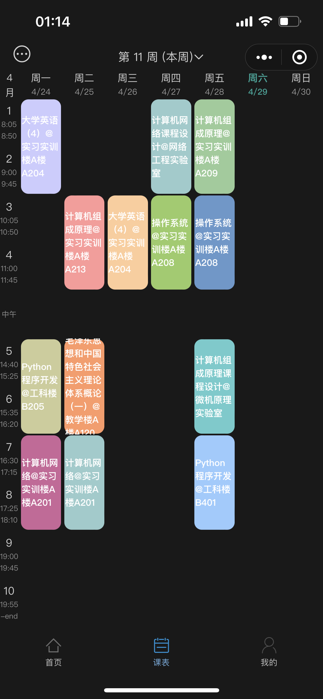
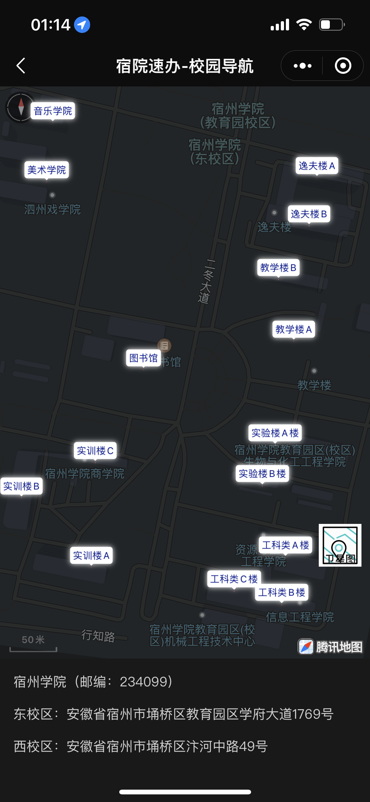

## 宿院速办

this is Campus Schedule Mini Program

## 项目展示
github地址：[https://github.com/hzbnb/affair](https://github.com/hzbnb/affair)

系统演示视频：[https://www.bilibili.com/video/BV1He4y1Z7du](https://www.bilibili.com/video/BV1He4y1Z7du)

线上小程序 ：

## 截图展示

### 招募开发者 下方联系微信
## 功能介绍
### 课表：
	登录教务系统的账号密码之后 可以一件获取自己的课表。

### 校园导航：
	给学校每一座建筑标好了 名字 还有自己的位置 麻麻再也不用担心我迷路了。

### 学校社团：
	预期将学校里每一个社团经行集中展示，且展示联系方式 ，新生来学校之后轻松找到组织。

### 学校通知：
	从官网实施爬取官网的通知，让学生可以从手机端方便的查看官网通知。

### 联系方式：
#### 我的微信
  

> 来自: [hututusb/affair: this is Campus Schedule Mini Program 这是一个校园课表小程序](https://github.com/hututusb/affair)
>

