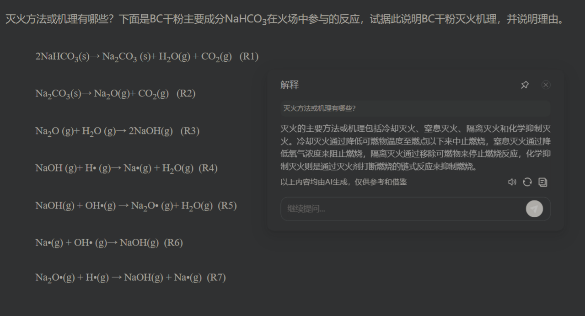

> BC干粉灭火剂的主要成分是碳酸氢钠（NaHCO3），其在火场中的灭火机理主要包括以下两点：
>
> 1. 化学抑制作用：当NaHCO3受热分解时，会产生二氧化碳（CO2）和水（H2O），反应式为：  
 2NaHCO3 ——> Na2CO3 + CO2 + H2O   
其中产生的二氧化碳可以稀释空气中的氧气，降低燃烧区域的氧气含量，从而抑制燃烧。同时，二氧化碳和水蒸气可以与燃烧过程中产生的自由基或活性基团发生化学反应，中断燃烧链反应，从而达到灭火效果。
> 2. 隔绝作用：NaHCO3分解产生的水蒸气在高温下会迅速蒸发，形成水雾，这些水雾可以覆盖在燃烧物表面，形成一层隔离层，阻止氧气与可燃物接触，从而窒息灭火。
>
> 理由：
>
> + 碳酸氢钠分解产生的二氧化碳和水蒸气能有效降低火场中的氧气浓度，减缓或阻止燃烧的继续。
> + 水蒸气的形成增加了火场中的湿度，有助于降低火场温度，同时水雾还能覆盖燃烧物，起到隔绝氧气的作用。
> + 这些物理和化学作用共同作用，使得BC干粉灭火剂能够迅速扑灭火焰，防止火势蔓延。
>

