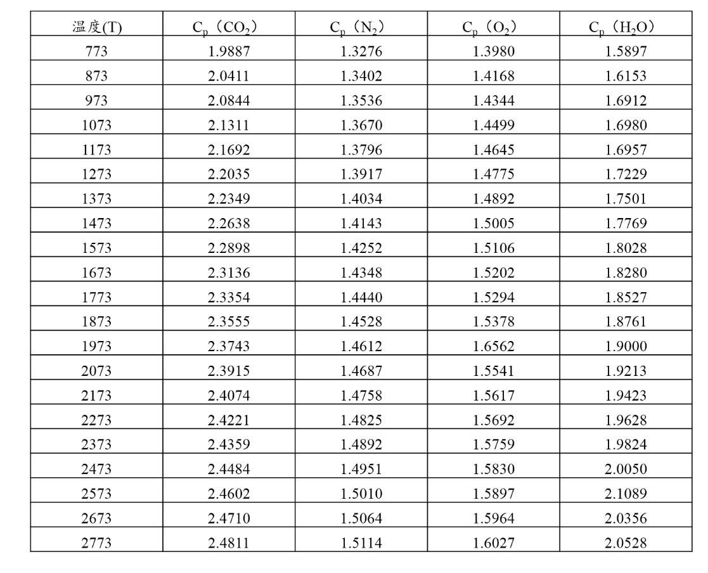

**一、名词解释（每题2分，共20分）**

1、活化能

2、热释放速率

3、冷却法灭火

4、分支链反应

5、灭火滞后

6、电极熄火距离

7、预混燃烧

8、可燃气爆炸(浓度)极限

9、沸溢

10、蒸发燃烧

**二、简答题（每题****6****分，共****48****分）**

 1.      灭火方法或机理有哪些？下面是BC干粉主要成分NaHCO3在火场中参与的反应，试据此说明BC干粉灭火机理，并说明理由。

2NaHCO3(s)→ Na2CO3 (s)+ H2O(g) + CO2(g)   (R1)

Na2CO3(s)→ Na2O(g)+ CO2(g)   (R2)

Na2O (g)+ H2O (g)→ 2NaOH(g)   (R3)

NaOH (g)+ H• (g)→ Na•(g) + H2O(g)  (R4)

NaOH(g) + OH•(g) → Na2O• (g)+ H2O(g)  (R5)

Na•(g) + OH• (g)→ NaOH(g)  (R6)

Na2O•(g) + H•(g) → NaOH(g) + Na•(g)  (R7)

2.   1994年新疆克拉玛依友谊馆大火，着火原因为舞台纱幕被光柱灯烤燃。已知纱幕单位面积密度ρ·d = 300 g/m2，点火温度Tig = 350℃，一侧接受灯柱热流密度q = 20 kW/m2,假定比热C= 850J/kgK，环境初始温度Ti=20℃，对流传热系数h=5W/m2K, 发射率ε=0.9。假设纱幕为热薄固体，请说明如何计算纱幕的着火时间（不需要计算结果）

3.  试简要说明采用氧弹法测定苯甲酸燃烧热的原理及实验过程？你觉得本实验的误差来源于哪些？

4.   下图是电火花点火模型，按照FA Williams着火判据，当球形火花内放热速率≥通过球形边界散失热量时，点火成功。最小着火能计算为。试根据这个着火判据，请说明可燃气活化能E和导热系数λ对最小着火能Emin的影响，并解释原因。

5.   在热着火理论中存在那些自燃着火极限？谢苗诺夫方程有何实际应用？

6.    试说明随着海拔增加（比如高原或者飞机上升阶段），汽油的爆炸温度极限如何变化？并解释原因。

7.  请说明阴燃受何种因素控制？据此解释下图阴燃传播现象，为何垂直向上蔓延速度大于水平蔓延速度？     

**8.****  **试说明沸溢发生过程及条件，有哪些措施可以延缓或消除沸溢的发生？

**三、计算题（每题****8****分，共****32****分）**

**1. **已知正癸烷(C10H22)蒸气在空气中的爆炸极限为0.75~5.6%，试求爆炸正癸烷(C10H22)蒸气在爆炸下限和爆炸上限处的化学当量比_f_（计算结果保留小数位3位有效数字）。

2. 2018年11月14日凌晨1时许，大连市西岗区一水产研究所的废弃工厂里有加气车起火，发生两次爆炸，初步判断，  爆炸物可能为液化石油气（LPG）。假设LPG由40%丙烷C3H8和60%丁烷C4H10构成。查询SFPE手册得丙烷和丁烷在空气中爆炸极限分别为2.1~9.5%，1.8~8.4%。试计算该LPG在空气中发生爆炸的浓度范围，并计算LPG浓度为多少时爆炸最剧烈（化学当量比为1），1mol丙烷和丁烷完全燃烧时需要空气分别23.8和30.94mol，计算结果保留小数位3位有效数字。莱-夏特尔公式如下：

3. 实验测得某可燃预混气在不同压力Pc时的临界着火温度Tc如下表所示。请利用谢苗诺夫方程（该方程中Tc和Pc的单位分别为K和Pa），确定该预混气的活化能_E_（计算结果保留小数位2位有效数字）；并说明利用计算结果，确定Pc=1atm时自燃点Tc的方法（不必算出结果）。

4.  试求CO-纯O2预混气的等压绝热火焰温度（计算结果保留小数位2位有效数字）。已知预混气中CO体积百分比20%，忽略离解。已知  混合气初始温度T0=298K，P­0=1atm, CO的标准燃烧热为-282.84kJ/mol，标准生成热为-110.54kJ/mol，低位热值为12694kJ/m3; CO2(g)的标准生成热为-393.51kJ/mol.

表平均恒压热容（273K~TK之间的平均值，kJ/m3-K）  

> 来自: [《燃烧学》模拟试卷A](https://viewer.mosoteach.cn/viewer?token=b24bc153cbb3c8ab756735997bc30a22&screenx=false&app_id=MTWEB&app_version=5.3.3&location=)
>

